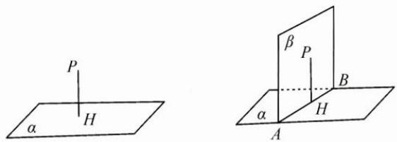

## 71 辅助平面法

## 方法介绍

辅助平面能使空间中的直线、平面的位置关系更明确. 在用综合法解决立体几何问题时常用到辅助平面法, 例如异面直线间的距离问题、动态问题、找线面角或二面角的平面角问题等.

研究某些动态问题中的平行、垂直关系时,难以运用静态的判定、性质定理进行定性或定量分析,对于此类问题,可构造辅助平面,找到不动的量.

类型①:构造某平面的平行平面,原理是“两个平面平行,一平面内任意一条直线必平行于另一个平面.”

类型②:构造某直线的垂直平面,原理是“直线垂直于平面,则该直线必垂直于平面内的任何一条直线.”

在用综合法找线面角和二面角的平面角时,第一步往往是找垂线,如图,已知平面 $\alpha$ 外一点 P,找到该平面 $\alpha$ 的垂线 PH 是关键.如果能找到过点 P 的平面 $\alpha$ 的辅助垂直平面 $\beta$ ,则由面面垂直性质定理知,只要过点 P 作平面 $\alpha$ 与平面 $\beta$ 的交线 AB 的垂线即可.

![[高中/思维方法/高中数学思想方法导引2023版/71_辅助平面法/二典例示范/二典例示范.md]]
![[高中/思维方法/高中数学思想方法导引2023版/71_辅助平面法/巩固练习/巩固练习.md]]
