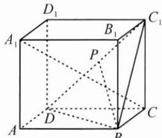
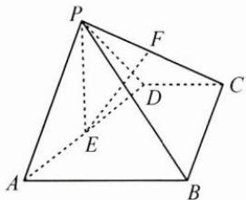
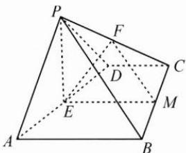
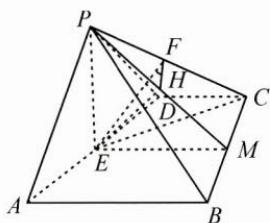
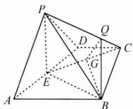
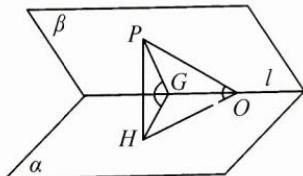

## 二典例示范

例 1 点 P 在正方体 $ABCD-A_{1}B_{1}C_{1}D_{1}$ 的侧面 $CDD_{1}C_{1}$ 及边界上运动，并保持 $BP \perp A_{1}C$ ，若正方体的棱长为 1，则 BP 的取值范围是 \_\_\_\_.

思路 要保持 $BP \perp A_{1}C$ ，则点 $P$ 必在过点 $B$ 且垂直于 $A_{1}C$ 的平面内，找到此辅助平面是解决问题的突破口。

解答 构造 $A_{1}C$ 的垂直平面 $BC_{1}D$ ，易得点 $P$ 在线段 $C_1D$ 上运动，如图.于是在正 $\triangle BC_{1}D$ 中，边长为 $\sqrt{2}$ ，得 $BP\in \left[\frac{\sqrt{6}}{2},\sqrt{2}\right]$

反思 本题的原理是: 直线垂直于平面, 则该直线必垂直于平面内的任何一条直线.

例 2 如图, 在四棱锥 P-ABCD 中, $\triangle PAD$ 为等边三角形, 四边形 ABCD 为直角梯形, $CD \parallel AB$ , $BC \perp AB$ , 平面 $PAD \perp$ 平面 ABCD, E, F 分别

为 AD, CP 的中点, AD = AB = 2CD = 2.

(1) 证明: 直线 $EF \parallel$ 平面 $PAB$ ;

(2)求直线 EF 与平面 PBC 所成角的正弦值；

(3)求二面角 E-PC-B 的余弦值.

思路 第(1)问关键在于构造平面 PAB 的平行平面(即辅助平面).

对于第(2)问,欲过点 E 作平面 PBC 的垂线,先找过点 E 且垂直于平面 PBC 的辅助平面.

对于第(3)问,在(2)的基础上,由于辅助平面 EFH 与棱 PC 垂直,则该平面与两个半平面的交线所成角就是二面角 E-PC-B 的平面角.若不考虑(2)的铺垫,则可在辅助平面 ABCD 中构造平面 PEC 的垂线,再由三垂线法确定二面角的平面角.

解答 (1)如图1,取BC的中点M,连接EM,FM,则 $EM\parallel AB$ .

因为 $EM \not\subset$ 平面 $PAB, AB \subset$ 平面 $PAB$ , 所以 $EM \parallel$ 平面 $PAB$ .

因为 $FM \parallel PB, FM \not\subset$ 平面 $PAB, PB \subset$ 平面 $PAB$ , 所以 $FM \parallel$ 平面 $PAB$ .

而 $EM \cap FM = M$ ，故平面 $FEM \parallel$ 平面 $PAB$ . 因为 $EF \subset$ 平面 $FEM$ ，所以 $EF \parallel$ 平面 $PAB$ .

图1

图2

(2)如图2,连接PM,作 $EH\perp PM$ 于点H,连接FH.

因为平面 $PAD \perp$ 平面 ABCD，交线为 AD，在正 $\triangle PAD$ 中， $PE \perp AD$ ，所以 $PE \perp$ 平面 ABCD，所以 $PE \perp BC$ 。

又因为 $EM \perp BC, EM \cap PE = E$ ，所以 $BC \perp$ 平面 PEM，

因为 $BC \subset$ 平面 PBC, 所以平面 $PBC \perp$ 平面 PEM.

因为 $EH \perp PM$ ，平面 $PBC \cap$ 平面 PEM = PM，所以 $EH \perp$ 平面 PBC，所以 $\angle EFH$ 是直线 EF 与平面 PBC 所成角.

在 Rt△PEM 中， $EH=\frac{PE\cdot EM}{PM}=\frac{\sqrt{3}\times\frac{3}{2}}{\sqrt{3+\frac{9}{4}}}=\frac{3}{7}\sqrt{7}$ ，

连接 $EC$ ，在 $\mathrm{Rt}\triangle PEC$ 中， $EF = \frac{PC}{2} = \frac{\sqrt{6}}{2},$

所以 $\sin\angle EFH=\frac{EH}{EF}=\frac{\sqrt{42}}{7}.$

(3) 解法 1: 由 (2) 知 $EH \perp$ 平面 $PBC$ , 则 $PC \perp EH$ .

又因为 $PC \perp EF, EF \cap EH = E$ ，所以 $PC \perp$ 平面 EFH，

所以 $PC \perp FE, PC \perp FH, \angle EFH$ 是二面角 E - PC - B 的平面角，

$$
\cos \angle E F H = \sqrt {1 - \sin^ {2} \angle E F H} = \frac {\sqrt {7}}{7}.
$$

解法 2: 如图 3, 过点 B 作 EC 的垂线, 垂足为 G, 再作 $GQ \perp PC$ 于点 Q, 连接 QB.

因为 $PE \perp$ 平面 ABCD, $PE \subset$ 平面 PEC,

所以平面 $ABCD \perp$ 平面 PEC.

图3

又因为平面 $ABCD \cap$ 平面 PEC = EC,

连接 BE, 在正△BEC 中, $BG \perp EC$ , 所以 $BG \perp$ 平面 PEC.

因为 $GQ \perp PC$ ，由三垂线定理得 $BQ \perp PC$ ，

所以 $\angle GQB$ 是二面角 $E - PC - B$ 的平面角.

在正 $\triangle BEC$ 中， $BG = \frac{3}{2}$

在等腰 Rt△PEC 中， $QG=\frac{CG}{\sqrt{2}}=\frac{\sqrt{3}}{2\sqrt{2}}=\frac{\sqrt{6}}{4}$

所以 $\tan \angle GQB = \frac{BG}{QG} = \sqrt{6}$ ，从而 $\cos \angle GQB = \frac{\sqrt{7}}{7}$

反思 发现第(2)问的线面角和第(3)问的二面角大小相同,自然引发思考:在一般情况下,线面角和二面角有什么关系?

如图，在二面角 $\alpha - l - \beta$ 中， $OP \subset$ 平面 $\beta, O \in l$ ，作

$PH \perp$ 平面 $\alpha$ 于点 $H$ , 则 $\angle POH$ 是直线 $OP$ 与平面 $\alpha$ 所成角. 过垂足 $H$ 引交线 $l$ 的垂线 $HG$ , 连接 $GP$ , 则 $\angle PGH$ 是二面角 $\alpha - l - \beta$ 的平面角.

从定性角度看, 有 $\angle POH \leqslant \angle PGH$ ; 从定量角度看, 则有三正弦定理 $\sin \angle PGH \cdot \sin \angle POG = \sin \angle POH$ , 可记忆为二面角的正弦值乘线棱角的正弦值等于线面角的正弦值, 因此, 当 $\angle POG = 90^{\circ}$ , 即点 $O$ 与点 $G$ 重合时, $\angle POH = \angle PGH$ .

