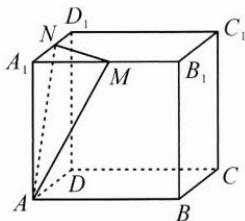

<!-- question-source:start -->
1. 如图, 在棱长为 2 的正方体 $ABCD-A_{1}B_{1}C_{1}D_{1}$ 中, $M,N$ 分别是棱 $A_{1}B_{1}, A_{1}D_{1}$ 的中点, 动点 $O$ 在正方体表面上运动, 使得 $BO \parallel$ 平面 $AMN$ , 则点 $O$ 的轨迹长度为 \_\_\_\_.

<!-- question-source:end -->

![[Q00009951A1]]
