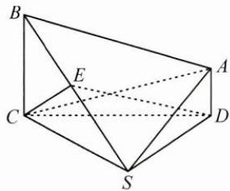

<!-- question-source:start -->
2. 如图, 在四棱锥 $S - ABCD$ 中, $AD \parallel BC$ , $AD \perp CD$ , 平面 $CSD \perp$ 平面 $ABCD$ , $CS \perp DS$ , $CS = 2AD = 2$ , $E$ 为 $BS$ 的中点, $CE = \sqrt{2}$ , $AS = \sqrt{3}$ .

(1)求点 A 到平面 BCS 的距离；

(2)求二面角 E-CD-A 的大小.
<!-- question-source:end -->

![[Q00009952A1]]
