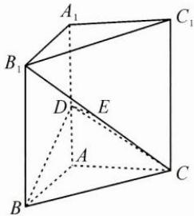

<!-- question-source:start -->
3. 如图，在直三棱柱 $ABC-A_{1}B_{1}C_{1}$ 中， $\angle BAC=90^{\circ}, AB=AC=1, D, E$ 分别为 $AA_{1}, B_{1}C$ 的中点.

(1) 证明: $DE \perp$ 平面 $BCC_{1}B_{1}$ ;

(2)已知 $B_{1}C$ 与平面 BCD 所成的角为 $30^{\circ}$ ，求二面角 $D - BC - B_{1}$ 的余弦值.

<!-- question-source:end -->

![[Q00009953A1]]
