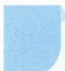

# 72 模型法

## 方法介绍

模型法在高中数学中分为两个层面: 其一是在实际问题中, 通过分析数据、观察特征, 进行抽象、构建, 得到函数、数列、排列组合或统计与概率的模型, 转而用数学的方法来解决问题; 其二是在具体的数学问题中, 追根溯源, 发现背景, 将问题归结为一个或者多个基本模型, 这就需要在平时学习中及时总结模型, 用对应的策略来处理.

![[高中/思维方法/高中数学思想方法导引2023版/72_模型法/典例示范/典例示范.md]]
![[高中/思维方法/高中数学思想方法导引2023版/72_模型法/巩固练习/巩固练习.md]]
