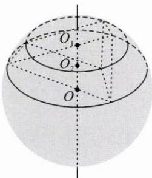
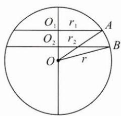
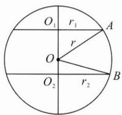

## (二)几何对称中发现模型

例 2 已知正三棱台的高为 1, 上、下底面边长分别 $3 \sqrt{3}, 4 \sqrt{3}$ , 其顶点都在同一球面上, 则该球的表面积为 \_\_\_\_.

思路 先找到上、下底面的圆心，并确定外接圆的大小，再在垂直于上、下底的截面图中求解.

解答

图1

图2

图3

如图 1, 由正三棱台知, 上、下底面都是正三角形, 且外心连线垂直于底面, 分别设上、下底面的外接圆圆心为 $O_{1}, O_{2}$ , 半径为 $r_{1}, r_{2}$ ,

则 $r_{1}=\frac{\sqrt{3}}{3}\times3\sqrt{3}=3,r_{2}=\frac{\sqrt{3}}{3}\times4\sqrt{3}=4.$ 作过外接球球心且垂直于上、下底的截面.
情况一: 上、下底面在球心同一侧(如图2).
设外接球半径为 $r, OO_{2}=x, O_{1}O_{2}=1$ ,
注意到 $\triangle OAO_{1}$ 和 $\triangle OBO_{2}$ 都以 r 为斜边长，
有 $r_{2}^{2}+x^{2}=r^{2}=r_{1}^{2}+(x+1)^{2}$ 解得 x=3，则 r=5，根据球的表面积公式可得 $S=100\pi$ .
情况二: 上、下底面在球心两侧(如图3).
设外接球半径为 r, $OO_{2}=x, O_{1}O_{2}=1$ ,
注意到 $\triangle OAO_{1}$ 和 $\triangle OBO_{2}$ 都以 r 为斜边长，
有 $r_{2}^{2}+x^{2}=r^{2}=r_{1}^{2}+(1-x)^{2}$ ，解得 x=-3<0，故舍去.
综上，该球表面积为 $100\pi$ .

反思 本题涉及外接球模型,本质是确定球心和半径,关键在于发现立体图形中存在的对称性.正棱台绕轴线 $O_{1}O_{2}$ 旋转特定角度后可以与原图形重合,且轴线垂直于上、下底面,所以作过 $O_{1}O_{2}$ 的截面,可以把立体几何问题转化为平面几何问题.

实际上，对直棱柱、正棱台、正棱锥（可认为是特殊的棱台），都可以这样处理。特别地，对于长方体，其外接球直径等于其体对角线长，也可以衍生出其他模型，即对于一些比较特殊的几何体，利用前面的补形法，将其补为长方体，使原几何体的顶点都落在长方体的顶点上，那么根据长方体的特殊性质，能很快得到外接球半径。
