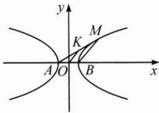

## (三)圆锥曲线中巧用模型

例 3 已知 A, B 为双曲线 E 的左、右顶点，点 M 在 E 上（不同于点 A, B）， $\triangle ABM$ 为等腰三角形，且顶角为 $120^{\circ}$ ，则 E 的离心率为 \_\_\_\_.

思路 过双曲线上除顶点外一点 $M$ 分别与两顶点 $A, B$ 作直线，两条直线的斜率乘积 $k_{AM} \cdot k_{BM} = \frac{b^2}{a^2} = e^2 - 1$ ，为定值，且仅与离心率相关。由题设中几何关系分别计算出直线 $AM, BM$ 的斜率，进而由上述模型求解离心率。

解答 如图,不妨设双曲线方程为 $\frac{x^{2}}{a^{2}}-\frac{y^{2}}{b^{2}}=1(a>0,b>0)$ ,

取 AM 的中点 K，因为 $OK \parallel BM$ ，所以 $k_{AM} \cdot k_{BM} = k_{AM} \cdot k_{OK}$ .

对双曲线上任意两点 $(x_{1},y_{1}),(x_{2},y_{2})$ ,

有 $\left\{\begin{aligned}\frac{x_{1}^{2}}{a^{2}}-\frac{y_{1}^{2}}{b^{2}}&=1\\ \frac{x_{2}^{2}}{a^{2}}-\frac{y_{2}^{2}}{b^{2}}&=1\end{aligned}\right.$ ①，②，

①-②，得 $\frac{(x_1 - x_2)(x_1 + x_2)}{a^2} -\frac{(y_1 - y_2)(y_1 + y_2)}{b^2} = 0,$

此处取 $A(x_{1},y_{1}),M(x_{2},y_{2})$ ，则 $K\left(\frac{x_1 + x_2}{2},\frac{y_1 + y_2}{2}\right)$

故 $k_{AM} \cdot k_{OK} = \frac{y_2 - y_1}{x_2 - x_1} \cdot \frac{y_1 + y_2}{x_1 + x_2} = \frac{b^2}{a^2}$ .

由等腰三角形的几何性质知 $k_{AM}=\tan30^{\circ}, k_{BM}=k_{OK}=\tan60^{\circ}$

可知 $\frac{b^{2}}{a^{2}}=k_{AM}\cdot k_{BM}=1$ ，故离心率 $e=\sqrt{2}$ .

## 反思 本题可按解答给出的方法利用点差法逐步求解,但涉及过双曲线顶点的直线时,可尝试以斜率乘积为定值的模型为突破口,打开思路,从而大幅度简化求解过程.对于该类问题,可总结抽象出如下结论.

记双曲线 $\frac{x^2}{a^2} -\frac{y^2}{b^2} = 1(a > 0,b > 0)$ 的左、右顶点分别为 $A,B$ ，对双曲线上除顶点外一点 $M,k_{AM}\cdot k_{BM} = \frac{b^2}{a^2} = e^2 -1;$

记椭圆 $\frac{x^2}{a^2} +\frac{y^2}{b^2} = 1(a > b > 0)$ 的左、右端点分别为 $A,B$ ，对椭圆上除左、右端点外一点 $M,k_{AM}\cdot k_{BM} = -\frac{b^2}{a^2} = e^2 -1.$

当 $e = 0$ 时，对应的圆锥曲线为圆，有 $k_{AM} \cdot k_{BM} = -1$ ，故该模型也可理解为“圆的直径所对的圆周角为直角”的推广.

