<!-- source-part:1 pages:1-200 -->

# Mathematics 高中数学 思想方法导引

主编 张金良

副主编 江战明 杨帆

72位高中数学名师联合编著
字典式实用解题方法工具书

# 高中数学思想方法导引

主 编 张金良

副主编 江战明 杨帆

编 委 （按姓氏笔画排列）

王野 王勇强 毕里兵 江琦

严兴光 顾予恒 景芳 谢丽丽

## 图书在版编目(CIP)数据

高中数学思想方法导引 / 张金良主编. — 杭州：

浙江大学出版社，2023.5

ISBN 978-7-308-23640-9

I. ①高… II. ①张… III. ①中学数学课—高中—教学参考资料 IV. ①G634.603

中国国家版本馆 CIP 数据核字(2023)第 059378 号

## 高中数学思想方法导引

主编 张金良

策划编辑 陈海权(QQ:1010892859)

责任编辑 董文

责任校对 陈海权

封面设计 林智广告

出版发行 浙江大学出版社
(杭州市天目山路148号 邮政编码310007)
(网址：http://www.zjupress.com)

排版 杭州星云光电图文制作有限公司

印刷 杭州高腾印务有限公司

开本 $787\mathrm{mm}\times 1092\mathrm{mm}$ 1/16

印 张 20.75

字 数 398 千

版印次 2023年5月第1版 2023年5月第1次印刷

书号 ISBN 978-7-308-23640-9

定价 59.80 元

版权所有 翻印必究 印装差错 负责调换

浙江大学出版社市场运营中心联系方式：0571-88925591；http://zjdxcbs.tmall.com

# 编写人员及单位

沈良 杭州市萧山区第五高级中学
范东晖 浙江省北仑中学
滕诗媛 温州市第八高级中学
沈瑜 桐乡市高级中学
张金良 浙江省教育厅教研室
李红 浙江省严州中学新安江校区
刘美良 浙江省绍兴鲁迅中学
曲文瑞 杭州师范大学附属未来科技城学校
庞海燕 杭州市余杭高级中学
张雪芳 浙江省萧山中学
俞海东 浙江省嵊州中学
陈巴尔 浙江省温州中学
李学军 杭州师范大学附属未来科技城学校
张春杰 杭州学军中学
邵琳华 浙江省绍兴市阳明中学
王雅萍 东阳市第二高级中学
叶秋平 杭州学军中学
龚超群 浙江省武义第一中学
赵朕博 浙江省湖州中学
许彪 浙江省台州中学
何承生 浙江师范大学附属中学
王一行 绍兴市第一中学刘娇 浙江省安吉县昌硕高级中学
景芳 杭州师范大学附属中学
谢丽丽 浙江省杭州第二中学
王凯 杭州市源清中学
陈坚 诸暨市牌头中学
曹良华 杭州市余杭高级中学
王勇强 湖州市教科研中心
祝玲 浙江省兰溪市第一中学
竺吴辉 浙江省北仑中学
周洁 杭州学军中学
韩新蕾 安吉县昌硕高级中学
杨帆 浙江省杭州第二中学
毕里兵 浙江省台州中学
骆银海 诸暨市教育研究中心
李雪纯 浙江省温州市第八高级中学
沈志强 浙江省临安中学
寿利军 浙江省诸暨二中
林新华 浙江省温岭中学
姚恒 浙江省湖州中学
余海东 义乌市教育研修院
吴贤盛 浙江省金华第一中学
王鑫 义乌市青岩书院
顾钰萍 浙江省湖州中学
顾予恒 杭州第二中学钱江学校
江琦 杭州市余杭第一中学朱祖煌 浙江省诸暨中学
代云龙 浙江省金华市外国语学校
陈锋 浙江省义乌市第三中学
钱方 浙江省永嘉中学
赵洋 浙江省新昌中学
张洁 浙江省绍兴市阳明中学
俞颂吉 杭州市源清中学
叶根福 浙江省杭州高级中学
吴仲玲 浙江省义乌中学
王华 桐乡市教育局教研科研室
李璜 浙江省嘉兴当湖高中
刘勇 杭州市余杭第一中学
胡艺 杭州市余杭中学
叶灵娅 浙江省温岭中学
许颖洲 浙江大学附属中学
王燕萍 浙江省桐庐中学
林洁 杭州市余杭高级中学
王野 浙江省台州中学
项莉敏 浙江省台州中学
骆永明 浙江省绍兴市第一中学
蒋吉林 浙江省龙泉市第一中学
林建平 浙江省龙泉市第一中学
陈碧文 浙江省宁波市正始中学
杨洁 浙江省鄞州中学
徐小芳 杭州学军中学海创园学校

## 前言

数学方法是人们以数学为工具认识世界和改造世界时所使用的方法,主要包括数学发现的一般方法(如观察与实验、分析与综合、比较与分类以及一般化与特殊化等),数学推理常用的策略性方法(如整体把握、代数思维、数形结合等),解决数学问题常用的技巧性方法(如换元法、待定系数法、反证法、递推法等).本书是以新课标、新教材、新高考为指导的思想方法工具书,它由浙江省11地市72位名校名师编写,精选了高中数学解题中诸如公式法、配方法、换元法、消元法、定义法、判别式法、分析法、综合法、同一法、作差法、作商法、构造法、基本量法、模型法、对称法、增量法、枚举法、面积法、待定系数法、观察法、反证法、赋值法、配凑法、点差法等使用较多、应用较广的72种数学思想方法,这些方法都是破解当前高中数学学习疑难点的重要方法.72位名师呕心沥血,数易其稿,每位名师精心打磨其中的一种方法.每种方法均由方法介绍(特点和作用)、典例示范、巩固练习三个部分组成:方法介绍言简意赅,主要阐明了方法的内涵、解题对象、适用范围和使用策略;典例示范以精选或自编的难度适中、简洁新颖的典型例题为示范进行讲解,力求体现方法的应用,包含思路、解答、反思三部分;巩固练习是方法的应用实践,也是典例示范的有力补充.

本书还具有方法全面、例题新颖、难易适中、普适性强的特点。本书的作者均为新课标、新教材、新高考的实践者，写作内容始终围绕高中数学学习中的难点、疑点展开，对引导学生系统理解和掌握处理各类问题的方法具有提纲挈领的作用。

本书是张金良名师工作室为广大读者呈上的一部对高中数学学习有所助力的精品图书，适合高二、高三年级学生及高中数学教师阅读。

## 目录

1 公式法 …… 1 25 变更主元 …… 90 49 递推法 …… 183
2 配方法 …… 4 26 数形结合 …… 94 50 进退互用 …… 187
3 换元法 …… 8 27 命题转换 …… 99 51 不动点 …… 191
4 消元法 …… 11 28 整体考虑 …… 103 52 倒序相加法 … 197
5 定义法 …… 14 29 局部处理 …… 106 53 同除一式 …… 201
6 判别式法 …… 18 30 变量分离法 … 110 54 倒置变换 …… 204
7 分析法 …… 21 31 适度放缩 …… 115 55 两边取对数 … 207
8 综合法 …… 25 32 均值代换 …… 120 56 平方开方 …… 209
9 比较法 …… 30 33 借助数轴 …… 123 57 累差累商 …… 213
10 构造法 …… 34 34 均值不等式 … 126 58 分组求和 …… 217
11 基本量法 …… 39 35 柯西不等式 … 131 59 增项减项 …… 221
12 对称法 …… 42 36 变角变次 …… 134 60 数学归纳法 … 224
13 增量法 …… 46 37 “1”的代换 … 137 61 错位相减 …… 228
14 导数法 …… 50 38 差异分析法 … 140 62 解析法 …… 231
15 枚举法 …… 53 39 边角互化 …… 143 63 点差法 …… 235
16 向量法 …… 58 40 和差代换 …… 147 64 设而不求 …… 240
17 面积法 …… 62 41 三角代换 …… 152 65 参数法 …… 244
18 待定系数法 … 66 42 齐次化 …… 155 66 插空法 …… 248
19 排除法 …… 69 43 构造对偶 …… 159 67 捆绑法 …… 251
20 正难则反 …… 72 44 合一变形 …… 161 68 隔板法 …… 254
21 裂项法 …… 75 45 差积互化 …… 166 69 等体积法 …… 256
22 赋值法 …… 79 46 基向量法 …… 169 70 补形法 …… 261
23 估算法 …… 83 47 极化恒等式 … 175 71 辅助平面法 … 265
24 配凑法 …… 86 48 等高线 …… 179 72 模型法 …… 270
巩固练习答案 ………

![[高中/思维方法/高中数学思想方法导引2023版/01_公式法/01_公式法.md]]
![[高中/思维方法/高中数学思想方法导引2023版/02_配方法/02_配方法.md]]
![[高中/思维方法/高中数学思想方法导引2023版/03_换元法/03_换元法.md]]
![[高中/思维方法/高中数学思想方法导引2023版/04_消元法/04_消元法.md]]
![[高中/思维方法/高中数学思想方法导引2023版/05_定义法/05_定义法.md]]
![[高中/思维方法/高中数学思想方法导引2023版/06_判别式法/06_判别式法.md]]
![[高中/思维方法/高中数学思想方法导引2023版/07_分析法/07_分析法.md]]
![[高中/思维方法/高中数学思想方法导引2023版/08_综合法/08_综合法.md]]
![[高中/思维方法/高中数学思想方法导引2023版/09_比较法/09_比较法.md]]
![[高中/思维方法/高中数学思想方法导引2023版/10_构造法/10_构造法.md]]
![[高中/思维方法/高中数学思想方法导引2023版/11_基本量法/11_基本量法.md]]
![[高中/思维方法/高中数学思想方法导引2023版/12_对称法/12_对称法.md]]
![[高中/思维方法/高中数学思想方法导引2023版/13_增量法/13_增量法.md]]
![[高中/思维方法/高中数学思想方法导引2023版/14_导数法/14_导数法.md]]
![[高中/思维方法/高中数学思想方法导引2023版/15_枚举法/15_枚举法.md]]
![[高中/思维方法/高中数学思想方法导引2023版/16_向量法/16_向量法.md]]
![[高中/思维方法/高中数学思想方法导引2023版/17_面积法/17_面积法.md]]
![[高中/思维方法/高中数学思想方法导引2023版/18_待定系数法/18_待定系数法.md]]
![[高中/思维方法/高中数学思想方法导引2023版/19_排除法/19_排除法.md]]
![[高中/思维方法/高中数学思想方法导引2023版/20_正难则反/20_正难则反.md]]
![[高中/思维方法/高中数学思想方法导引2023版/21_裂项法/21_裂项法.md]]
![[高中/思维方法/高中数学思想方法导引2023版/22_赋值法/22_赋值法.md]]
![[高中/思维方法/高中数学思想方法导引2023版/23_估算法/23_估算法.md]]
![[高中/思维方法/高中数学思想方法导引2023版/24_配凑法/24_配凑法.md]]
![[高中/思维方法/高中数学思想方法导引2023版/25_变更主元/25_变更主元.md]]
![[高中/思维方法/高中数学思想方法导引2023版/26_数形结合/26_数形结合.md]]
![[高中/思维方法/高中数学思想方法导引2023版/27_命题转换/27_命题转换.md]]
![[高中/思维方法/高中数学思想方法导引2023版/28_整体考虑/28_整体考虑.md]]
![[高中/思维方法/高中数学思想方法导引2023版/29_局部处理/29_局部处理.md]]
![[高中/思维方法/高中数学思想方法导引2023版/30_变量分离法/30_变量分离法.md]]
![[高中/思维方法/高中数学思想方法导引2023版/31_适度放缩/31_适度放缩.md]]
![[高中/思维方法/高中数学思想方法导引2023版/32_均值代换/32_均值代换.md]]
![[高中/思维方法/高中数学思想方法导引2023版/33_借助数轴/33_借助数轴.md]]
![[高中/思维方法/高中数学思想方法导引2023版/34_均值不等式/34_均值不等式.md]]
![[高中/思维方法/高中数学思想方法导引2023版/35_柯西不等式/35_柯西不等式.md]]
![[高中/思维方法/高中数学思想方法导引2023版/36_变角变次/36_变角变次.md]]
![[高中/思维方法/高中数学思想方法导引2023版/37__1_的代换/37__1_的代换.md]]
![[高中/思维方法/高中数学思想方法导引2023版/38_差异分析法/38_差异分析法.md]]
![[高中/思维方法/高中数学思想方法导引2023版/39_边角互化/39_边角互化.md]]
![[高中/思维方法/高中数学思想方法导引2023版/40_和差代换/40_和差代换.md]]
![[高中/思维方法/高中数学思想方法导引2023版/41_三角代换/41_三角代换.md]]
![[高中/思维方法/高中数学思想方法导引2023版/42_齐次化/42_齐次化.md]]
![[高中/思维方法/高中数学思想方法导引2023版/43_构造对偶/43_构造对偶.md]]
![[高中/思维方法/高中数学思想方法导引2023版/44_合一变形/44_合一变形.md]]
![[高中/思维方法/高中数学思想方法导引2023版/45_差积互化/45_差积互化.md]]
![[高中/思维方法/高中数学思想方法导引2023版/46_基向量法/46_基向量法.md]]
![[高中/思维方法/高中数学思想方法导引2023版/47_极化恒等式/47_极化恒等式.md]]
![[高中/思维方法/高中数学思想方法导引2023版/48_等高线/48_等高线.md]]
![[高中/思维方法/高中数学思想方法导引2023版/49_递推法/49_递推法.md]]
![[高中/思维方法/高中数学思想方法导引2023版/50_进退互用/50_进退互用.md]]
![[高中/思维方法/高中数学思想方法导引2023版/51_不动点/51_不动点.md]]
![[高中/思维方法/高中数学思想方法导引2023版/52_倒序相加法/52_倒序相加法.md]]
![[高中/思维方法/高中数学思想方法导引2023版/53_同除一式/53_同除一式.md]]
![[高中/思维方法/高中数学思想方法导引2023版/54_倒置变换/54_倒置变换.md]]
![[高中/思维方法/高中数学思想方法导引2023版/55_两边取对数/55_两边取对数.md]]
![[高中/思维方法/高中数学思想方法导引2023版/56_平方开方/56_平方开方.md]]
![[高中/思维方法/高中数学思想方法导引2023版/57_累差累商/57_累差累商.md]]
![[高中/思维方法/高中数学思想方法导引2023版/58_分组求和/58_分组求和.md]]
![[高中/思维方法/高中数学思想方法导引2023版/59_增项减项/59_增项减项.md]]
![[高中/思维方法/高中数学思想方法导引2023版/60_数学归纳法/60_数学归纳法.md]]
![[高中/思维方法/高中数学思想方法导引2023版/61_错位相减/61_错位相减.md]]
![[高中/思维方法/高中数学思想方法导引2023版/62_解析法/62_解析法.md]]
![[高中/思维方法/高中数学思想方法导引2023版/63_点差法/63_点差法.md]]
![[高中/思维方法/高中数学思想方法导引2023版/64_设而不求/64_设而不求.md]]
![[高中/思维方法/高中数学思想方法导引2023版/65_参数法/65_参数法.md]]
![[高中/思维方法/高中数学思想方法导引2023版/66_插空法/66_插空法.md]]
![[高中/思维方法/高中数学思想方法导引2023版/67_捆绑法/67_捆绑法.md]]
![[高中/思维方法/高中数学思想方法导引2023版/68_隔板法/68_隔板法.md]]
![[高中/思维方法/高中数学思想方法导引2023版/69_等体积法/69_等体积法.md]]
![[高中/思维方法/高中数学思想方法导引2023版/70_补形法/70_补形法.md]]
![[高中/思维方法/高中数学思想方法导引2023版/71_辅助平面法/71_辅助平面法.md]]
![[高中/思维方法/高中数学思想方法导引2023版/72_模型法/72_模型法.md]]

# 巩固练习答案

## 1 公式法

1. B 【解析】由 $1=\tan(\alpha+\beta)=\frac{\tan\alpha+\tan\beta}{1-\tan\alpha\tan\beta}$ ,
得 $1=\tan\alpha+\tan\beta+\tan\alpha\tan\beta,$ 故 $(1+\tan\alpha)(1+\tan\beta)$ $=1+\tan\alpha+\tan\beta+\tan\alpha\tan\beta=2,$ 故选 B.

2. A 【解析】由 $\tan2\alpha=\frac{2\tan\alpha}{1-\tan^{2}\alpha}=\frac{2\sin\alpha\cos\alpha}{\cos^{2}\alpha-\sin^{2}\alpha}=\frac{\cos\alpha}{2-\sin\alpha}$ ，得 $\sin\alpha=\frac{1}{4}$ ，易得 $\tan\alpha=\frac{\sqrt{15}}{15}$ ，故选 A.

3.8 【解析】由 $(S_{4}-S_{2})^{2}=S_{2}(S_{6}-S_{4})$ ,
得 $S_{6}-S_{4}=\frac{(S_{4}-S_{2})^{2}}{S_{2}}=S_{2}+\frac{4}{S_{2}}+4\geqslant8,$ 当且仅当 $S_{2}=2$ 时取等号.
4. $\frac{\sqrt{5}}{2}$ 【解析】设 $A(x_{1},y_{1}), B(x_{2},y_{2})$ ,
根据焦半径公式， $|AF|=x_{1}+\frac{p}{2}=2,$ $|BF|=x_{2}+\frac{p}{2}=4$ ，得 $|x_{1}-x_{2}|=2$ 由 $|AB|=\sqrt{1+k^{2}}|x_{1}-x_{2}|=3$ ，且k>0，
得 $k=\frac{\sqrt{5}}{2}$ .

5.【解析】联想数量积公式 $\cos\theta=\frac{x_{1}x_{2}+y_{1}y_{2}}{\sqrt{x_{1}^{2}+y_{1}^{2}}\sqrt{x_{2}^{2}+y_{2}^{2}}}$ ,
得 $z=\frac{2x+y}{\sqrt{x^{2}+y^{2}}}=\sqrt{5}\frac{2\times x+1\times y}{\sqrt{2^{2}+1^{2}}\sqrt{x^{2}+y^{2}}}$ 记 $\overrightarrow{OA}=(2,1),\overrightarrow{OB}=(x,y)$ ，则z为向量$\overrightarrow{OA}, \overrightarrow{OB}$ 的夹角余弦值的 $\sqrt{5}$ 倍，且点 $B$ 在以(1,2)为圆心，1为半径的圆上，结合图象可知，当 $\overrightarrow{OB} = (0,2)$ 时， $\overrightarrow{OA}$ 与 $\overrightarrow{OB}$ 的夹角最大，此时 $z_{\min} = 1$

## 2 配方法

1. C 【解析】由定义知 $f(x)=(x-1)(x+3)+2x=x^{2}+4x-3=(x+2)^{2}-7$ ，利用一元二次函数的单调性可知选 C.

2.【解析】建立函数关系，用配方法化归为一次函数区间上的最值问题.
如图建系，则 $A(8,0)$ , $B(0,6)$ , $C(0,0)$ ，其内切圆方程为 $(x-2)^{2}+(y-2)^{2}=4$ ，设 $P(x,y)$ 是圆上的动点，
则 $S=|PA|^{2}+|PB|^{2}+|PC|^{2}$ $=(x-8)^{2}+y^{2}+x^{2}+(y-6)^{2}+x^{2}+y^{2}$ $=3[(x-2)^{2}+(y-2)^{2}]-4x-76$ $=3\times4-4x+76=88-4x.$ 题目即求 S 在 [0,4] 上的最值，
由单调性得 $S_{max}=88, S_{min}=72.$

3.【解析】设 $u = \sin x + \cos x = \sqrt{2}\sin \left(x + \frac{\pi}{4}\right)$ $\in [-\sqrt{2},\sqrt{2} ]$ 则 $y = \frac{u^2 - 1}{2} +u = \frac{1}{2} (u + 1)^2 -1,$

当 $u = \sqrt{2}$ 时， $y$ 在 $[- \sqrt{2}, \sqrt{2}]$ 上的最大值为 $\frac{1}{2} + \sqrt{2}$ .

4.1【解析】对原式配方，得 $S = x^{2} + 2xy + y^{2} + 2x + 2y + 2y^{2} + 4y + 4$ $= (x + y)^{2} + 2(x + y) + 1 + 2(y + 1)^{2} + 1$ $= (x + y + 1)^{2} + 2(y + 1)^{2} + 1\geqslant 1,$ 当且仅当 $x = 0,y = -1$ 时取等号.

5. -2 【解析】由题意可得 $c = \frac{5}{8}(2a + b)^2$ $+\frac{3}{8} (2a - 3b)^2 \geqslant \frac{5}{8} (2a + b)^2,$ 当且仅当 $2a = 3b$ 时取等号，所以 $|2a + b|_{\max} = \sqrt{\frac{8}{5} c},$ 此时 $a = \frac{3}{2} b, c = 10b^2.$ 所以 $\frac{3}{a} - \frac{4}{b} + \frac{5}{c} = \frac{1}{2}\left(\frac{1}{b} - 2\right)^2 - 2 \geqslant -2.$

## 3 换元法

1. ABD 【解析】正数 a, b 满足 $a^{2} + b^{2} = 1$ ，则可设 $a = \sin\theta, b = \cos\theta, \theta \in \left(0, \frac{\pi}{2}\right)$ .
对于 A, $a + b = \sin\theta + \cos\theta = \sqrt{2} \sin\left(\theta + \frac{\pi}{4}\right)$ ，当 $\theta = \frac{\pi}{4}$ 时， $a + b$ 取得最大值 $\sqrt{2}$ ，故 A 正确.
对于 B, $ab = \sin\theta \cos\theta = \frac{1}{2} \sin 2\theta$ , 当 $\theta = \frac{\pi}{4}$ 时, ab 取得最大值 $\frac{1}{2}$ ，故 B 正确.
对于 C, $a - b = \sin\theta - \cos\theta = \sqrt{2} \sin\left(\theta - \frac{\pi}{4}\right)$ ，由于 $\theta - \frac{\pi}{4} \in \left(-\frac{\pi}{4}, \frac{\pi}{4}\right)$ ，所以 a - b 没有最小值，故 C 错误.
对于 D, $\frac{a}{b-2}$ 表示圆 $a^{2}+b^{2}=1$ 上的点 (b, a) 与点 P(2,0) 的连线的斜率，如图.

由图可知, 当过点 P 的直线与圆相切时, $\frac{a}{b-2}$ 取得最值, 易知 $\angle OPD = 30^{\circ}$ , 切线
PD 的倾斜角为 $150^{\circ}$ ，斜率为 $-\frac{\sqrt{3}}{3}$ ，为 $\frac{a}{b-2}$ 的最小值，故 D 正确.
故选 ABD.

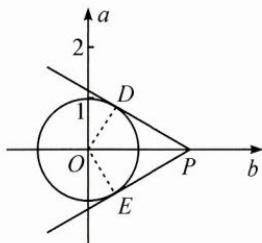

2.3 【解析】设 $x=1+t_{1}, y=1+t_{2}, z=1+t_{3}$ ，且 $t_{1}+t_{2}+t_{3}=0$ ，
则 $x^{2}+y^{2}+z^{2}$ $=(1+t_{1})^{2}+(1+t_{2})^{2}+(1+t_{3})^{2}$ $=3+2(t_{1}+t_{2}+t_{3})+t_{1}^{2}+t_{2}^{2}+t_{3}^{2}\geqslant3.$

3.【解析】 $f(x)=9^{x}-3^{x+1}+c$ $=(3^{x})^{2}-3\cdot3^{x}+c$ 设 $t=3^{x}$ ，当 $x\in[0,1]$ 时， $t\in[1,3]$ ，

则 $g(t)=t^{2}-3t+c<0$ 恒成立，

参变分离得 $c<-t^{2}+3t$ 在 $t\in[1,3]$ 上恒成立，可得 c<0，即 c 的取值范围为 $(-∞,0)$ .

## 4 消元法

1.4 【解析】 $a^{2}-10ac+25c^{2}=(a-5c)^{2}\geqslant0$ $a^{2}+\frac{1}{ab}+\frac{1}{a(a-b)}=a^{2}+\frac{1}{b(a-b)}\geqslant a^{2}+\frac{4}{a^{2}}$ $\geqslant4$ , 经检验等号能取到.

2. $\left[\frac{1}{3},3\right]$ 【解析】定比点差法,用整体消元思想,过程略.

3.【解析】(1)略.
(2)由题意知 $\frac{\ln a+1}{a}=\frac{\ln b+1}{b}$ ,
利用比值换元,不妨令 $t=\frac{a}{b},t\in(0,1)$ ,
同例2得到结论的左侧部分.

右侧部分先换元，令 $x_{1} = \frac{1}{a}, x_{2} = \frac{1}{b}$ ，将问题转化为“已知 $f(x_{1}) = f(x_{2})$ ，证明 $x_{1} + x_{2} < e$ ”，利用单调性和消元的思想，构造函数 $y = f(x) - f(e - x)$ ， $0 < x < 1$ ，进而得证。

## 5 定义法

1. $\left[0,\frac{\sqrt{2}}{4}\right]$ 【解析】设 $m=\sin x, n=\cos x$ ，则 $y=\frac{mn}{m+n}$ ，由三角函数的定义知 $P(m,n)$ 是角 x 与单位圆的交点，利用基本不等式可得结论.

2. $\pm 4\sqrt{5}$ 【解析】 $\sqrt{x^2 - 10\sqrt{3}x + 80} + \sqrt{x^2 + 10\sqrt{3}x + 80}$ $= \sqrt{(x - 5\sqrt{3})^2 + 5} + \sqrt{(x + 5\sqrt{3})^2 + 5}$ $= \sqrt{(x - 5\sqrt{3})^2 + y^2} + \sqrt{(x + 5\sqrt{3})^2 + y^2}$ $= 20$ ，其中 $y^{2} = 5$ 利用椭圆的定义即得 $x = \pm 4\sqrt{5}$

3.【解析】设 $\angle PF_{1}F_{2} = \theta$ ，由椭圆的定义及 $\triangle F_1F_2P$ 是等腰三角形得 $8\cos \theta +4 = 6$ 得 $\tan \theta = \pm \sqrt{15}$ ，因为 $P$ 是上半椭圆上一点，所以直线 $PF_{1}$ 的斜率是 $\sqrt{15}$

4.【解析】 $|PA|+|PB|$ $=(|PA|+|C_{1}A|)+(|PB|+|C_{2}B|)-2$ $\geqslant |PC_{1}| + |PC_{2}| - 2 = 18.$

5.【解析】(1)对于第一个数列，
有 $|2-3|=1,|5-3|=2,|1-3|=2$ 满足题意，该数列具有性质 p；
对于第二个数列，
有 $|3-4|=1,|2-4|=2,|5-4|=1,$ $|1-4|=3$ 不满足题意，该数列不具有性质 p.
(2) $q\in(-\infty,-2]\cup(0,+\infty)$ .
由题意， $|q^{n}-1|\geqslant|q^{n-1}-1|$ ， $n\in$ $\{2,3,\cdots,9\}$ ,

两边平方得 $q^{2n} - 2q^n + 1 \geqslant q^{2n-2} - 2q^{n-1} + 1$ , 整理得 $(q-1)q^{n-1}[q^{n-1}(q+1)-2] \geqslant 0$ , 分 $q \geqslant 1, 0 < q < 1, -1 < q < 0, q \leqslant -1$ 四类讨论可解.

## 6 判别式法

1. $\frac{2\sqrt{3}}{3}$ 【解析】将条件变形为 $y^{2} + xy + x^{2}$ $-1 = 0, \Delta = x^{2} - 4(x^{2} - 1) \geqslant 0$ ，解得 $-\frac{2\sqrt{3}}{3} \leqslant x \leqslant \frac{2\sqrt{3}}{3}$ ，故 $x_{\max} = \frac{2\sqrt{3}}{3}$ .

2.2 【解析】由题意得 $b^{2}=x^{2}+y^{2}-\sqrt{3}xy$ ，于是有 $y^{2}-\sqrt{3}xy+x^{2}-b^{2}=0$ ，因为 y 为实数，所以 $\Delta=(\sqrt{3}x)^{2}-4(x^{2}-b^{2})\geqslant0$ ，即 $4b^{2}\geqslant x^{2}$ ，所以 $\frac{|x|}{|b|}\leqslant2$ .

3. ±4; 3 【解析】将函数变形为 $yx^{2}-ax+y-b=0$ .
当 $y \neq 0$ 时，这个关于 x 的方程有解，
则 $\Delta = a^{2} - 4y(y - b) \geqslant 0$ 即 $4y^{2}-4by-a^{2}\leqslant0$ 由题设知 $y_{\min}=-1, y_{\max}=4$ 是方程 $4y^{2}-4by-a^{2}=0$ 的两个根，
根据韦达定理，
得 $b=(-1)+4,-\frac{a^{2}}{4}=(-1)\times4$ 解得 $a=\pm4, b=3$ 当 y=0 时， $a=\pm4, b=3$ 也满足题意.

4.【解析】将函数变形为 $4x^{2} - 2(2y - 1)x + y^{2} - 1 = 0, x \in \left(-\infty, \frac{1}{2}\right]$ , 从而得 $\Delta = [2(2y - 1)]^2 - 16(y^2 - 1) \geqslant 0$ , 解得 $y \leqslant \frac{5}{4}$ , 且当 $x = \frac{3}{8}$ 时, $y = \frac{5}{4}$ , 所以原函数的最大值是 $\frac{5}{4}$ , 无最小值.

## 7 分析法

1. C 【解析】对于 A, $\sqrt{3} + \sqrt{7} > 0$ 且 $2\sqrt{5} > 0$ ,$(\sqrt{3} + \sqrt{7})^2 < (2\sqrt{5})^2$ 是 $\sqrt{3} + \sqrt{7} < 2\sqrt{5}$ 的充分条件，A正确.
对于B， $(a^2 - 1)(b^2 - 1) \geqslant 0$ 变形可得 $a^2 b^2 - a^2 - b^2 + 1 \geqslant 0$ ，即 $a^2 + b^2 - 1 - a^2 b^2 \leqslant 0$ ，则 $(a^2 - 1)(b^2 - 1) \geqslant 0$ 是 $a^2 + b^2 - 1 - a^2 b^2 \leqslant 0$ 的充分条件，B正确.
对于C， $x_1 + x_2 > 4$ 且 $x_1 x_2 > 4$ 不能推出一元二次方程的两根 $x_1, x_2$ 都大于2，如 $x_1 = 1, x_2 = 5, C$ 错误.
对于D，若 $a + c = 2b$ ，则 $a, b, c$ 为等差数列，所以 $a + c = 2b$ 是 $a, b, c$ 为等差数列的充分条件，D正确.
故选C.

2.【解析】因为 $a > b > c, a + b + c = 0$ 所以 $a > 0, c < 0$ 要证 $\frac{\sqrt{b^2 - ac}}{a} < \sqrt{3}$ 只需证 $\sqrt{b^2 - ac} < \sqrt{3} a$ 只需证 $b^2 - ac < 3a^2$ 又 $b = -(a + c)$ ，只需证 $(a + c)^2 - ac < 3a^2$ 即证 $a^2 + c^2 + ac < 3a^2$ 即证 $(a - c)(2a + c) > 0$ 因为 $a - c > 0, 2a + c = a + c + a = a - b > 0$ 所以 $(a - c)(2a + c) > 0$ 成立，所以原不等式 $\frac{\sqrt{b^2 - ac}}{a} < \sqrt{3}$ 成立.

3.【解析】一方面，因为 $(\sin\theta+\cos\theta)^{2}=1+2\sin\theta\cos\theta,$ 故由已知得 $4\sin^{2}\alpha-2\sin^{2}\beta=1$ ①.
另一方面，要证 $\frac{1-\tan^{2}\alpha}{1+\tan^{2}\alpha}=\frac{1-\tan^{2}\beta}{2(1+\tan^{2}\beta)}$ 只需证 $\frac{1-\frac{\sin^{2}\alpha}{\cos^{2}\alpha}}{1+\frac{\sin^{2}\alpha}{\cos^{2}\alpha}}=\frac{1-\frac{\sin^{2}\beta}{\cos^{2}\beta}}{2\left(1+\frac{\sin^{2}\beta}{\cos^{2}\beta}\right)}$ 即证 $\cos^{2}\alpha-\sin^{2}\alpha=\frac{1}{2}(\cos^{2}\beta-\sin^{2}\beta)$ ,
即证 $1-2\sin^{2}\alpha=\frac{1}{2}(1-2\sin^{2}\beta)$ ,
即证 $4\sin^{2}\alpha-2\sin^{2}\beta=1$ ②.

①式与②式相同,故原命题得证.

4.【解析】(1)根据题意, 易得 $a_{2}=\frac{1}{2}$ , $a_{3}=\frac{1}{3}$ , 猜想 $a_{n}=\frac{1}{n}$ .
(2)考虑到待证式的右边是一个含 n 的表达式, 故设 $Q_{n}=\sqrt{2}\left(\sqrt{2n+1}-1\right)$ ,
记 $d_{n}=Q_{n}-Q_{n-1}=\sqrt{2}\left(\sqrt{2n+1}-\sqrt{2n-1}\right)$ ,
设 $S_{n}=\sqrt{a_{1}}+\sqrt{a_{2}}+\cdots+\sqrt{a_{n}}$ 欲证 $S_{n}<\sqrt{2}\left(\sqrt{2n+1}-1\right)$ ,
只需证 $\sqrt{a_{n}}=\frac{1}{\sqrt{n}}<d_{n}=\sqrt{2}\left(\sqrt{2n+1}-\sqrt{2n-1}\right)$ ,
只需证 $\frac{1}{2n}<2n+1+2n-1-2\sqrt{4n^{2}-1}$ ,
只需证 $\sqrt{4n^{2}-1}<2n-\frac{1}{4n}$ ,
只需证 $4n^{2}-1<4n^{2}-1+\frac{1}{16n^{2}}$ ，显然成立.
对 $\sqrt{a_{n}}=\frac{1}{\sqrt{n}}<d_{n}=\sqrt{2}\left(\sqrt{2n+1}-\sqrt{2n-1}\right)$ 两边分别求和，
有 $S_{n}<\sqrt{2}\left(\sqrt{2n+1}-1\right)$ 成立，得证.

## 8 综合法

1. B 【解析】如图, 过点 Q 作 $Q M \perp$ 准线 l 于点 M,
因为 $\overrightarrow{FP}=4\overrightarrow{FQ}$ ，所以 $\frac{|PQ|}{|PF|}=\frac{3}{4}$ ,
又 $\frac{\left|QM\right|}{4}=\frac{\left|PQ\right|}{\left|PF\right|}=\frac{3}{4}$ ，所以 $|QM|=3$ ，
由抛物线的定义知 $\left|QF\right|=\left|QM\right|=3$ .
故选 B.

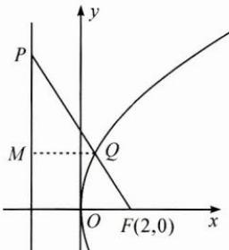

2. A 【解析】由 $\tan2\alpha=\frac{\cos\alpha}{2-\sin\alpha}$ ,
得 $\frac{\sin2\alpha}{\cos2\alpha}=\frac{2\sin\alpha\cos\alpha}{1-2\sin^{2}\alpha}=\frac{\cos\alpha}{2-\sin\alpha}$ 因为 $\alpha\in\left(0,\frac{\pi}{2}\right)$ ，所以 $\cos\alpha\neq0$ 则 $2\sin\alpha(2-\sin\alpha)=1-2\sin^{2}\alpha$ 解得 $\sin\alpha=\frac{1}{4}$ ，则 $\cos\alpha=\sqrt{1-\sin^{2}\alpha}=\frac{\sqrt{15}}{4}$ ，
所以 $\tan\alpha=\frac{\sin\alpha}{\cos\alpha}=\frac{\sqrt{15}}{15}$ . 故选 A.

3. $2\sqrt{2}$ 【解析】解法1：因为 $\frac{a_1 + a_2 + \cdots + a_n}{n} \geqslant \sqrt[n]{a_1a_2\cdots a_n}$ ，所以 $\frac{1}{a} + \frac{a}{b^2} + b = \frac{1}{a} + \frac{a}{b^2} + \frac{b}{2} + \frac{b}{2} \geqslant 4\sqrt[4]{\frac{1}{a} \cdot \frac{a}{b^2} \cdot \frac{b}{2} \cdot \frac{b}{2}} = 2\sqrt{2}$ ，当且仅当 $\frac{1}{a} = \frac{a}{b^2} = \frac{b}{2}$ 时等号成立，即当 $a = b = \sqrt{2}$ 时， $\frac{1}{a} + \frac{a}{b^2} + b$ 取得最小值 $2\sqrt{2}$ . 解法2：因为 $a > 0, b > 0$ ，所以 $\frac{1}{a} + \frac{a}{b^2} + b \geqslant 2\sqrt{\frac{1}{a} \cdot \frac{a}{b^2}} + b = \frac{2}{b} + b \geqslant 2\sqrt{\frac{2}{b} \cdot b} = 2\sqrt{2}$ ，当且仅当 $\frac{1}{a} = \frac{a}{b^2}$ 和 $\frac{2}{b} = b$ 同时成立，即 $a = b = \sqrt{2}$ 时等号成立.

4.(0,1)【解析】由题意， $f(x)=\left|e^{x}-1\right|=$ $\left\{\begin{aligned}1-e^{x},&x<0,\\ e^{x}-1,&x\geqslant0,\end{aligned}\right.$ 则 $f'(x)=\left\{\begin{aligned}-\mathrm{e}^{x},&x<0,\\ \mathrm{e}^{x},&x\geqslant0,\end{aligned}\right.$ 所以 $A(x_{1},1-\mathrm{e}^{x_{1}}),B(x_{2},\mathrm{e}^{x_{2}}-1)$ , $k_{AM}=-e^{x_{1}},k_{BN}=e^{x_{2}}$ 如图，由 $AM \perp BN$ 知 $-e^{x_{1}}e^{x_{2}}=-1$ 得 $x_{1}+x_{2}=0$

$AM: y-1+e^{x_{1}}=-e^{x_{1}}(x-x_{1}),$ $M(0, e^{x_{1}} x_{1} - e^{x_{1}} + 1),$ $|AM|=\sqrt{x_{1}^{2}+(e^{x_{1}}x_{1})^{2}}=\sqrt{1+e^{2x_{1}}}|x_{1}|,$ 同理， $|BN|=\sqrt{1+e^{2x_{2}}}|x_{2}|$ 所以 $\frac{|AM|}{|BN|}=\frac{\sqrt{1+e^{2x_{1}}}|x_{1}|}{\sqrt{1+e^{2x_{2}}}|x_{2}|}$ $=\sqrt{\frac{1+e^{2x_{1}}}{1+e^{2x_{2}}}}=\sqrt{\frac{1+e^{2x_{1}}}{1+e^{-2x_{1}}}}=e^{x_{1}}\in(0,1).$

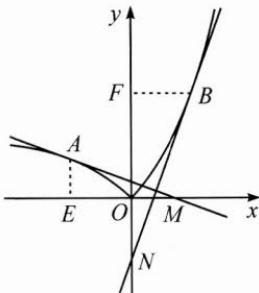

5.【解析】(1) $f(x)$ 的定义域为 $(-∞,a)$ ，
令 $g(x)=xf(x)=x\ln(a-x), x∈(-∞,a)$ 则 $g'(x)=\ln(a-x)+\frac{-x}{a-x}$ .
因为 x=0 是函数 $y=xf(x)$ 的极值点，
则有 $g'(0)=0$ ，即 $\ln a=0$ ，所以 a=1。
当 a=1 时， $g'(x)=\ln(1-x)+\frac{-x}{1-x}$ $=\ln(1-x)+\frac{-1}{1-x}+1,$ 且 $g'(0)=0$ ,
因为 $g''(x)=\frac{-1}{1-x}+\frac{-1}{(1-x)^{2}}=\frac{x-2}{(1-x)^{2}}<0,$ 则 $g'(x)$ 在 $(-∞,1)$ 上单调递减，
所以当 $x∈(-∞,0)$ 时， $g'(x)>0$ 当 $x∈(0,1)$ 时， $g'(x)<0$ x=0 是函数 $y=xf(x)$ 的极大值点.
综上所述，a=1.
(2)由(1)可知， $xf(x)=x\ln(1-x)$ ，
因为当 $x\in(-∞,0)$ 时， $x\ln(1-x)<0$ ，
当 $x\in(0,1)$ 时， $x\ln(1-x)<0$ ，
所以需证明 $x+\ln(1-x)>x\ln(1-x)$ ，
即证明 $x+(1-x)\ln(1-x)>0.$ 令 $h(x)=x+(1-x)\ln(1-x), x<1,$ 则 $h'(x)=(1-x)\cdot\frac{-1}{1-x}+1-\ln(1-x)$ $=\ln(1-x)$ , $h'(0)=0$ ,

当 $x\in(-\infty,0)$ 时， $h'(x)<0$ ,

当 $x\in(0,1)$ 时， $h'(x)>0$ ,

所以 x=0 为 $h(x)$ 的极小值点，

所以 $h(x)>h(0)=0$ ,

即 $x+\ln(1-x)>x\ln(1-x)$ ,

故 $\frac{x+\ln(1-x)}{x\ln(1-x)}<1$ , 即 $\frac{x+f(x)}{xf(x)}<1$ 得证.

## 9 比较法

1. C 【解析】利用单调性比较法.
由 $f(x)$ 为偶函数知 $f\left(\log_{3}\frac{1}{4}\right)=f\left(-\log_{3}4\right)$ $=f\left(\log_{3}4\right)$ ，而 $0<2^{-\frac{3}{2}}<2^{-\frac{2}{3}}<1<$ $\log_{3}4$ ，且 $f(x)$ 在 $(0,+\infty)$ 上单调递减，
故选 C.

2. D 【解析】利用作商比较法.
令 $2^{x}=3^{y}=5^{z}=k$ ，其中 k>1，
则有 $x=\log_{2}k, y=\log_{3}k, z=\log_{5}k,$ $\frac{2x}{3y}=\frac{2\lg k}{\lg2}\cdot\frac{\lg3}{3\lg k}=\frac{\lg9}{\lg8}>1,$ 则 2x>3y，排除 A，B；
再比较 2x 与 5z， $\frac{2x}{5z}=\frac{2\lg k}{\lg2}\cdot\frac{\lg5}{5\lg k}=\frac{\lg25}{\lg32}<1$ ，则 2x<5z.
故选 D.

3. A 【解析】利用单调性比较法.
由 $2^{x}-2^{y}<3^{-x}-3^{-y}$ 得 $2^{x}-3^{-x}<2^{y}-3^{-y}$ ，
令 $f(t)=2^{t}-3^{-t}$ ，则 $f(t)$ 为 R 上的增函数，
所以 x<y,y-x>0,y-x+1>1，
所以 $\ln(y-x+1)>0$ ，则 A 正确，B 错误； $|x-y|$ 与 1 的大小不确定，故 C, D 无法确定。
故选 A.

4. A 【解析】转化为比较 $\log_{10}11, \log_{9}10, \log_{8}9$ 三个数的大小.

解法1：（作差比较）由于三个对数不同底，考虑化同底之后作差. $\log_{10}11 - \log_910 = \lg 11 - \frac{1}{\lg 9} = \frac{\lg 11 \cdot \lg 9 - 1}{\lg 9}$ $<\frac{\left(\frac{\lg 11 + \lg 9}{2}\right)^2 - 1}{\lg 9} < \frac{\left(\frac{\lg 100}{2}\right)^2 - 1}{\lg 9} = 0$ 故 $\log_{10}11 < \log_910$ ，同理， $\log_910 < \log_89$ 所以 $a > 0, b < 0$ ，故选A.
解法2：（作商比较） $\frac{\log_910}{\log_89} = \log_910 \cdot \log_98$ $<\left(\frac{\log_910 + \log_98}{2}\right)^2 < 1$ 故 $\log_910 < \log_89$ ，同理， $\log_{10}11 < \log_910$ 下同解法1.
解法3：（单调性比较）令 $f(x) = \log_x(x + 1)$ ， $x > 1$ ，求导得 $f'(x) < 0, f(x)$ 在 $(1, +\infty)$ 上单调递减，故 $\log_{10}11 < \log_910 < \log_89$ 下同解法1.

## 10 构造法

1. D 【解析】 $ae^{5}=5e^{a}, be^{4}=4e^{b}, ce^{3}=3e^{c}$ 可转化为 $\frac{e^{5}}{5}=\frac{e^{a}}{a}, \frac{e^{4}}{4}=\frac{e^{b}}{b}, \frac{e^{3}}{3}=\frac{e^{c}}{c}$ ，构造函数 $f(x)=\frac{e^{x}}{x}$ ，则 a, b, c 分别是与自变量取 5, 4, 3 时所得函数值相等的 x 值。作图可知 a<b<c（图略），故选 D.

2.5 【解析】 $f(x)=\sqrt{(x-2)^{2}+(0-3)^{2}}+\sqrt{(x-5)^{2}+[0-(-1)]^{2}}$ ，转化为 x 轴上的动点到两定点 $(2,3)$ ， $(5,-1)$ 的距离之和最小，易知距离之和的最小值为 5.

3.2 【解析】设 $f(x)=x^{3}+2022x$ , $f(x)$ 为奇函数且在 R 上单调递增， $f(a-1)=f(1-b)$ ,
因此 a-1=1-b, $a+b=2$ .

4. $\frac{13}{3}$ 【解析】 $a + b = 5 - c, ab = c^2 - 5c + 3$ ，构造一元二次方程 $t^2 - (5 - c)x + c^2 - 5c + 3 = 0$ ，则其两根为 $a, b$ ，则 $\Delta \geqslant 0$ ，

即 $(5-c)^{2}-4(c^{2}-5c+3)\geqslant0$ ,
解得 $-1\leqslant c\leqslant\frac{13}{3}$ ，故c的最大值为 $\frac{13}{3}$ .

5.【解析】(1) $f'(x)=-\ln x$ , $f(x)$ 在 $(0,1)$ 上单调递增，在 $(1,+\infty)$ 上单调递减.
(2) $b\ln a-a\ln b=a-b\Leftrightarrow\frac{\ln a}{a}-\frac{\ln b}{b}=\frac{1}{b}-\frac{1}{a}$ $\Leftrightarrow\frac{1+\ln a}{a}=\frac{1+\ln b}{b}$ 即 $f\left(\frac{1}{a}\right)=f\left(\frac{1}{b}\right)$ ,
令 $p=\frac{1}{a}, q=\frac{1}{b}$ ，不妨设 0<p<1<q，
下面证明 $2<p+q<e$ .
①先证 $p+q>2$ ，当 $q\geqslant2$ 时显然成立。
当 $q\in(1,2)$ 时，要证 $p+q>2$ ，即证 p>2-q，
又因为 2-q<1, p<1，
所以只需证 $f(p)>f(2-q)$ ,
即证 $f(q)>f(2-q)$ .
令 $g(x)=f(x)-f(2-x), x\in(1,2)$ ,
则 $g'(x)=f'(x)+f'(2-x)$ $=-\ln[-(x-1)^{2}+1]>0$ 所以 $g(x)$ 在 $(1,2)$ 上单调递增，
所以 $g(x)>g(1)=0$ ，即 $f(q)>f(2-q)$ .
②再证 $p+q<e$ .
当 $x\in(0,e)$ 时， $f(x)>0$ ,
当 $x\in(e,+\infty)$ 时， $f(x)<0$ ,
所以 0<p<1<q<e，
所以 e-p>e-1>1，
要证 $p+q<e$ ，只要证 q<e-p，
只要证 $f(q)>f(e-p)$ ,
即证 $f(p)>f(e-p)$ .
令 $h(x)=f(x)-f(e-x), x\in(0,1),$ $h'(x)=f'(x)+f'(e-x)=-\ln[x(e-x)]$ .
设方程 $x(e-x)=1$ 的小于 1 的根为 $x_{0}$ ，
则 $h(x)$ 在 $(0,x_{0})$ 上单调递增，在 $(x_{0},1)$ 上单调递减， $h(1)=f(1)-f(e-1)>0, h(0)=0,$ 因此 $h(x)>0,$ 即 $f(p)>f(e-p)$ .
综上，得证.

## 11 基本量法

1.【解析】观察得 $3x+y=2(x+y)+(x-y)$ , $2x=(x+y)+(x-y)$ ,
令 $x+y=a, x-y=b$ ，则 a>0, b>0，
结论变为求 $\frac{2a+b}{a}+\frac{a+b}{b}$ 的最小值， $\frac{2a+b}{a}+\frac{a+b}{b}=\frac{b}{a}+\frac{a}{b}+3\geqslant2+3=5$ 当且仅当 a=b 即 y=0 时取等号.
故所求最小值为 5.

2.【解析】条件和结论都是对称式，考虑选基本量为 $x + y, xy$ 将条件变为 $x + y = 2xy$ 则 $f(x,y) = xy - \frac{4}{7} [(x + y)^2 - 2xy]$ $= -\frac{4}{7}\left[(x + y)^2 - 2xy - \frac{7}{4} xy\right]$ $= -\frac{4}{7}\left[(x + y)^2 - \frac{15}{4} xy\right]$ $= -\frac{4}{7}\left[(x + y)^2 - \frac{15}{8}(x + y)\right]$ $= -\frac{4}{7}\left(x + y - \frac{15}{16}\right)^2 + \frac{225}{448},$ 因为 $x + y = 2xy \leqslant \frac{(x + y)^2}{2},$ 所以 $x + y \geqslant 2$ 所以当 $x + y = 2$ 时， $f(x,y)_{\max} = -\frac{1}{7}$ .

3.【解析】令 $a + b = p, a - b = q$ 则原题目变成：已知 $|p| = 1, |2p + q| = 2,$ $\langle p, q \rangle = 60^{\circ}$ 求 $\frac{p + q}{2}, \frac{p - q}{2}$ 的夹角 $\theta$ 的余弦值.由 $4|p|^2 + 4p \cdot q + |q|^2 = 4$ 得 $|q| = 2$ ，则 $\left|\frac{p + q}{2}\right| = \frac{\sqrt{7}}{2}, \left|\frac{p - q}{2}\right| = \frac{\sqrt{3}}{2},$ $\cos \theta = \frac{\frac{p + q}{2} \cdot \frac{p - q}{2}}{\left|\frac{p + q}{2}\right| \left|\frac{p - q}{2}\right|} = \frac{\frac{-3}{4}}{\frac{\sqrt{7}}{2} \times \frac{\sqrt{3}}{2}} = \frac{-3\sqrt{91}}{91}.$

4.【解析】解法1：由 $4a^{2}-4a\cdot b+b^{2}=4$ ， $a^{2}+a\cdot b=1$ 令 $|a| = x, |b| = y$ ,
消去 $a \cdot b$ 得 $8x^{2} + y^{2} = 8$ .
再考虑 $-|a||b| \leqslant a \cdot b \leqslant |a||b|$ ,
即 $-xy \leqslant 1 - x^{2} \leqslant xy$ ,
将 $y \geqslant \frac{1 - x^{2}}{x}$ 代入 $8x^{2} + y^{2} = 8$ 得 $\frac{1}{9} \leqslant x^{2} \leqslant 1$ ,
目标式 $|a+b|=\sqrt{10-9x^{2}}$ 得 $1 \leqslant |a+b| \leqslant 3$ .
解法2: 设 $2a-b=(2,0), a+b=(x,y)$ ,
则 $a=\left(\frac{x+2}{3},\frac{y}{3}\right)$ ,
条件 $a\cdot(a+b)=1$ 转化为 $\frac{x(x+2)}{3}+\frac{y^{2}}{3}=1$ ,
即 $(x+1)^{2}+y^{2}=4$ ,
表示以(-1,0)为圆心，2为半径的圆，
目标 $|a+b|=\sqrt{x^{2}+y^{2}}$ ，其几何意义为动点 P(x,y) 到原点 O 的距离 |PO |
所以 $1 \leqslant |PO| \leqslant 3$ .

## 12 对称法

1. ABC 【解析】易知方程 $f(f(x))=x$ 的零点即函数 $f(x)=x^{2}+m$ 的图象与直线 y=x 交点的横坐标，以及函数 $f(x)=x^{2}+m$ 图象上的关于直线 y=x 对称的两个（不同的）点的横坐标.
当 $m=\frac{1}{4}$ 时，由于函数 $f(x)=x^{2}+m$ 的图象与直线 y=x 相切，显然只有唯一零点；
当 $m>\frac{1}{4}$ 时，由于函数 $f(x)=x^{2}+m$ 的图象与直线 y=x 相离，显然无零点；
当 $m < \frac{1}{4}$ 时，如图，可知函数 $f(x)=x^{2}+m$ 的图象与直线 y=x 有两个不同的交点，因此必有两个不同的零点。
接下来我们考虑函数 $f(x)=x^{2}+m$ 的图象上是否存在两点关于直线 y=x 对称.
如图, 将函数 $f(x)=x^{2}+m$ 的图象 C 关于直线 y=x 作镜面对称得到曲线 $C'$ ，则 C 上是否存在两个（不同的）对称点，等价于两条曲线 C 与 $C'$ 是否有两个不在直线 y=x 上的交点 P, $P'$ ，又易知 $PP'$ 恒与直线 y=x 垂直，所以临界状态时交点 P, $P'$ 重合于曲线 C 与直线 y=x 的交点 A，即曲线 C 在点 A 处的切线与直线 y=x 垂直.
设 $A(t,t)$ ，则 $\left\{\begin{aligned} t=t^{2}+m, \\ 2t=-1,\end{aligned}\right.$ 解得 $m=-\frac{3}{4}$ .
结合图象知，
当 $m<-\frac{3}{4}$ 时， $g(x)$ 有四个零点，
当 $-\frac{3}{4} \leqslant m < \frac{1}{4}$ 时， $g(x)$ 有两个零点。
故选 ABC.

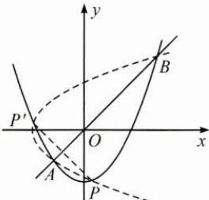

2. B 【解析】由四面体 $D^{\prime}-ABC$ 的对称性可知，二面角 $A-CD^{\prime}-B$ 等于二面角 $D^{\prime}-BC-A$ ，则由二面角的最大性，可知 $\gamma>\beta$ ；又因为 $BC\perp AB$ ，所以二面角 $D^{\prime}-AB-C$ 又等于直线 BC 与平面 $D^{\prime}AB$ 所成的线面角，则由线面角的最小性，可知 $\gamma<\alpha$ 。故选 B.

3. $\sqrt{2}$ 【解析】如图，取 $AB$ 的中点 $E'$ ，则由正方体的对称性可知 $PE = PE'$ ，所以 $PF + PE = PF + PE' \geqslant FE' \geqslant \sqrt{2}$ ，当 $F, P$ 分别为 $D_{1}C_{1}, D_{1}B$ 的中点时取等号.

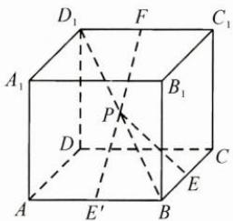

4. $\frac{1}{2}$ 【解析】由 $f(x) = x^{2} - 2x + a(\mathrm{e}^{x - 1} +$ $\mathrm{e}^{-x + 1})$ 可得 $f(2 - x) = f(x)$ ，所以 $f(x)$ 的图象关于直线 $x = 1$ 轴对称，因此唯一的零点只能为 $x = 1$ 由 $f(1) = 1^{2} - 2 + a(\mathrm{e}^{1 - 1} + \mathrm{e}^{-1 + 1}) = 0,$ 解得 $a = \frac{1}{2}$

5.【解析】本题作为传统的解析几何问题，可以通过常规代数方法解决，这里应用对称这种重要的思想方法给出全新的解法。作点 $F_{1}$ 关于切线HP的对称点 $F_{1}^{\prime}$ ，如图，则有 $|PF_{1}| = |PF_{1}^{\prime}|$ ，又由椭圆的光学性质可知，焦半径 $PF_{1}, PF_{2}$ 与切线所成的角相等，所以 $F_{1}^{\prime}, P, F_{2}$ 三点共线，因此有 $|F_{1}^{\prime}F_{2}| = |PF_{2}| + |PF_{1}^{\prime}| = |PF_{2}| + |PF_{1}| = 4$ ，所以点 $F_{1}^{\prime}$ 的轨迹是以 $F_{2}$ 为圆心，4为半径的圆；又因为H恒为 $F_{1}^{\prime}F_{1}$ 的中点，所以 $|OH| = \frac{1}{2}|F_{1}^{\prime}F_{2}| = 2$ ，点H的轨迹是以O为圆心，2为半径的圆，所以轨迹方程为 $x^{2} + y^{2} = 4$ 。

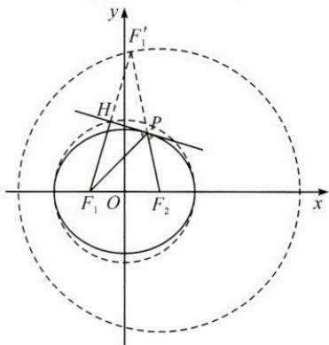

## 13 增量法

1. B 【解析】因为容器中总的水量(即注水量)V关于水深h的函数图象是上凸的, 即h每增加一个单位增量 $\Delta h$ , V的增量 $\Delta V$ 越来越小, 这说明容器的横截面积越来越小, 故选B.

2. B 【解析】由已知得 $\lambda + |a| = \lambda +$ $\sqrt{\lambda^2 + 2\lambda + 4} (\lambda < 0)$ 令 $x = \lambda + 1$ 则 $\lambda + |\pmb{a}| = x - 1 + \sqrt{x^2 + 3} (x < 1)$ 令 $y_1 = \sqrt{x^2 + 3}, y_2 = -x$ 转化为双曲线 $y_1 = \sqrt{x^2 + 3}$ 上横坐标小于1且在上支的一点到一条渐近线 $y_2 = -x$ 上一点的纵向距离问题，
如图， $0 < y_1 - y_2 < 3$ 所以 $-1 < x - 1 + \sqrt{x^2 + 3} < 2$ ，故选B.

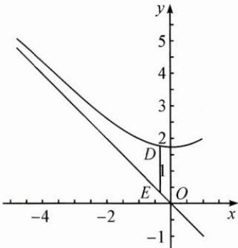

3. $\frac{25}{4}$ 【解析】因为 $a, b > 0$ ，且 $a + b = 1$ ，设 $a = \frac{1}{2} + t, b = \frac{1}{2} - t\left(-\frac{1}{2} < t < \frac{1}{2}\right)$ ，则 $\left(a + \frac{1}{a}\right)\left(b + \frac{1}{b}\right) = \frac{t^4 + \frac{3}{2}t^2 + \frac{25}{16}}{\frac{1}{4} - t^2}$ $\geqslant \frac{\frac{25}{16}}{\frac{1}{4}} = \frac{25}{4}$ ，当且仅当 $t = 0$ 时取等号。

4.64 【解析】设该等比数列的公比为 q，
则 $q=\frac{a_{2}+a_{4}}{a_{1}+a_{3}}=\frac{1}{2}$ ,
可得 $a_{1}+\frac{1}{4}a_{1}=10$ ，得 $a_{1}=8$ 所以 $a_{n}=8\cdot\left(\frac{1}{2}\right)^{n-1}=\left(\frac{1}{2}\right)^{n-4}$ . $a_{1}a_{2}\cdots a_{n}=\left(\frac{1}{2}\right)^{-3-2-1+0+\cdots+(n-4)}=\left(\frac{1}{2}\right)^{\frac{1}{2}(n^{2}-7n)}$

易知当 n=3 或 n=4 时， $\frac{1}{2}(n^{2}-7n)$ 取得最小值 -6，故 $a_{1}a_{2}\cdots a_{n}$ 的最大值为 $\left(\frac{1}{2}\right)^{-6}=64.$

5.【解析】由题意知 $k = \frac{\mathrm{e}^{ax_2} - \mathrm{e}^{ax_1}}{x_2 - x_1} - 1$ 设 $g(x) = f'(x) - k = ae^{ax} - \frac{e^{ax_2} - e^{ax_1}}{x_2 - x_1}$ 令 $x_{2} = x_{1} + t(t > 0)$ 则 $g(x_{1}) = ae^{ax_{1}} - \frac{e^{ax_{1} + at} - e^{ax_{1}}}{t}$ $= \frac{\mathrm{e}^{ax_1}}{t} (at + 1 - \mathrm{e}^{at})$ 同理， $g(x_{2}) = \frac{\mathrm{e}^{ax_2}}{t} (at - 1 + \mathrm{e}^{-at})$ 易证 $\mathrm{e}^x\geqslant x + 1$ （当且仅当 $x = 0$ 时等号成立），得 $\mathrm{e}^{at}\geqslant at + 1,\mathrm{e}^{-at}\geqslant -at + 1$ 所以 $g(x_{1}) <   0,g(x_{2}) > 0.$ 又 $g^{\prime}(x) = a^{2}\mathrm{e}^{ax} > 0$ ，所以 $g(x)$ 在 $[x_1,x_2]$ 上的图象是一条连续不断的曲线，故存在唯一实数 $c = \frac{1}{a}\ln \frac{\mathrm{e}^{ax_2} - \mathrm{e}^{ax_1}}{a(x_2 - x_1)}$ 使得 $g(c) = 0$ 当 $x\in (x_1,c)$ 时， $g(x) <   0$ 当 $x\in (c,x_2)$ 时， $g(x) > 0$ 所以当且仅当 $x\in (c,x_2)$ 时， $f^{\prime}(x_{0}) > k.$ 所以存在 $x_0\in (x_1,x_2)$ ，使得 $f^{\prime}(x_0) > k$ 成立，且 $x_0\in \left(\frac{1}{a}\ln \frac{\mathrm{e}^{ax_2} - \mathrm{e}^{ax_1}}{a(x_2 - x_1)},x_2\right).$

## 14 导数法

1. C 【解析】 $y = f(x) = \sin x + a\cos x = \sqrt{1 + a^2}\sin (x + \varphi)$ ,
其中 $\sin\varphi=\frac{a}{\sqrt{1+a^{2}}},\cos\varphi=\frac{1}{\sqrt{1+a^{2}}}$ .
直线 $x=\frac{5\pi}{3}$ 为函数 $f(x)$ 图象的对称轴，
则 $f(x)$ 在 $x=\frac{5\pi}{3}$ 处取到最值， $f'\left(\frac{5\pi}{3}\right)=0$ .

又 $f^{\prime}(x) = \cos x - a\sin x,$ $f^{\prime}\left(\frac{5\pi}{3}\right) = \cos \frac{5\pi}{3} -a\sin \frac{5\pi}{3} = 0,$ 所以 $a = -\frac{\sqrt{3}}{3}$ 进一步求解可知选C.

2.【解析】不等式 $a(x + 1)\mathrm{e}^x -x <   0$ 可化为 $a(x + 1) <   \frac{x}{\mathrm{e}^x}$ 令 $g(x) = a(x + 1),h(x) = \frac{x}{\mathrm{e}^x},x\in \mathbf{R}.$ $g(x) = a(x + 1)$ 的图象恒过定点 $P(-1,0)$ $h(x) = \frac{x}{\mathrm{e}^x}$ ，则 $h^{\prime}(x) = \frac{1 - x}{\mathrm{e}^{x}}$ 当 $x\in (-\infty ,1)$ 时， $h^\prime (x) > 0,h(x)$ 单调递增；当 $x\in (1, + \infty)$ 时， $h^\prime (x) <   0,h(x)$ 单调递减.所以当 $x = 1$ 时， $h(x)_{\max} = h(1) = \frac{1}{\mathrm{e}}.$ 又 $h(2) = \frac{2}{\mathrm{e}^2}$ ，记点 $A\left(1,\frac{1}{\mathrm{e}}\right),B\left(2,\frac{2}{\mathrm{e}^2}\right)$ 且 $h(0) = 0$ ，当 $x\to +\infty$ 时， $h(x)\rightarrow 0^{+}$ 作出 $h(x)$ 的大致图象，如图.

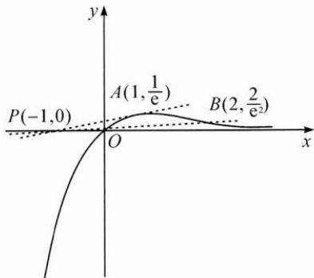

若不等式 $a(x + 1)\mathrm{e}^x -x <   0$ 有且仅有一个正整数解，则结合函数图象知，必有 $k_{PB}\leqslant a <   k_{PA}$ $k_{PB} = \frac{\frac{2}{\mathrm{e}^2} - 0}{2 - (-1)} = \frac{2}{3\mathrm{e}^2},k_{PA} = \frac{\frac{1}{\mathrm{e}} - 0}{1 - (-1)} = \frac{1}{2\mathrm{e}},$ 则 $\frac{2}{3\mathrm{e}^2}\leqslant a <   \frac{1}{2\mathrm{e}}.$

3. D 【解析】 $a=\ln\left(\frac{1}{14}+1\right)$ , $b=\frac{1}{14}\times\frac{15}{14}$ , $c=\tan\left(\frac{1}{14}\times\frac{15}{14}\right)$ 令 $h(x)=x-\ln(x+1)(x>-1)$ ,
则 $h'(x)=1-\frac{1}{x+1}=\frac{x}{x+1}$ .
当 $x \in (-1,0)$ 时， $h'(x) < 0$ ，h(x) 单调递减；
当 $x \in (0, +\infty)$ 时， $h'(x) > 0$ ，h(x) 单调递增.
所以 $h(x)_{\min}=h(0)=0$ ,
故 $h\left(\frac{1}{14}\right)=\frac{1}{14}-\ln\left(1+\frac{1}{14}\right)>0$ ,
而 $\frac{1}{14}\times\frac{15}{14}>\frac{1}{14}>\ln\left(\frac{1}{14}+1\right)$ ，故 b>a.
令 $f(x)=x\cos x-\sin x\left(x\in\left(0,\frac{\pi}{2}\right)\right)$ ,
则 $f'(x)=\cos x-x\sin x-\cos x=-x\sin x$ ,
当 $x \in \left(0, \frac{\pi}{2}\right)$ 时， $f'(x)<0$ ， $f(x)$ 单调递减，
所以 $f(x)<f(0)=0$ ,
故 $f\left(\frac{15}{196}\right)=\frac{15}{196}\cos\frac{15}{196}-\sin\frac{15}{196}<0$ ,
即 $\frac{15}{196}<\tan\frac{15}{196}$ ，故 b<c.
综上，a<b<c，故选D.

## 15 枚举法

1. B 【解析】用枚举法找规律. $a_{1}=\left[\frac{20}{7}\right]=2=b_{1},a_{2}=\left[\frac{200}{7}\right]=28,b_{2}=8,$ 同理， $a_{3}=285,b_{3}=5,a_{4}=2857,b_{4}=7,$ $a_{5}=28571,b_{5}=1,a_{6}=285714,b_{6}=4,$ $a_{7}=2857142,b_{7}=2,\cdots,b_{n+6}=b_{n}.$ 故 $\{b_{n}\}$ 是以6为周期的周期数列，
则 $b_{2022}=b_{6\times337}=b_{6}=4.$ 故选B.

2. D 【解析】画出“谁当裁判”的树状图(图略), 观察得共有 8 种等可能的情况. 其中前四局中乙当裁判一次有 5 种情况, 乙当裁判两次有 2 种情况, 乙没当裁判有 1 种情况. 前四局中乙当裁判一次的

概率是 $\frac{5}{8}$ , 故选 D.

3.【解析】 $4(ab+bc+ca)=3abc$ 可变形为 $\frac{1}{a}+\frac{1}{b}+\frac{1}{c}=\frac{3}{4},a,b,c$ 为正整数.
不妨设 $a \leqslant b \leqslant c$ ，则 $\frac{3}{a} \geqslant \frac{3}{4}$ ，得 $a \leqslant 4$ .
当 a=4 时, b=c=4.
当 a=3 时, b=4, c=6, 或 b=3, c=12.
当 a=2 时, b=8, c=8, 或 b=6, c=12, 或 b=5, c=20.
即当 a, b, c 都取 4 时，有序数组有 1 个；
当 a, b, c 取 3, 4, 6 时，有序数组有 6 个；
当 a, b, c 取 3, 3, 12 时，有序数组有 3 个；
当 a, b, c 取 2, 8, 8 时，有序数组有 3 个；
当 a, b, c 取 2, 6, 12 时，有序数组有 6 个；
当 a, b, c 取 2, 5, 20 时，有序数组有 6 个.
故不同的有序数组共有25个.

## 16 向量法

1.【解析】(1)略；(2)1.

2.【解析】设 $a = (x,1 - y), b = (1 - x,y)$ 因为 $\vert a + b\vert \leqslant \vert a\vert +\vert b\vert$ 所以 $\sqrt{x^2 + (1 - y)^2} +\sqrt{y^2 + (1 - x)^2}\geqslant \sqrt{2}.$

3.【解析】因为 $PA \perp PB$ ，
所以 $|BP|$ 是 $\overrightarrow{BA}$ 在 $\overrightarrow{BP}$ 方向上的投影长，
所以 $|BP||BQ| = \overrightarrow{QB} \cdot \overrightarrow{BA}$ .
设直线 $BQ$ 的方程为 $y = kx + 1$ ，
联立椭圆方程 $\frac{x^2}{4} + y^2 = 1$ 可得， $\overrightarrow{QB} \cdot \overrightarrow{BA} = \frac{16k - 8k^2}{4k^2 + 1} = -2 + \frac{2(8k + 1)}{4k^2 + 1}$ ,
令 $t = 8k + 1$ ，由 $0 < k < 2$ ，知 $1 < t < 17$ ，
所以 $\overrightarrow{QB} \cdot \overrightarrow{BA} = -2 + \frac{32t}{t^2 - 2t + 17}$ $= -2 + \frac{32}{t + \frac{17}{t} - 2} \leqslant -2 + \frac{32}{2\sqrt{17} - 2}$ $= \sqrt{17} - 1$ ，当且仅当 $t = \sqrt{17}$ 时取等号，
所以所求有最大值为 $\sqrt{17} - 1$ .

## 17 面积法

1. A 【解析】 $\frac{S_{\triangle BCF}}{S_{\triangle ACF}}=\frac{|BC|}{|AC|}=\frac{x_{B}}{x_{A}}=\frac{|BF|-1}{|AF|-1}$ ，故选 A.

2.9 【解析】利用 $S_{\triangle ABC} = \frac{1}{2} ab \sin C$ ，由 $S_{\triangle ABC} = S_{\triangle ABD} + S_{\triangle BCD}$ ，可得 $a + c = ac$ ，进而求出 $4a + c$ 的最小值为 9.

3.【解析】(1)略.
(2) 如图, 取 BC 的中点 N, 连接 $FB_{1}$ , FN, $B_{1}N$ , 则 $\triangle DEF$ 在平面 $BB_{1}C_{1}C$ 上的射影为 $\triangle B_{1}NF$ .

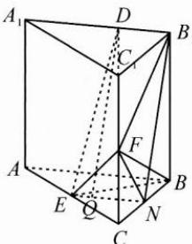

记平面 $BB_{1}C_{1}C$ 与平面DFE所成的锐二面角的平面角为 $\theta$ ，则 $\cos \theta = \frac{S_{\triangle B_1NF}}{S_{\triangle DEF}}.$ 设 $B_{1}D = t(0\leqslant t\leqslant 2)$ 则 $S_{\triangle DEF} = \frac{1}{2} DF\cdot EF\sin \angle DFE$ $= \frac{1}{2}\sqrt{2t^2 - 2t + 14},$ 易知 $S_{\triangle B_1NF} = \frac{3}{2},$ 则 $\cos \theta = \frac{S_{\triangle B_1NF}}{S_{\triangle DEF}} = \frac{3}{\sqrt{2t^2 - 2t + 14}},$ $\sin \theta = \sqrt{1 - \frac{9}{2(t^2 - t + 7)}}$ 当 $t = \frac{1}{2}$ ，即 $B_{1}D = \frac{1}{2}$ 时，平面 $BB_{1}C_{1}C$ 与平面DFE所成的锐二面角的正弦值最小，最小值为 $\frac{\sqrt{3}}{3}$

## 18 待定系数法

1.【解析】设 $f(x) = kx + b (k \neq 0)$ ，由 $f(f(x)) = x + 2$ ，得 $k(kx + b) + b = x + 2$ ，即 $k^2x + kb + b = x + 2$ ，所以 $k^2 = 1$ ，且 $kb + b = 2$ ，解得 $k = b = 1$ ，所以 $f(x) = x + 1$ .

2.【解析】 $6 \leqslant f(-2) \leqslant 10.$

3.【解析】设圆的方程为 $x^{2} + y^{2} + Dx + Ey$ $+F = 0(D^{2} + E^{2} - 4F > 0)$ 则有 $\left\{ \begin{array}{l} F = 0, \\ 1 + 1 + D + E + F = 0, \\ 4 + 2D + F = 0, \end{array} \right.$ 解得 $D = -2, E = 0, F = 0$ 即圆的方程为 $x^{2} + y^{2} - 2x = 0$

## 19 排除法

1. C 【解析】由 $a_{1}=1, a_{605}=1813$ ,
取 $a_{n+1}=\frac{a_{n}+a_{n+2}}{2}$ ，则可以推出 $\{a_{n}\}$ 为等差数列，公差为3，此时 $a_{10}=28$ ，排除A,B.
由 $a_{n+1}\leqslant\frac{a_{n}+a_{n+2}}{2}$ 得 $a_{n+2}-a_{n+1}\geqslant a_{n+1}-a_{n}$ ，
记 $d_{n}=a_{n+1}-a_{n}$ ，则 $d_{n+1}>d_{n}$ ，
若 $a_{10}=29$ ，则由 $a_{10}=1+d_{1}+d_{2}+\cdots+d_{9}$ ，得 $d_{9}>3$ ，
所以 $a_{605}=29+d_{10}+d_{11}+\cdots+d_{604}>29+595\times3=1814$ 矛盾，排除 D.
故选 C.

2. D 【解析】首先由 $\frac{4}{a_{n+1}} = \frac{1}{a_n} - \frac{1}{a_n-1}$ 得 $a_{n+1} = -4a_n(a_n - 1)$ , $a_{n+1} - 1 = -4a_n(a_n - 1) - 1$ $= -(2a_n - 1)^2 < 0$ , 即 $a_n < 1 (n \geqslant 2)$ , 所以若 $a_1 = t > 1$ , 则 $a_{2021} < a_1$ , 排除 A. 由 $a_{n+1} = -4a_n(a_n - 1)$ , 若 $a_1 = t < 0$ ,

可以推出 $a_{n} < 0$ （用数学归纳法可证），
所以 $a_{n + 1} - a_n = -4a_n(a_n - 1) - a_n = a_n(3 - 4a_n) < 0,$ $\{a_{n}\}$ 单调递减，排除B.
由 $a_{n + 1} = -4a_{n}(a_{n} - 1),a_{1} = t,$ 得 $a_2 = 4t(1 - t)$ $a_3 = 4[4t(1 - t)][1 - 4t(1 - t)]$ 若 $a_3 = a_1$ ，则 $16(1 - t)(2t - 1)^2 = 1$ 该方程有除了 $\frac{3}{4}$ 之外的其他解，
所以 $a_{2021} = \dots = a_3 = a_1$ ，但 $a_2\neq a_1$ ，排除C.故选D.

3.【解析】当 $a \leqslant 0$ 时， $f(x) = ax^2 - x\ln x - a = a(x - 1)(x + 1) - x\ln x > 0$ ，所以舍去。当 $a > 0$ 时， $f'(x) = 2ax - \ln x - 1$ ，令 $f''(x) = 2a - \frac{1}{x} = 0$ ，得 $x = \frac{1}{2a}$ 是 $f'(x)$ 的极小值点，所以 $f'(x)_{\min} = f'\left(\frac{1}{2a}\right) = \ln 2a$ 。当 $a \geqslant \frac{1}{2}$ 时， $f'(x) \geqslant 0, f(x)$ 在 $(0,1)$ 上单调递增， $f(x) < f(1) = 0, f(x)$ 无零点，舍去；当 $0 < a < \frac{1}{2}$ 时， $f'(x)$ 在 $(0,1)$ 上单调递减，又 $f'(1) = 2a - 1 < 0, f'\left(\frac{1}{e}\right) = \frac{2a}{e} > 0$ ，故 $f'(x)$ 在 $(0,1)$ 上存在唯一零点 $x_0$ ，即 $x_0$ 是 $f(x)$ 的极大值点， $f(x_0) > f(1) = 0$ ，又当 $x \to 0$ 时， $f(x) \to -a$ ，由零点存在性定理知， $f(x)$ 在 $(0,1)$ 上有零点。综上， $0 < a < \frac{1}{2}$ 。

## 20 正难则反

1. B 【解析】 $A_{23}^{2}-17A_{2}^{2}-A_{3}^{1}A_{20}^{1}A_{2}^{2}-A_{3}^{2}=$ 346. 故选 B.

2. $k \neq -1$ 且 $k \neq 1$ 【解析】先求 $ke_{1} + e_{2}$ 与$e_{1}+ke_{2}$ 共线时 k 的取值范围, 再求其补集.

3. $\frac{1}{2} \leqslant m \leqslant \sqrt{2} + 2$ 【解析】先求 $A \cap B = \emptyset$ 的情况，对 $A$ 分 $A = \emptyset$ 和 $A \neq \emptyset$ 两类讨论，再求补集.

## 21 裂项法

1.【解析】 $a_{n}=\frac{1}{\sqrt{n}+\sqrt{n+2}}=\frac{1}{2}(\sqrt{n+2}-\sqrt{n})$ , $T_{n}=\frac{1}{2}(\sqrt{n+1}+\sqrt{n+2}-1-\sqrt{2}).$

2.【解析】易得 $a_{n} = 2n$ 则 $b_{n} = \frac{n + 1}{4n^{2}(n + 2)^{2}} = \frac{1}{16}\left[\frac{1}{n^{2}} -\frac{1}{(n + 2)^{2}}\right],$ $T_{n} = \frac{1}{16}\left[1 + \frac{1}{2^{2}} -\frac{1}{(n + 1)^{2}} -\frac{1}{(n + 2)^{2}}\right] <   \frac{5}{64}.$

3.【解析】 $a_{n}=-6n+3,b_{n}=2^{n+1}$ $c_{n}=\frac{2^{n+1}}{(2^{n+1}-2)(2^{n+1}-1)}$ $=\frac{2^{n}}{(2^{n}-1)(2^{n+1}-1)}$ $=\frac{1}{2^{n}-1}-\frac{1}{2^{n+1}-1},$ $T_{n}=1-\frac{1}{2^{n+1}-1}.$

4.【解析】 $b_{n}=(-1)^{n-1}\frac{4n}{a_{n}a_{n+1}}$ $=(-1)^{n-1}\left(\frac{1}{2n-1}+\frac{1}{2n+1}\right)$ ,

当 n 为偶数时， $T_{n}=\left(1+\frac{1}{3}\right)-\left(\frac{1}{3}+\frac{1}{5}\right)+\left(\frac{1}{5}+\frac{1}{7}\right)-$ $\cdots+\left(\frac{1}{2n-3}+\frac{1}{2n-1}\right)-\left(\frac{1}{2n-1}+\frac{1}{2n+1}\right)$ $=1-\frac{1}{2n+1}=\frac{2n}{2n+1}$ ;

当 n 为奇数时，

$T_{n}=\left(1+\frac{1}{3}\right)-\left(\frac{1}{3}+\frac{1}{5}\right)+\left(\frac{1}{5}+\frac{1}{7}\right)-$ $\cdots-\left(\frac{1}{2n-3}+\frac{1}{2n-1}\right)+\left(\frac{1}{2n-1}+\frac{1}{2n+1}\right)$ $=1+\frac{1}{2n+1}=\frac{2n+2}{2n+1}.$ 于是 $T_{n}=\left\{\begin{aligned}&\frac{2n+2}{2n+1},&n\text{为奇数,}\\ &\frac{2n}{2n+1},&n\text{为偶数.}\end{aligned}\right.$

5.【解析】 $\frac{a_{n+2}}{a_{n}a_{n+1}}=\frac{(n+2)2^{n+1}}{n\cdot2^{n-1}\cdot(n+1)2^{n}}$ $=4\left[\frac{1}{n\cdot2^{n-1}}-\frac{1}{(n+1)2^{n}}\right]$ ,

则 $S_{n}=4\left\{\left(\frac{1}{1\cdot2^{0}}-\frac{1}{2\cdot2^{1}}\right)+\left(\frac{1}{2\cdot2^{1}}-\frac{1}{3\cdot2^{2}}\right)+\cdots+\left[\frac{1}{n\cdot2^{n-1}}-\frac{1}{(n+1)2^{n}}\right]\right\}$ $=4-\frac{4}{(n+1)2^{n}}.$

## 22 赋值法

1.【解析】(1)由 $f(1+0)=f(1)+f(0)+1$ ,
得 $f(0)=-1$ , $f(x+(-x))=f(x)+f(-x)+1$ 即 $-1=f(x)+f(-x)+1$ , $f(x)+1=-\left[f(-x)+1\right]$ ,
可得 $f(x)+1$ 为奇函数.
(2) 设 $x_{1}>x_{2}$ ，则 $x_{1}-x_{2}>0$ ， $f(x_{1})-f(x_{2})=f(x_{1}-x_{2}+x_{2})-f(x_{2})=f(x_{1}-x_{2})+1>-1+1=0$ ，得证.

2. 2022 【解析】先换元，令 t = x - 3，则 $(t + 2)^{2022} = a_{0} + a_{1}t + a_{2}t^{2} + \cdots + a_{2022}t^{2022}$ ，两边同时求导，得 $2022(t + 2)^{2021} = a_{1} + 2a_{2}t + \cdots + 2022a_{2022}t^{2021}$ ，令 t = -1，得待求式 = 2022。

3. B 【解析】用特殊赋值法, 令 a=b=c=1, 易知选 B.

## 23 估算法

1. D 【解析】如图, 当点 A(a,b) 在 x 轴上方、曲线 $f(x) = \mathrm{e}^{x}$ 的右下方时，可以画出两条切线，则 $b < \mathrm{e}^{a}$ . 将 $A(a, b)$ 同侧的点(1,1)代入曲线 $f(x) = \mathrm{e}^{x}$ ，有 $1 < \mathrm{e}^{1}$ ，估计 $0 < b < \mathrm{e}^{a}$ . 故选D.

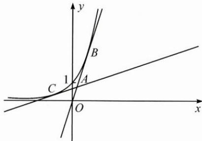

2. D 【解析】D(X) 反映离散程度, 随机变量 X 的概率分布均匀, 若 a 也取平均值 $\frac{1}{2}$ , 则 D(X) 最小, 当 a 越靠近 0 或 1 时, 估算可知离散程度越大, D(X) 越大. 故选 D.

3. c<b<a 【解析】由函数的单调性可估算范围， $a=\left(\frac{3}{5}\right)^{-\frac{1}{3}}>\left(\frac{3}{5}\right)^{0}=1,0<b=\left(\frac{4}{3}\right)^{-\frac{1}{2}}<\left(\frac{4}{3}\right)^{0}=1,c=\ln\frac{3}{5}<\ln1=0$ ，所以 c<b<a。

4.【解析】由 $f(0)=a-1\geqslant0$ ，估算 $a\geqslant1$ 当 a=1 时， $f(x)=-x\leqslant0$ ，舍去.
当 a>1 时， $f'(x)=(a-1)e^{x}-1$ 单调递增，
令 $f'(x)=(a-1)e^{x}-1=0$ ，得 $x=\ln\frac{1}{a-1}$ 若 $\ln\frac{1}{a-1}\leqslant0$ , 即 $a\geqslant2$ 则当 $x\in[0,+\infty)$ 时， $f'(x)>0$ ， $f(x)$ 单调递增， $f(x)\geqslant f(0)>0;$ 若 $\ln\frac{1}{a-1}>0$ , 即 1<a<2,
则当 $x\in\left[0,\ln\frac{1}{a-1}\right)$ 时， $f'(x)<0,f(x)$ 单调递减，
当 $x\in\left(\ln\frac{1}{a-1},+\infty\right)$ 时， $f'(x)>0$ $f(x)$ 单调递增，

得 $f(x) \geqslant f\left(\ln \frac{1}{a-1}\right)$ $=(a-1)\mathrm{e}^{\ln\frac{1}{a-1}}-\ln\frac{1}{a-1}$ $=1-\ln\frac{1}{a-1}\geqslant0,$ 解得 $a \geqslant 1 + \frac{1}{e}$ ,
所以 $a \geqslant 1 + \frac{1}{e}$ .

## 24 配凑法

1. B 【解析】 $1=5x^{2}y^{2}+y^{4}=y^{2}(5x^{2}+y^{2})$ $=\frac{1}{4}(4y^{2})(5x^{2}+y^{2})\leqslant\frac{1}{4}\left(\frac{5x^{2}+5y^{2}}{2}\right)^{2}$ ,

当且仅当 $4y^{2}=5x^{2}+y^{2}$ 时， $x^{2}+y^{2}$ 取到最小值 $\frac{4}{5}$ . 故选 B.

2.【解析】 $\frac{1}{a_{n+1}}=\frac{2}{a_{n}}+3,\frac{1}{a_{n+1}}+3=2\left(\frac{1}{a_{n}}+3\right)$ ，
所以 $\left\{\frac{1}{a_{n}}+3\right\}$ 是以 5 为首项，2 为公比的等比数列， $\frac{1}{a_{n}}+3=5\cdot2^{n-1}$ 得 $a_{n}=\frac{1}{5\cdot2^{n-1}-3}$ .

3.【解析】 $\frac{4}{x - 3} + x = -\left(\frac{4}{3 - x} +3 - x\right) + 3,$ 因为 $x <   3$ ，所以 $\frac{4}{3 - x} +3 - x\geqslant 4$ 所以 $\frac{4}{x - 3} +x\leqslant -4 + 3 = -1.$ 经检验等号能取到，故所求最大值为-1.

4.【解析】配凑 $1 = (5 - \lambda)x^{2} + \lambda x^{2} + y^{2}\geqslant$ $(5 - \lambda)x^{2} + 2\sqrt{\lambda}xy,$ 当 $5 - \lambda = 2(2\sqrt{\lambda})$ ，即 $\lambda = 1$ 时， $(5 - \lambda)x^{2} + 2\sqrt{\lambda}xy = 4x^{2} + 2xy,$ 所以 $1 = 5x^{2} + y^{2} = 4x^{2} + x^{2} + y^{2}\geqslant 4x^{2} + 2xy,$ 从而 $2x^{2} + xy\leqslant \frac{1}{2}.$

## 25 变更主元

1.【解析】设 $f(m)=(x^{2}-1)m-(2x-1)$ ,
则不等式 $2x-1>m(x^{2}-1)$ 对满足 $m\in[-2,2]$ 的一切实数 m 恒成立 $\Leftrightarrow f(m)<0$ 对 $m\in[-2,2]$ 恒成立.
当 $-2 \leqslant m \leqslant 2$ 时， $f(m) < 0$ $\Leftrightarrow\left\{\begin{aligned}f(2)&=2(x^{2}-1)-(2x-1)<0,\\ f(-2)&=-2(x^{2}-1)-(2x-1)<0,\end{aligned}\right.$ 即 $\left\{\begin{aligned}2x^{2}-2x-1<0,\\ 2x^{2}+2x-3>0,\end{aligned}\right.$ 解得 $\left\{\begin{aligned}\frac{1-\sqrt{3}}{2}<x<\frac{1+\sqrt{3}}{2},\\ x>\frac{-1+\sqrt{7}}{2}\text{或}x<\frac{-1-\sqrt{7}}{2},\end{aligned}\right.$ 故 x 的取值范围是 $\left(\frac{\sqrt{7}-1}{2},\frac{\sqrt{3}+1}{2}\right)$ .

2. $(-5,0)$ 【解析】设两个零点为 $x_{1}, x_{2}$ ，则 $x_{1}, x_{2} \in (0,1)$ ， $f(x)=(x-x_{1})(x-x_{2})$ , $a=-(x_{1}+x_{2}), b=x_{1}x_{2}$ 可得 $3a+b=-3(x_{1}+x_{2})+x_{1}x_{2}$ 而 $-5<-3-2x_{2}<(-3+x_{2})x_{1}-3x_{2}<-3x_{2}<0$ 所以 $3a+b\in(-5,0)$ .

3.【解析】先将 $a$ 看作主元，记关于 $a$ 的一次函数 $g(a) = \frac{1}{x} a + x + b$ ，则对任意的 $a \in \left[\frac{1}{2}, 2\right]$ ，不等式 $g(a) \leqslant 10$ 恒成立。由于 $x > 0$ ，故 $g(a)$ 单调递增，则只要 $g(2) = \frac{2}{x} + x + b \leqslant 10$ ，因此不等式 $\frac{2}{x} + x + b \leqslant 10$ 在 $\left[\frac{1}{4}, 1\right]$ 上恒成立。分离变量得不等式 $b \leqslant 10 - \left(\frac{2}{x} + x\right)$ 在 $\left[\frac{1}{4}, 1\right]$ 上恒成立，

故 $b \leqslant \left[10 - \left(\frac{2}{x} + x\right)\right]_{\min} = 10 - \left(\frac{2}{x} + x\right)_{\max}$ $= 10 - \left(8 + \frac{1}{4}\right) = \frac{7}{4}$ , 即 $b \leqslant \frac{7}{4}$ .

4.D【解析】两个条件中，只有第二个条件与z有关，那么首先消去的应该是变量z. $\frac{w}{x}+\frac{z}{y}\geqslant\frac{w}{x}+\frac{\frac{x+y}{2}-w}{y}$ $=w\left(\frac{1}{x}-\frac{1}{y}\right)+\frac{x}{2y}+\frac{1}{2}$ 因为 $\frac{1}{x}-\frac{1}{y}<0,w\leqslant y,$ 则 $w\left(\frac{1}{x}-\frac{1}{y}\right)+\frac{x}{2y}+\frac{1}{2}$ $\geqslant y\left(\frac{1}{x}-\frac{1}{y}\right)+\frac{x}{2y}+\frac{1}{2}=\frac{y}{x}+\frac{x}{2y}-\frac{1}{2}$ $\geqslant 2\sqrt{\frac{1}{2}} - \frac{1}{2} = \sqrt{2} - \frac{1}{2}$ 当且仅当 $x=\sqrt{2}y, w=y$ 时等号同时成立，故选 D.

## 26 数形结合

1.2

2. $\left\{-3,5 - \frac{2\sqrt{3}}{9},1 + \frac{2\sqrt{3}}{9}\right\}$

3.【解析】设 $g(x)=-x^{2}, x\in\left[-\frac{1}{2},0\right]$ , $h(x)=ax+b,$ 函数 $f(x)=x^{2}+ax+b$ 在 $\left[-\frac{1}{2},0\right]$ 上至少存在一个零点，即 $g(x)$ 和 $h(x)$ 的图象有交点.
根据题意可得 $h(1)=a+b\in[0,1]$ ,
所求目标 $a-2b=-2h\left(-\frac{1}{2}\right)$ ,
如图，当 $h(1)=0$ 且 $h(x)$ 的图象过原点 O
时（即直线 AD）， $h\left(-\frac{1}{2}\right)$ 取到最大值 0；
当 $h(1)=1$ 且 $h(x)$ 的图象过原点 O 时（即直线 BC）， $h\left(-\frac{1}{2}\right)$ 取到最小值 $-\frac{1}{2}$ .

所以 $a - 2b = -2h\left(-\frac{1}{2}\right)\in [0,1].$

4.C【解析】因为 $f(2) - g(2) = 0$ ，所以命题①成立.由题意可知函数 $f(x)$ 的图象是椭圆 $\frac{x^2}{6} +\frac{y^2}{3} = 1$ 在 $x$ 轴上方的部分，函数 $g(x)$ 的图象是以 $M(2 - r,1 - r)$ 为圆心， $\sqrt{2} r$ 为半径的动圆的上半部分，圆心 $M$ 在直线 $y = x - 1$ 上，如图.由于圆关于直线 $y = x - 1$ 对称，而椭圆不关于直线 $y = x - 1$ 对称，所以一定存在某个范围的 $r$ ，使得当 $x <   2$ 时，椭圆在圆的上方，当 $x > 2$ 时，椭圆在圆的下方，即当 $x <   2$ 时， $y = f(x) - g(x) > 0,$ 当 $x > 2$ 时， $y = f(x) - g(x) <   0.$ 根据函数极值点的定义可知，此时2不是函数 $y = f(x) - g(x)$ 的极值点，即命题 $②$ 不成立.故选C

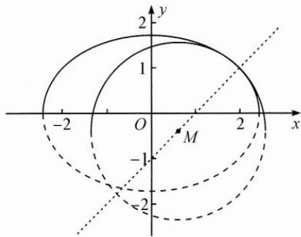

## 27 命题转换

1. C 【解析】如图,通过补体法将空间角(线线角)转换为平面角.(降维转换)

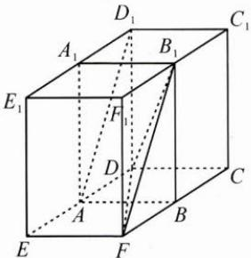

2.16 【解析】“至少、至多”问题常常采用正难则反法， $C_{6}^{3}-C_{4}^{3}=16$ （正反转换）

3. A 【解析】C 是锐角，
则 $c^{2}<a^{2}+b^{2}\Leftrightarrow\left(\frac{a}{c}\right)^{2}+\left(\frac{b}{c}\right)^{2}>1$ 将 $c^{3}<2(a^{3}+b^{3})$ 转换为 $\left(\frac{a}{c}\right)^{3}+\left(\frac{b}{c}\right)^{3}>\frac{1}{2}$ 进而转换为线性规划问题。(视角转换)
4. $\frac{1}{4}+\sqrt{2}$ 【解析】固定△ABD，则原点O的轨迹是以C为圆心， $2\sqrt{2}$ 为半径的圆。再从投影的角度分析可得最值。(动静转换)

## 28 整体考虑

1. $\frac{\sqrt{3}}{2}\pi$ 【解析】将三棱锥复原为正方体，如图，可知三棱锥与正方体的外接球相同，其半径是正方体的体对角线长的一半，为 $\frac{\sqrt{3}}{2}$ ，所以球的体积为 $\frac{\sqrt{3}}{2}\pi$ .

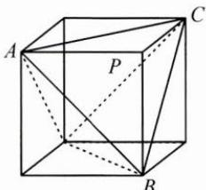

2. $y=\pm\sqrt{13}x+3$ 【解析】设 $M(x_{1},y_{1})$ , $N(x_{2},y_{2})$ ，联立方程组 $\left\{\begin{aligned}\frac{x^{2}}{3}-y^{2}&=1,\\ y&=kx+3,\end{aligned}\right.$

得 $\frac{x^{2}}{3}-y^{2}=\left(\frac{y-kx}{3}\right)^{2}$ ,
整理得 $10\left(\frac{y}{x}\right)^{2}-2k\left(\frac{y}{x}\right)+k^{2}-3=0$ 所以 $k_{1}k_{2}=\frac{y_{1}}{x_{1}}\cdot\frac{y_{2}}{x_{2}}=\frac{k^{2}-3}{10}=1$ 解得 $k=\pm\sqrt{13}$ 所以所求直线方程为 $y=\pm\sqrt{13}x+3$ .

3.2 【解析】注意到 $a + b$ 中 $a, b$ 系数相同，不妨令 $\cos x = \cos 2x = 2\cos^2 x - 1$ ，于是 $x = \frac{2}{3}\pi$ ，则有 $(a + b)\left(-\frac{1}{2}\right) + 1 \geqslant 0$ ，即 $a + b \leqslant 2$ 下面检验 $a + b = 2$ 是否能取到.当 $a + b = 2$ 时， $a\cos x + b\cos 2x + 1 = 2b\cos^2 x + (2 - b)\cos x + 1 - b \geqslant 0$ 恒成立，即 $b(2\cos^2 x - \cos x - 1) + 2\cos x + 1 = (2\cos x + 1)[b(\cos x - 1) + 1] \geqslant 0$ 恒成立，故 $\cos x = \frac{b - 1}{b} = -\frac{1}{2}$ ，解得 $b = \frac{2}{3}, a = \frac{4}{3}$ ，此时对任意实数 $x, a\cos x + b\cos 2x + 1 \geqslant 0$ 恒成立.所以 $(a + b)_{\max} = 2.$

## 29 局部处理

1.1 【解析】由题意可知,局部函数 $g(x)=a \cdot 2^{x}-2^{-x}$ 是奇函数,
故 $g(-x)=-g(x)$ ,
整理得 $(a-1)(2^{x}+2^{-x})=0$ ，故a=1。

2. $\left[-\frac{7}{12},1+\frac{\sqrt{21}}{3}\right]$ 【解析】采用局部固定法，先固定c，将 $2a+b$ 与 $3a^{2}+b^{2}$ 联系起来。运用柯西不等式，
得 $(2a+b)^{2}=\left(\frac{2}{\sqrt{3}}\cdot\sqrt{3}a+1\cdot b\right)^{2}$ $\leqslant\left(\frac{4}{3}+1\right)(3a^{2}+b^{2})\leqslant\frac{7}{3}c,$ 故 $-\frac{\sqrt{21c}}{3}\leqslant2a+b\leqslant\frac{\sqrt{21c}}{3}.$ 再将 $2a+b$ 转化为 c，从而运用二次函数求值域的方法来解决问题。

## 3.【解析】(1)略.

(2)采用局部突破法.
过点 D 作 $DH \perp AC$ 于点 H，连接 $A_{1}H$ ，如图，因为 $A_{1}D \perp$ 平面 ABC，所以 $\angle DHA_{1}$ 即为二面角 $A_{1}-AC-B$ 的平面角，所以 $\angle DHA_{1}=60^{\circ}$ .
接下来不要考虑整个棱台，只需研究局部三棱锥 $A_{1}-AHD$ 即可.
在 $\triangle A_{1}AH$ 中， $AA_{1}=4,\angle A_{1}AH=30^{\circ}$ ，
可得 $A_{1}H=2, AH=2\sqrt{3}$ .
在 $\triangle A_{1}HD$ 中， $A_{1}D=\sqrt{3},DH=1$ .
在 $\triangle AHD$ 中， $AD=\sqrt{13}$ ， $\sin\angle DAH=\frac{1}{\sqrt{13}}.$ 在 $\triangle ABD$ 中，因为 $\angle BAC=90^{\circ}$ ，
所以 $\cos\angle DAB=\sin\angle DAH=\frac{1}{\sqrt{13}}.$ 又因为 AB=4，由余弦定理可得 $BD^{2}=AD^{2}+AB^{2}-2AB\cdot AD\cdot\cos\angle DAB=21$ 所以 $A_{1}B=\sqrt{A_{1}D^{2}+BD^{2}}=2\sqrt{6}.$ 设点 B 到平面 $ACC_{1}A_{1}$ 的距离为 h，
直线 $BA_{1}$ 与平面 $ACC_{1}A_{1}$ 所成角为 $\theta$ ，
由 $V_{B-AA_{1}H}=V_{A_{1}-AHB}$ 得 $\frac{1}{3}S_{\triangle AA_{1}H}\cdot h=\frac{1}{3}S_{\triangle AHB}\cdot A_{1}D,$ 得 $h=2\sqrt{3}$ ，故 $\sin\theta=\frac{h}{A_{1}B}=\frac{2\sqrt{3}}{2\sqrt{6}}=\frac{\sqrt{2}}{2}.$

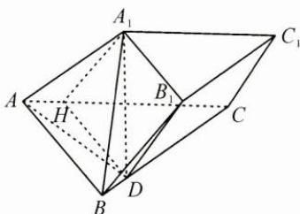

4.【解析】要证 $\ln b - \ln a > \frac{2a(b - a)}{a^2 + b^2}$ 只需证 $\ln b - \frac{2ab}{a^2 + b^2} >\ln a - \frac{2a^2}{a^2 + b^2}$ （\*），故只需研究局部函数 $f(x) = \ln x -$ $\frac{2ax}{a^2 + b^2}, x \in (0, b]$ 的单调性即可. (\*)式等价于 $f(b) > f(a)$ , 以下略.

## 30 变量分离法

1. D 【解析】由 $g(0)=0$ ，将问题转化为 $y=|kx-2|$ 与 $h(x)=\frac{f(x)}{|x|}$ 的图象有 3 个不同的交点.

2.D【解析】函数 $g(x) = \mathrm{e}^{x}(2x - 1)$ 在直线 $y = a(x - 1)$ 下方的图象中，只有一个点的横坐标为整数，故 $-a > g(0) = -1$ 且 $g(-1) = -\frac{3}{\mathrm{e}}\geqslant -2a$ ，解得 $\frac{3}{2\mathrm{e}}\leqslant a <   1.$

3.1 【解析】当 $x = 0$ 时， $c \leqslant 1$ . 当 $x \neq 0$ 时，分离成 $a \leqslant \frac{1 - bx - c}{x^2}$ ，则 $a_{\min} = 1 \leqslant \frac{1 - bx - c}{x^2}$ ，故 $x^2 + bx + c \leqslant 1$ 对 $x \in [0,1]$ 恒成立，所以 $c \leqslant 1$ ，且 $b + c \leqslant 0$ 所以 $2b + 3c = 2(b + c) + c \leqslant 1$ .

4. ①②④ 【解析】 $f(x)=0\Leftrightarrow\left|\lg x\right|=kx+2$ ，考虑直线 $y=kx+2$ 与曲线 $g(x)=\left|\lg x\right|$ 的左、右支分别相切的情形，利用方程思想以及数形结合可判断各结论的正误.

5.【解析】(1) 单调递增区间为 $\left(0, \frac{2}{\ln 2}\right)$ ，单调递减区间为 $\left(\frac{2}{\ln 2}, +\infty\right)$ .
(2) $\frac{x^{a}}{a^{x}}=1\Leftrightarrow x^{a}=a^{x}\Leftrightarrow a\ln x=x\ln a\Leftrightarrow\frac{\ln x}{x}=\frac{\ln a}{a}$ ，即曲线 $g(x)=\frac{\ln x}{x}$ 与直线 $y=\frac{\ln a}{a}$ 有两个交点，结合 $g(x)$ 的图象，可得 $0<\frac{\ln a}{a}<\frac{1}{e}$ ，即 $g(1)<g(a)<g(e)$ ，根据 $g(x)$ 的图象和单调性得到a的取值范围为 $(1,e)\cup(e,+\infty)$ .

## 31 适度放缩

1. A 【解析】 $a_{n+1}=\frac{a_{n}}{1+\sqrt{a_{n}}}$ $\Rightarrow\frac{1}{a_{n+1}}=\frac{1}{a_{n}}+\frac{1}{\sqrt{a_{n}}}=\left(\frac{1}{\sqrt{a_{n}}}+\frac{1}{2}\right)^{2}-\frac{1}{4}$ $\Rightarrow\frac{1}{\sqrt{a_{n+1}}}-\frac{1}{\sqrt{a_{n}}}<\frac{1}{2}$ 累加得 $\frac{1}{\sqrt{a_{n}}}\leqslant\frac{n+1}{2}$ ，故 $a_{n}\geqslant\frac{4}{(n+1)^{2}}$ 所以 $a_{n+1}=\frac{a_{n}}{1+\sqrt{a_{n}}}\leqslant\frac{n+1}{n+3}a_{n}$ 由累乘法可得 $a_{n}\leqslant\frac{6}{(n+1)(n+2)}$ 故 $S_{100}\leqslant6\times\left(\frac{1}{2}-\frac{1}{3}+\cdots+\frac{1}{101}-\frac{1}{102}\right)$ $=6\times\left(\frac{1}{2}-\frac{1}{102}\right)<3$ 显然 $S_{100}>\frac{3}{2}$ ，故选A.

2. D 【解析】由于 $f(x) \geqslant 0$ 恒成立，故 $f(1) = 1 - a \geqslant 0$ ，得 $a \leqslant 1$ .
利用不等式 $e^{x} \geqslant x + 1$ （当且仅当 x = 0 时等号成立）， $f(x)=\mathrm{e}^{x-\ln x-1}+\ln x-ax$ $\geqslant x-\ln x+\ln x-ax=(1-a)x\geqslant0,$ 从而 $a \leqslant 1$ ，故选 D.

3.18 【解析】 $2(\sqrt{n+1}-\sqrt{n})=\frac{2}{\sqrt{n+1}+\sqrt{n}}$ $<\frac{1}{\sqrt{n}}=\frac{2}{\sqrt{n}+\sqrt{n}}<\frac{2}{\sqrt{n}+\sqrt{n-1}}$ $=2(\sqrt{n}-\sqrt{n-1})$ ,

取 n=100，累加即得.

4. $\frac{3\sqrt{3}}{2}$ 【解析】 $\sin A + \sin B + \sin C + \sin 60^\circ = 2\sin \frac{A + B}{2} \cos \frac{A - B}{2} + 2\sin \frac{C + 60^\circ}{2} \cdot \cos \frac{C - 60^\circ}{2}$

$\leqslant 2\sin \frac{A + B}{2} + 2\sin \frac{C + 60^\circ}{2}$ $= 4\sin \frac{A + B + C + 60^\circ}{4}\cos \frac{A + B - C - 60^\circ}{4}$ $\leqslant 4\sin \frac{A + B + C + 60^\circ}{4} = 2\sqrt{3}$ . 故 $\sin A + \sin B + \sin C \leqslant \frac{3\sqrt{3}}{2}$ .

5.【解析】设函数 $f(x)=\frac{\ln(x+1)}{x}(x\geqslant2)$ ,
则 $f'(x)=\frac{\frac{x}{x+1}-\ln(x+1)}{x^{2}}$ .
解法1(构造函数):
令 $g(x)=\frac{x}{x+1}-\ln(x+1)(x\geqslant2)$ ,
则 $g'(x)=\frac{1}{(x+1)^{2}}-\frac{1}{x+1}=\frac{-x}{(x+1)^{2}}$ 由 $x \geqslant 2$ 可知 $g'(x) < 0$ ,
故 $g(x)$ 在 $[2, +\infty)$ 上单调递减，
因此 $g(x) \leqslant g(2) = \frac{2}{3} - \ln 3 < 0$ .
由于 $f'(x)=\frac{g(x)}{x^{2}}<0$ 故 $f(x)$ 在 $[2, +\infty)$ 上单调递减.
故当 $m, n \in N^{*}$ ，且 $2 \leqslant m < n$ 时， $f(m)>f(n)\Rightarrow\frac{\ln(m+1)}{m}>\frac{\ln(n+1)}{n}$ 从而 $(1+m)^{n}>(1+n)^{m}$ .
解法2(适度放缩): $x \geqslant 2$ , 则 $\frac{x}{x+1} < 1 < \ln 3 \leqslant \ln (x+1)$ ,
可知 $f'(x)<0$ ，故 $f(x)$ 在 $[2, +\infty)$ 上单调递减.
下同解法1.

## 32 均值代换

1. -1 【解析】令 $a=1+t, b=1-t$ ,
则原式可化为 $\frac{t^{2}}{1-t}+\frac{t^{2}}{1+t}=t^{2}\cdot\frac{2}{1-t^{2}}=-4$ ,
可得 $t^{2}=2$ ，所以 $ab=1-t^{2}=-1$ 。

2.【解析】由题意知 $b + c = -a$ 令 $b = -\frac{a}{2} + t, c = -\frac{a}{2} - t,$ 则 $a^2 + \left(-\frac{a}{2} + t\right)^2 + \left(-\frac{a}{2} - t\right)^2 = 1,$ 即 $\frac{3a^2}{2} + 2t^2 = 1, \frac{3a^2}{2} = 1 - 2t^2 \leqslant 1,$ 故 $a^2 \leqslant \frac{2}{3}, -\frac{\sqrt{6}}{3} \leqslant a \leqslant \frac{\sqrt{6}}{3}$ .

3.【解析】令 $x=2+2t,\quad y=1+m,\quad z=1-t$ -m, $t, m \in R$ ,
则 $x^{2} + y^{2} + z^{2}$ $=6+5t^{2}+2m^{2}+2mt+6t$ $=6+5t^{2}+(2m+6)t+2m^{2}$ $=6+5\left[t^{2}+\frac{2m+6}{5}t+\left(\frac{m+3}{5}\right)^{2}\right]-5\left(\frac{m+3}{5}\right)^{2}+2m^{2}$ $=6+5\left(t+\frac{m+3}{5}\right)^{2}+\frac{9}{5}m^{2}-\frac{6}{5}m-\frac{9}{5}$ $\geqslant\frac{9}{5}m^{2}-\frac{6}{5}m+\frac{21}{5}\geqslant\frac{21}{5}-\frac{1}{5}=4,$ 当且仅当 $t=-\frac{2}{3}, m=\frac{1}{3}$ 时取等号，
此时 $x=\frac{2}{3}, y=z=\frac{4}{3}.$

4.【解析】由正弦定理及余弦定理可得 $A = \frac{2\pi}{3}$ 则 $B + C = \frac{\pi}{3}$ ，可设 $B = \frac{\pi}{6} - d, C = \frac{\pi}{6} + d, -\frac{\pi}{6} < d < \frac{\pi}{6}$ . 由正弦定理知 $\frac{3}{\sin \frac{2\pi}{3}} = \frac{b}{\sin B} = \frac{c}{\sin C} = 2\sqrt{3}$ ，得 $b = 2\sqrt{3}\sin \left(\frac{\pi}{6} - d\right), c = 2\sqrt{3}\sin \left(\frac{\pi}{6} + d\right)$ ，则 $\triangle ABC$ 的周长为 $a + b + c = 3 + 2\sqrt{3}\sin \left(\frac{\pi}{6} - d\right) + 2\sqrt{3}\sin \left(\frac{\pi}{6} + d\right) = 3 + 2\sqrt{3}\left(\frac{1}{2}\cos d - \frac{\sqrt{3}}{2}\sin d + \frac{1}{2}\cos d + \frac{\sqrt{3}}{2}\sin d\right)$

$= 3 + 2\sqrt{3}\cos d$ 当 $d = 0$ ，即 $B = C = \frac{\pi}{6}$ 时， $\triangle ABC$ 的周长取得最大值 $3 + 2\sqrt{3}$

5.【解析】由 $x + y = 1 - z$ 设 $x = \frac{1 - z}{2} + t, y = \frac{1 - z}{2} - t,$ 则 $xy = \left(\frac{1 - z}{2}\right)^2 - t^2 = z^2 - 7z + 14,$ 整理得 $3z^2 - 26z + 55 = -4t^2 \leqslant 0,$ 即 $(3z - 11)(z - 5) \leqslant 0,$ 解得 $\frac{11}{3} \leqslant z \leqslant 5,$ 且 $x^2 + y^2 = (x + y)^2 - 2xy$ $= (z - 1)^2 - 2(z^2 - 7z + 14)$ $= -(z - 6)^2 + 9,$ 当 $z = 5$ 时， $(x^2 + y^2)_{\max} = 8.$

## 33 借助数轴

1.(1,2]【解析】对任意的 $x \in \mathbb{R}$ , $(a-2)x^{2}+2(a-2)x-4<0$ ①恒成立. 当 $a=2$ 时, ①变为 $-4<0$ , 恒成立; 当 $a \neq 2$ 时, 若要①成立, 则 $\left\{\begin{aligned} & a-2<0, \\ & \Delta=4(a-2)^{2}+16(a-2)<0, \end{aligned}\right.$ 得 $-2<a<2$ , 从而 $A=(-2,2]$ , $|x-4|+|x-3|<a$ 的解集是空集, 等价于 $(|x-4|+|x-3|)_{\min} \geqslant a$ , 由 $|x-4|+|x-3|$ 的几何意义, 借助数轴易得 $(|x-4|+|x-3|)_{\min}=1$ , 所以 $B=(-\infty,1], \complement_{\mathbb{R}} B=(1,+\infty)$ , 所以 $A \cap \complement_{\mathbb{R}} B=(1,2]$ .

2. C 【解析】设 $f(x)=(x+1)(x+2)\cdot(x+3)+k$ ,
根据 $f(0)=c$ ，比较常数项可知 k=c-6.
画出 $f(x)$ 的大致图象（如图），这里曲线穿过的不是 x 轴，而是直线 $y=f(-1)=k$ ，即图象往上平移了.

根据图象有 $0<c-6 \leqslant 3$ ，解得 $6<c \leqslant 9$ 。故选 C.

3. C 【解析】当 k=1 时， $f(x)=(e^{x}-1)(x-1)$ ,
根据穿针引线法画出草图,如图1,不合题意;
当 k=2 时, $f(x)=(e^{x}-1)(x-1)^{2}$ ,
画出草图,如图2,显然 $f(x)$ 在x=1处取到极小值.
故选C.

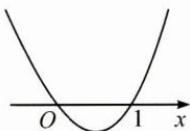
图1

图2

4.【解析】 $f(x)=2|x-1|+\frac{1}{2}|x+2|$ $=\frac{1}{2}\left(|x-1|+|x-1|+|x-1|+|x-1|+|x+2|\right)$ ,

由绝对值的几何意义得，当 $x\in[-2,1]$ 时， $|x-1|+|x+2|$ 最小，只需在此基础上使 $3|x-1|$ 最小，显然应取 x=1，

所以 $f(x)_{\min}=f(1)=\frac{3}{2}$ .

## 34 均值不等式

1. B 【解析】因为 $a=\log_{13}8$ ，故 $8=13^{a}$ ，
所以 $13^{4}<8^{5}=13^{5a}$ ，故 $a>\frac{4}{5}$ 同理, $5=8^{c}$ ,所以 $8^{5c}=5^{5}<8^{4}$ ,故 $c<\frac{4}{5}$ ,
而 $\frac{c}{b}=\log_{8}5\cdot\log_{3}5=\frac{\lg^{2}5}{\lg3\cdot\lg8}$ , $\lg3\cdot\lg8<\left(\frac{\lg3+\lg8}{2}\right)^{2}<\lg^{2}5$

所以 $\frac{\lg^25}{\lg 3\cdot\lg 8} >1$ ，即 $\frac{c}{b} >1$ ，所以 $c > b$ 所以 $a > c > b$ ，故选B.

2.A【解析】因为 $a, b$ 均为正实数，则 $\frac{ab + bc}{a^2 + 2b^2 + c^2} = \frac{a + c}{\frac{a^2 + c^2}{b} + 2b} \leqslant \frac{a + c}{2\sqrt{\frac{a^2 + c^2}{b}} \times 2b}$ $= \frac{a + c}{2\sqrt{2(a^2 + c^2)}} = \frac{1}{2}\sqrt{\frac{a^2 + 2ac + c^2}{2(a^2 + c^2)}}$ $= \frac{1}{2}\sqrt{\frac{1}{2} + \frac{ac}{a^2 + c^2}} \leqslant \frac{1}{2}\sqrt{\frac{1}{2} + \frac{ac}{2\sqrt{a^2c^2}}} = \frac{1}{2},$ 当且仅当 $\frac{a^2 + c^2}{b} = 2b$ 且 $a = c$ ，即 $a = b = c$ 时取等号，则 $\frac{ab + bc}{a^2 + 2b^2 + c^2}$ 的最大值为 $\frac{1}{2}$ 故选A.

3. -1 【解析】由正弦定理得 $2b^{2} + 3c^{2} = 2bc\sin A + a^{2}$ ，由余弦定理得 $2b^{2} + 3c^{2} = 2bc\sin A + b^{2} + c^{2} - 2bc\cos A$ ，即 $\frac{b^{2} + 2c^{2}}{2bc} = \sin A - \cos A$ .
因为 $\frac{b^{2}+2c^{2}}{2bc}\geqslant\frac{2\sqrt{b^{2}\cdot2c^{2}}}{2bc}=\sqrt{2}$ $\sin A - \cos A \leqslant \sqrt{2}$ 所以 $b=\sqrt{2}c, A=\frac{3\pi}{4}$ ，得 $\tan A=-1$ .

4.【解析】(1)根据 $(a_{1}b_{1}+a_{2}b_{2})^{2}\leqslant(a_{1}^{2}+a_{2}^{2})\cdot(b_{1}^{2}+b_{2}^{2})$ ，将其中的 $a_{1},a_{2},b_{1},b_{2}$ 分别换成 $\sqrt{x_{1}},\sqrt{x_{2}},\sqrt{y_{1}},\sqrt{y_{2}}$ ，
可得 $(\sqrt{x_{1}}\sqrt{y_{1}}+\sqrt{x_{2}}\sqrt{y_{2}})^{2}$ $\leqslant\left[(\sqrt{x_{1}})^{2}+(\sqrt{x_{2}})^{2}\right]\left[(\sqrt{y_{1}})^{2}+(\sqrt{y_{2}})^{2}\right]$ $=(x_{1}+x_{2})(y_{1}+y_{2})$ ,
故 $(x_{1}+x_{2})(y_{1}+y_{2})\geqslant(\sqrt{x_{1}y_{1}}+\sqrt{x_{2}y_{2}})^{2}.$ (2)令 $A=\sqrt[3]{x_{1}^{3}+x_{2}^{3}},B=\sqrt[3]{y_{1}^{3}+y_{2}^{3}},C=\sqrt[3]{z_{1}^{3}+z_{2}^{3}}$ 则 $\frac{x_{1}y_{1}z_{1}+x_{2}y_{2}z_{2}}{ABC}$ $=\frac{x_{1}}{A}\cdot\frac{y_{1}}{B}\cdot\frac{z_{1}}{C}+\frac{x_{2}}{A}\cdot\frac{y_{2}}{B}\cdot\frac{z_{2}}{C}$

$\leqslant \frac{\left(\frac{x_1}{A}\right)^3 + \left(\frac{y_1}{B}\right)^3 + \left(\frac{z_1}{C}\right)^3}{3}$ $+\frac{\left(\frac{x_2}{A}\right)^3 + \left(\frac{y_2}{B}\right)^3 + \left(\frac{z_2}{C}\right)^3}{3}$ $= \frac{\left(\frac{x_1}{A}\right)^3 + \left(\frac{x_2}{A}\right)^3}{3} + \frac{\left(\frac{y_1}{B}\right)^3 + \left(\frac{y_2}{B}\right)^3}{3}$ $+\frac{\left(\frac{z_1}{C}\right)^3 + \left(\frac{z_2}{C}\right)^3}{3}$ $= \frac{x_1^3 + x_2^3}{3A^3} + \frac{y_1^3 + y_2^3}{3B^3} + \frac{z_1^3 + z_2^3}{3C^3}$ $= \frac{A^3}{3A^3} + \frac{B^3}{3B^3} + \frac{C^3}{3C^3} = \frac{1}{3} + \frac{1}{3} + \frac{1}{3} = 1,$ 所以 $\frac{x_1y_1z_1 + x_2y_2z_2}{ABC} \leqslant 1$ ，

即 $x_1y_1z_1 + x_2y_2z_2 \leqslant ABC$ ，

所以 $(x_1y_1z_1 + x_2y_2z_2)^3 \leqslant A^3B^3C^3$ $= (x_1^3 + x_2^3)(y_2^3 + y_2^3)(z_1^3 + z_2^3)$ ,

将上式中的 $x_1, y_1, z_1, x_2, y_2, z_2$ 分别换成 $\sqrt[3]{x_1}, \sqrt[3]{y_1}, \sqrt[3]{z_1}, \sqrt[3]{x_2}, \sqrt[3]{y_2}, \sqrt[3]{z_2}$ ,

得 $\left(\sqrt[3]{x_1} \cdot \sqrt[3]{y_1} \cdot \sqrt[3]{z_1} + \sqrt[3]{x_2} \cdot \sqrt[3]{y_2} \cdot \sqrt[3]{z_2}\right)^3$ $\leqslant \left[(\sqrt[3]{x_1})^3 + (\sqrt[3]{x_2})^3\right]\left[(\sqrt[3]{y_1})^3 + (\sqrt[3]{y_2})^3\right]\left[(\sqrt[3]{z_1})^3 + (\sqrt[3]{z_2})^3\right],$ 所以 $(\sqrt[3]{x_1y_1z_1} + \sqrt[3]{x_2y_2z_2})^3 \leqslant (x_1 + x_2) \cdot (y_1 + y_2)(z_1 + z_2)$ , 得证.

## 35 柯西不等式

1.【解析】设点 $Q(x,y)$ 是直线 $l$ 上任意一点，则点 $P$ 到直线 $l$ 的距离就是点 $P$ 与动点 $Q$ 的最短距离.又 $\left|PQ\right|^2 = (x - x_0)^2 +(y - y_0)^2,$ 由 $Ax + By + C = 0$ 可得， $A(x - x_0) + B(y - y_0) = -(Ax_0 + By_0 + C),$ $(Ax_0 + By_0 + C)^2$ $= [A(x - x_0) + B(y - y_0)]^2$

$\leqslant (A^2 + B^2)[(x - x_0)^2 + (y - y_0)^2]$ 从而有 $(x - x_0)^2 + (y - y_0)^2 \geqslant \frac{(Ax_0 + By_0 + C)^2}{A^2 + B^2}$ 当且仅当 $A(y - y_0) = B(x - x_0)$ 时取等号，此时 $PQ \perp l$ 故点 $P$ 到直线 $l$ 的距离为 $\frac{|Ax_0 + By_0 + C|}{\sqrt{A^2 + B^2}}.$

2.【解析】由柯西不等式，
有 $(2b^{2}+3c^{2}+6d^{2})\left(\frac{1}{2}+\frac{1}{3}+\frac{1}{6}\right)\geqslant$ $(b+c+d)^{2}$ ,
即由条件可得 $5-a^{2}\geqslant(3-a)^{2}$ ,
解得 $1 \leqslant a \leqslant 2$ ,
当且仅当 $\frac{\sqrt{2}b}{\sqrt{1/2}}=\frac{\sqrt{3}c}{\sqrt{1/3}}=\frac{\sqrt{6}d}{\sqrt{1/6}}$ 时取等号.
当 $b=\frac{1}{2}, c=\frac{1}{3}, d=\frac{1}{6}$ 时，a 的最大值为 2，
当 b=1, $c=\frac{2}{3}$ , $d=\frac{1}{3}$ 时，a 的最小值为 1.

3.【解析】由 $a^2 + 4b^2 + 9c^2 = 4b - 12c - 2$ ，
可得 $a^2 + (2b - 1)^2 + (3c - 2)^2 = 3$ ，
所以 $(a + 2b - 1 + 3c - 2)^2$ $\leqslant (1 + 1 + 1)[a^2 + (2b - 1)^2 + (3c - 2)^2]$ $= 9$ ，
即 $a + 2b + 3c \leqslant 6$ 。 $\left(\frac{1}{a} + \frac{2}{b} + \frac{3}{c}\right)(a + 2b + 3c) \geqslant (1 + 2 + 3)^2$ $= 36$ ，所以 $\frac{1}{a} + \frac{2}{b} + \frac{3}{c} \geqslant \frac{36}{a + 2b + 3c} \geqslant 6$ ，
当且仅当 $a = b = c = 1$ 时取等号，
所以 $\frac{1}{a} + \frac{2}{b} + \frac{3}{c}$ 的最小值是6.

4.【解析】 $(\sqrt{16 + 6x - x^2} +\sqrt{36x - 68 - x^2})^2$ $= (\sqrt{8 - x}\sqrt{2 + x} +\sqrt{34 - x}\sqrt{x - 2})^2$ $\leqslant (8 - x + x - 2)(2 + x + 34 - x) = 216,$ 当且仅当 $x = \frac{46}{7}$ 时取等号，所以 $f(x)\leqslant 6\sqrt{6},f(x)$ 的最大值是 $6\sqrt{6}$

5.【解析】显然 $x = 0$ 不是原方程的根.
原方程可等价变形为： $ax^3 + bx = -(x^4 + 2x^2 + 1)$ ，
由柯西不等式得 $(x^4 + 2x^2 + 1)^2$ $= (ax^3 + bx)^2 \leqslant (a^2 + b^2)(x^6 + x^2)$ ，
即 $a^2 + b^2 \geqslant \frac{(x^4 + 2x^2 + 1)^2}{x^6 + x^2} = \frac{\left(\frac{x^4 + 2x^2 + 1}{x^2}\right)^2}{\frac{x^6 + x^2}{x^4}}$ $= \frac{\left(x^2 + \frac{1}{x^2} + 2\right)^2}{x^2 + \frac{1}{x^2}}$ 设 $x^2 + \frac{1}{x^2} = t$ ，则 $t \geqslant 2$ 所以 $a^2 + b^2 \geqslant \frac{(t + 2)^2}{t} = t + \frac{4}{t} + 4 \geqslant 8$ 当且仅当 $t = 2$ ，即 $x = \pm 1$ 时取等号，
所以 $a^2 + b^2$ 的最小值为8.

## 36 变角变次

1. $-\frac{1}{2}$ 【解析】因为 $\sin \alpha + \cos \beta = 1$ ， $\cos \alpha + \sin \beta = 0$ ，
所以 $\sin^2\alpha + \cos^2\beta + 2\sin \alpha \cos \beta = 1$ ， $\cos^2\alpha + \sin^2\beta + 2\cos \alpha \sin \beta = 0$ ，
两式相加得 $2 + 2\sin (\alpha + \beta) = 1$ ，
所以 $\sin (\alpha + \beta) = -\frac{1}{2}$ .

2. A 【解析】由条件知 $6\cos^{2}\alpha-8\cos\alpha-8=0$ ，
则 $(\cos\alpha-2)(3\cos\alpha+2)=0$ 得 $\cos\alpha=-\frac{2}{3},\sin\alpha=\frac{\sqrt{5}}{3}$ ，故选 A.

3. D 【解析】 $f(x)=2\cos^{2}x\sin^{2}x=\frac{1}{2}\sin^{2}2x$ $=\frac{1-\cos4x}{4}$ ，易知选 D.

4. $\frac{9}{8}$ 【解析】原式 $=\left(\frac{1+\cos40^{\circ}}{2}\right)^{2}+\left(\frac{1+\cos80^{\circ}}{2}\right)^{2}+\left(\frac{1+\cos160^{\circ}}{2}\right)^{2}$

$= \frac{3}{4} +\frac{1}{2} (\cos 40^{\circ} + \cos 80^{\circ} + \cos 160^{\circ})+$ $\frac{1}{4} (\cos^2 40^\circ +\cos^2 80^\circ +\cos^2 160^\circ)$ $= \frac{3}{4} +\frac{1}{2} (\cos 40^{\circ} + \cos 80^{\circ} + \cos 160^{\circ})+$ $\frac{1}{8}(3 + \cos 80^{\circ} + \cos 160^{\circ} + \cos 320^{\circ})$ $= \frac{9}{8} +\frac{5}{8}\Big[\cos (60^{\circ} - 20^{\circ}) + \cos (60^{\circ} + 20^{\circ})$ $-\cos 20^{\circ}\Big] = \frac{9}{8}.$

5.【解析】由题意知 $\sin^{2}\alpha + \sin^{2}\beta = \sin\alpha\cos\beta + \cos\alpha\sin\beta,$ $\sin\alpha(\sin\alpha - \cos\beta) = \sin\beta(\cos\alpha - \sin\beta),$ 则 $\sin\alpha - \cos\beta$ 与 $\cos\alpha - \sin\beta$ 同号或同为零.

若 $\sin\alpha > \cos\beta$ 且 $\cos\alpha > \sin\beta,$ 则 $1 = \sin^{2}\alpha + \cos^{2}\alpha > \cos^{2}\beta + \sin^{2}\beta = 1$ ，矛盾；

若 $\sin\alpha < \cos\beta$ 且 $\cos\alpha < \sin\beta,$ 则 $1 = \sin^{2}\alpha + \cos^{2}\alpha < \cos^{2}\beta + \sin^{2}\beta = 1$ ，矛盾.

故 $\cos\alpha = \sin\beta$ 且 $\sin\alpha = \cos\beta,$ 即 $\alpha + \beta = \frac{\pi}{2}.$

## 37 “1”的代换

1.3或 $-\frac{1}{3}$ 【解析】将已知条件两边平方，构造“1”进行代换，得 $\frac{(\sin\alpha + 2\cos\alpha)^2}{\sin^2\alpha + \cos^2\alpha} = \left(\frac{\sqrt{10}}{2}\right)^2$ 转化为 $\tan\alpha$ 后求解.

2. $\frac{4\sqrt{7}}{7}$ 【解析】联系已知条件，将“1”灵活转换，得 $(x + y)^2 = \frac{(x + y)^2}{2x^2 - xy + y^2} = 1 + \frac{9}{s + \frac{16}{s} - 1}$ $\in \left[0, \frac{16}{7}\right]$ ，其中 $s = 3\left(\frac{y}{x}\right) - 1 \in \mathbb{R}$ . 另外，分子、分母同除的过程中要考虑

s=0 和 x=0 的情况.

3. $-\frac{1}{4}$ 【解析】构造“1”进行代换. $x+y+\frac{1}{x}+\frac{1}{2y}=\frac{19}{4}$ ,
则 $\frac{3}{x}-\frac{7}{16y}+x+y+\frac{1}{x}+\frac{1}{2y}-\frac{19}{4}$ $=x+y+\frac{4}{x}+\frac{1}{16y}-\frac{19}{4}\geqslant\frac{9}{2}-\frac{19}{4}=-\frac{1}{4}$ ,
当且仅当 $\left\{\begin{aligned}x&=\frac{4}{x},\\ y&=\frac{1}{16y},\end{aligned}\right.$ 即 $\left\{\begin{aligned}x&=2,\\ y&=\frac{1}{4}\end{aligned}\right.$ 时取等号.

4.【解析】待证不等式可变形为 $\frac{x^2}{x + yz}+$ $\frac{y^2}{y + xz} + \frac{z^2}{z + yx}\geqslant M,$ 因为 $x,y,z > 0$ 可得 $\left(\frac{x^2}{x + yz} +\frac{y^2}{y + xz} +\frac{z^2}{z + yx}\right)(x + yz$ $+y + xz + z + xy)\geqslant (x + y + z)^2,$ 化简得 $\frac{x^2}{x + yz} +\frac{y^2}{y + xz} +\frac{z^2}{z + yx}$ $\geqslant \frac{(x + y + z)^2}{x + yz + y + xz + z + xy} = \frac{(x + y + z)^2}{x + y + z + 1},$ 当且仅当 $\frac{x^2}{x^2 + xyz} = \frac{y^2}{y^2 + xyz} = \frac{z^2}{z^2 + yxz}$ 时等号成立，即 $x = y = z = \frac{\sqrt{3}}{3}$ 由 $(x + y + z)^2\geqslant 3(yz + xz + xy),$ 有 $x + y + z\geqslant \sqrt{3}$ 当且仅当 $x = y = z = \frac{\sqrt{3}}{3}$ 时成立.下面证明函数 $f(u) = \frac{u^2}{u + 1}(u\geqslant \sqrt{3})$ 单调递增.事实上，令 $u > v\geqslant \sqrt{3}$ $f(u) > f(v)\Leftrightarrow \frac{u^2}{u + 1} >\frac{v^2}{v + 1}$ $\Leftrightarrow u^{2}v + u^{2} - uv^{2} - v^{2} > 0$ $\Leftrightarrow (u - v)(uv + u + v) > 0\Leftrightarrow u - v > 0,$

于是 $f(u) \geqslant f(\sqrt{3}) = \frac{3(\sqrt{3} - 1)}{2}$ . 故 $\frac{x^2}{x + yz} + \frac{y^2}{y + xz} + \frac{z^2}{z + yx} \geqslant \frac{(x + y + z)^2}{x + y + z + 1} \geqslant \frac{3(\sqrt{3} - 1)}{2}$ , 因此, $M_{\max} = \frac{3(\sqrt{3} - 1)}{2}$ .

## 38 差异分析法

1.10 【解析】根据函数解析式的结构特点进行变形, $f(x)=x^{5}=(1+x-1)^{5}$ ,把 $1+x$ 看成整体再展开,得 $a_{3}=C_{5}^{3}(-1)^{2}=10$ .

2.【解析】(1)由 $a^2 + b^2 \geqslant 2ab, b^2 + c^2 \geqslant 2bc$ ， $c^2 + a^2 \geqslant 2ca$ ，
得 $a^2 + b^2 + c^2 \geqslant ab + bc + ca$ ，
由题设得 $(a + b + c)^2 = 1$ ，
即 $a^2 + b^2 + c^2 + 2ab + 2bc + 2ca = 1$ ，
所以 $3(ab + bc + ca) \leqslant 1$ ，
即 $ab + bc + ca \leqslant \frac{1}{3}$ .

(2)由 $\frac{a^2}{b} + b \geqslant 2a, \frac{b^2}{c} + c \geqslant 2b, \frac{c^2}{a} + a \geqslant 2c$ ，
得 $\frac{a^2}{b} + \frac{b^2}{c} + \frac{c^2}{a} + (a + b + c) \geqslant 2(a + b + c)$ ，即 $\frac{a^2}{b} + \frac{b^2}{c} + \frac{c^2}{a} \geqslant a + b + c$ ，
所以 $\frac{a^2}{b} + \frac{b^2}{c} + \frac{c^2}{a} \geqslant 1$ .

3.4 【解析】由 $\frac{b}{a} + \frac{a}{b} = 6\cos C$ 得 $6ab\cos C = a^2 + b^2$ 即 $6ab \cdot \frac{a^2 + b^2 - c^2}{2ab} = a^2 + b^2$ 得 $a^2 + b^2 = \frac{3c^2}{2}$ $\frac{\tan C}{\tan A} + \frac{\tan C}{\tan B} = \frac{\sin C}{\cos C} \cdot \frac{\cos B\sin A + \sin B\cos A}{\sin A\sin B} = \frac{\sin C}{\cos C} \cdot \frac{\sin(A + B)}{\sin A\sin B} = \frac{1}{\cos C} \cdot \frac{\sin^2C}{\sin A\sin B},$ 由正弦定理可知，上式 $= \frac{1}{\cos C} \cdot \frac{c^2}{ab} = \frac{c^2}{\frac{1}{6}(a^2 + b^2)} = \frac{c^2}{\frac{1}{6} \cdot \frac{3c^2}{2}} = 4.$

## 39 边角互化

1. C 【解析】由余弦定理得 $c\cos A + a\cos C = c \cdot \frac{b^{2} + c^{2} - a^{2}}{2bc} + a \cdot \frac{a^{2} + b^{2} - c^{2}}{2ab} = b,$ 则 $3b\cos A = c\cos A + a\cos C = b,$ 两边约去 b，得 $3\cos A = 1, \cos A = \frac{1}{3} > 0,$ 所以 A 为锐角，且 $\sin A = \sqrt{1 - \cos^{2} A} = \frac{2\sqrt{2}}{3}$ 因此， $\tan A=\frac{\sin A}{\cos A}=2\sqrt{2}$ . 故选 C.

2. A 【解析】由正弦定理得 $a^{2}-b^{2}=4c^{2}$ ，
由余弦定理得 $-\frac{1}{4}=\cos A=\frac{b^{2}+c^{2}-a^{2}}{2bc}$ ，
所以 $\frac{c^{2}-4c^{2}}{2bc}=-\frac{1}{4}$ ，所以 $\frac{3c}{2b}=\frac{1}{4}$ ，
所以 $\frac{b}{c}=\frac{3}{2}\times4=6$ ，故选A.

3. 等腰或直角 【解析】由正弦定理，
得 $\frac{a}{b}=\frac{\sin A}{\sin B}$ ，又 $a\cos A=b\cos B$ 所以 $\frac{a}{b}=\frac{\cos B}{\cos A}$ ，所以 $\frac{\sin A}{\sin B}=\frac{\cos B}{\cos A}$ 则 $\sin A \cos A = \sin B \cos B$ ,
即 $\sin 2A = \sin 2B$ .
因为 A, B 为三角形的内角，所以 2A = 2B
或 $2A + 2B = \pi$ ，得 A = B 或 $A + B = \frac{\pi}{2}$ ，
所以△ABC是等腰三角形或直角三角形.

4. $\frac{2\sqrt{3}}{3}$ 【解析】由 $b\sin C + c\sin B = 4a\sin B\sin C$ 结合正弦定理可得 $\sin B\sin C + \sin C\sin B = 4\sin A\sin B\sin C$ 可得 $\sin A = \frac{1}{2}$ ，又 $b^2 + c^2 - a^2 = 8$

结合余弦定理有 $a^2 = b^2 + c^2 - 2bc\cos A$ 可得 $2bc\cos A = 8$ 所以 $A$ 为锐角， $\cos A = \frac{\sqrt{3}}{2}$ ，从而 $bc = \frac{8\sqrt{3}}{3}$ ，所以 $\triangle ABC$ 的面积为 $S = \frac{1}{2} bc\sin A = \frac{1}{2} \times \frac{8\sqrt{3}}{3} \times \frac{1}{2} = \frac{2\sqrt{3}}{3}$ .

5.【解析】(1)根据 $a\sin\frac{A+C}{2}=b\sin A$ ,
由正弦定理得 $\sin A \sin \frac{A + C}{2} = \sin B \sin A$ ,
因为 0 < A < $\pi$ , 故 $\sin A > 0$ ,
消去 $\sin A$ 得 $\sin \frac{A + C}{2} = \sin B$ .
因为 $0 < B < \pi, 0 < \frac{A + C}{2} < \pi,$ 故 $\frac{A+C}{2}=B$ 或 $\frac{A+C}{2}+B=\pi,$ 而 $A+B+C=\pi$ , 故 $\frac{A+C}{2}+B=\pi$ 不成立，
所以 $\frac{A+C}{2}=B$ ，得 $3B=\pi$ ，所以 $B=\frac{\pi}{3}$ .
(2) 因为 $\triangle ABC$ 是锐角三角形，由(1)知 $B=\frac{\pi}{3}, A+B+C=\pi,$ 得 $A+C=\frac{2\pi}{3}$ ,
故 $\left\{\begin{aligned}&0<C<\frac{\pi}{2},\\ &0<\frac{2\pi}{3}-C<\frac{\pi}{2},\end{aligned}\right.$ 解得 $\frac{\pi}{6}<C<\frac{\pi}{2}$ .
由正弦定理得 $\frac{a}{\sin A}=\frac{c}{\sin C}$ ，又 c=1，
由三角形面积公式有 $S_{\triangle ABC}=\frac{1}{2}ac\sin B$ $=\frac{1}{2}c^{2}\cdot\frac{a}{c}\cdot\sin B=\frac{1}{2}c^{2}\cdot\frac{\sin A}{\sin C}\cdot\sin B$ $=\frac{\sqrt{3}}{4}\cdot\frac{\sin\left(\frac{2\pi}{3}-C\right)}{\sin C}$ $=\frac{\sqrt{3}}{4}\cdot\frac{\sin\frac{2\pi}{3}\cos C-\cos\frac{2\pi}{3}\sin C}{\sin C}$ $=\frac{\sqrt{3}}{4}\left(\sin\frac{2\pi}{3}\cdot\frac{1}{\tan C}-\cos\frac{2\pi}{3}\right)$

$= \frac{3}{8}\cdot \frac{1}{\tan C} +\frac{\sqrt{3}}{8}.$ 又因为 $\frac{\pi}{6} <  C <   \frac{\pi}{2},\tan C > \frac{\sqrt{3}}{3},$ 故 $\frac{\sqrt{3}}{8} <  \frac{3}{8}\cdot \frac{1}{\tan C} +\frac{\sqrt{3}}{8} <  \frac{\sqrt{3}}{2},$ 即 $\frac{\sqrt{3}}{8} <  S_{\triangle ABC} <   \frac{\sqrt{3}}{2}.$

## 40 和差代换

1.【解析】由 $a + b = 1$ ，设 $a = \frac{1}{2} + x, b = \frac{1}{2} - x,$ 则 $a^4 + b^4 = \left(\frac{1}{2} + x\right)^4 + \left(\frac{1}{2} - x\right)^4$ $= \frac{1}{8} + 3x^{2} + 2x^{4} \geqslant \frac{1}{8}$ .

2.【解析】令 $\left\{\begin{aligned}x&=u-v,\\ y&=u+v,\end{aligned}\right.$ 代入条件得 $3u^{2}+v^{2}=1$ ，即 $v^{2}=1-3u^{2}\left(0\leqslant u^{2}\leqslant\frac{1}{3}\right)$ ，
则 $S = x^{2} - xy + y^{2} = u^{2} + 3v^{2} = 3 - 8u^{2}$ ,
由 $0 \leqslant u^{2} \leqslant \frac{1}{3}$ 得 $\frac{1}{3} \leqslant S \leqslant 3$ ,
故 S 的取值范围为 $\left[\frac{1}{3},3\right]$ .

3.【解析】由条件得 $(x-2y)^{2}-2x+3y+1$ =0，令 $\left\{\begin{aligned}x-2y&=u,\\ y&=v,\end{aligned}\right.$ 从而 $\left\{\begin{aligned}x&=u+2v,\\ y&=v,\end{aligned}\right.$ 代入条件得 $(u-1)^{2}=v$ ，

所以 $x-3y=u-v=u-(u-1)^{2}$ $=-\left(u-\frac{3}{2}\right)^{2}+\frac{5}{4}$ 因此 $(x-3y)_{\max}=\frac{5}{4}$ ，此时 $x=2,y=\frac{1}{4}$ .

4.【解析】不妨设 $a \geqslant b$ ，令 $\left\{ \begin{array}{l} a = x + y, \\ b = x - y, \end{array} \right.$ $x \geqslant y \geqslant 0$ ，则 $a + b = 2x$ ，只需证 $\sqrt[3]{\frac{1}{4}} \leqslant x \leqslant 1$ 即可。由 $a^3 + b^3 = (x + y)^3 + (x - y)^3 = 2$ 整理得 $x^3 + 3xy^2 = 1$

所以 $x^{3} = 1 - 3xy^{2}\leqslant 1$ ，所以 $x\leqslant 1$ 又因为 $x\geqslant y\geqslant 0$ 所以 $1 = x^{3} + 3xy^{2}\leqslant x^{3} + 3x\cdot x^{2} = 4x^{3},$ 故 $\frac{1}{4}\leqslant x^3,\sqrt[3]{\frac{1}{4}}\leqslant x.$ 综上， $\sqrt[3]{\frac{1}{4}}\leqslant x\leqslant 1$ ，即 $\sqrt[3]{2}\leqslant a + b\leqslant 2$ ，得证.

## 41 三角代换

1. B 【解析】令 $\left\{\begin{aligned}x&=\sqrt{5}\cos\theta,\\ y&=\sqrt{5}\sin\theta,\end{aligned}\right.$ $\theta\in[0,2\pi]$ ,
则 $t=4x^{2}-5xy+4y^{2}=20-\frac{25}{2}\sin2\theta\in\left[\frac{15}{2},\frac{65}{2}\right]$ ，故选 B.

2. B 【解析】 $f(x+1)=1+\sqrt{2f(x)-f^{2}(x)}$ $\Rightarrow f(x+1)=1+\sqrt{1-\left[f(x)-1\right]^{2}}$ $\Rightarrow\left[f(x+1)-1\right]^{2}+\left[f(x)-1\right]^{2}=1,$ 令 $f(x+1)=1+\cos\theta, f(x)=1+\sin\theta,$ $\theta\in\left[-\frac{\pi}{2},\frac{\pi}{2}\right]$ ,
则 $f(2021)+f(2022)=2+\cos\theta+\sin\theta\leqslant$ $2+\sqrt{2}$ ，当 $\theta=\frac{\pi}{4}$ 时取等号，故选 B.

3.【解析】设 $a=\sin\alpha\sin\beta, c=\sin\alpha\cos\beta, b=\cos\alpha$ ，其中 $\alpha,\beta\in\left(0,\frac{\pi}{2}\right)$ ，
则 $3ab+bc=\frac{3}{2}\sin2\alpha\sin\beta+\frac{1}{2}\sin2\alpha\cos\beta$ $=\frac{\sqrt{10}}{2}\sin2\alpha\sin(\beta+\theta)$ ,
其中 $\theta\in\left(0,\frac{\pi}{2}\right),\tan\theta=\frac{1}{3}$ .
当 $\alpha=\frac{\pi}{4},\beta=\frac{\pi}{2}-\theta$ 时， $3ab+bc=\frac{\sqrt{10}}{2}$ ,
即当 $a=\frac{3\sqrt{5}}{10},b=\frac{\sqrt{2}}{2},c=\frac{\sqrt{5}}{10}$ 时， $3ab+bc$ 的最大值为 $\frac{\sqrt{10}}{2}$ .

4.【解析】函数 $y=2x+\sqrt{4x^{2}-8x+3}$ 可化为 $y=(2x-2)+\sqrt{(2x-2)^{2}-1}+2$ .
由 $(2x-2)^{2}\geqslant1$ ，得 $|2x-2|\geqslant1$ 可设 $2x-2=\frac{1}{\sin\alpha}\left(-\frac{\pi}{2}\leqslant\alpha\leqslant\frac{\pi}{2}\right.$ 且 $\alpha\neq0$ 。
当 $0<\alpha\leqslant\frac{\pi}{2}$ 时， $y=\frac{1}{\sin\alpha}+\sqrt{\frac{1}{\sin^{2}\alpha}-1}+2$ $=\frac{1+\cos\alpha}{\sin\alpha}+2=\frac{1}{\tan\frac{\alpha}{2}}+2,$ 当 $\alpha=\frac{\pi}{2}$ ，即 $x=\frac{3}{2}$ 时，y 有最小值 3.
当 $-\frac{\pi}{2}\leqslant\alpha<0$ 时， $y=\frac{1}{\sin\alpha}+\sqrt{\frac{1}{\sin^{2}\alpha}-1}+2=\frac{1-\cos\alpha}{\sin\alpha}+2=\tan\frac{\alpha}{2}+2,$ 当 $\alpha=-\frac{\pi}{2}$ ，即 $x=\frac{1}{2}$ 时，y 有最小值 1.
综上，所求函数的最小值为1.

5.【解析】令 $A(a\cos \alpha ,b\sin \alpha),B(a\cos \beta ,b\sin \beta)$ 则 $C(-a(\cos \alpha +\cos \beta), - b(\sin \alpha +\sin \beta))$ 点 $C$ 在椭圆上，代入得 $(\cos \alpha +\cos \beta)^2 +(s i n\alpha +s i n\beta)^2 = 1$ 即 $\cos (\alpha -\beta) = -\frac{1}{2}.$ $S_{\triangle ABC} = 3S_{\triangle OAB} = \frac{3}{2} ab|\sin (\alpha -\beta)|$ $= \frac{3\sqrt{3}}{4} ab,$ 为定值.

## 42 齐次化

1. $-\frac{7}{5}$ 【解析】由 $\frac{\cos^2\alpha - \sin^2\alpha}{1 + 2\sin\alpha\cos\alpha}$ $= \frac{\cos^2\alpha - \sin^2\alpha}{\cos^2\alpha + \sin^2\alpha + 2\sin\alpha\cos\alpha}$ $= \frac{1 - \tan^2\alpha}{1 + \tan^2\alpha + 2\tan\alpha} = \frac{1 - \tan\alpha}{1 + \tan\alpha} = 3,$ 可得 $\tan \alpha = -\frac{1}{2},$ 则 $\sin^2\alpha = \frac{\sin^2\alpha}{\sin^2\alpha + \cos^2\alpha} = \frac{\tan^2\alpha}{\tan^2\alpha + 1} = \frac{1}{5},$ $\sin\alpha\cos\alpha=\frac{\sin\alpha\cos\alpha}{\sin^{2}\alpha+\cos^{2}\alpha}=\frac{\tan\alpha}{\tan^{2}\alpha+1}=-\frac{2}{5},$ 所以 $4\sin^{2}\alpha-2\sin\alpha\cos\alpha-3$ $=4\times\frac{1}{5}-2\times\left(-\frac{2}{5}\right)-3=-\frac{7}{5}.$

2. $\frac{2\sqrt{10}}{5}$ 【解析】构造齐次式， $(2x + y)^2 = \frac{(2x + y)^2}{1} = \frac{(2x + y)^2}{4x^2 + y^2 + xy}$ $= \frac{4 + 4\left(\frac{y}{x}\right) + \left(\frac{y}{x}\right)^2}{4 + \frac{y}{x} + \left(\frac{y}{x}\right)^2} (x \neq 0)$ ，令 $t = \frac{y}{x} \in \mathbb{R}$ ，得 $(2x + y)^2 = \frac{4 + 4t + t^2}{4 + t + t^2} = 1 + \frac{3t}{4 + t + t^2}$ . 要使 $2x + y$ 取到最大值，只需考虑 $t > 0$ 的情况即可，从而有 $(2x + y)^2 = 1 + \frac{3t}{4 + t + t^2} = 1 + \frac{3}{\frac{4}{t} + t + 1} \leqslant 1 + \frac{3}{5} = \frac{8}{5}$ ，当且仅当 $t = 2$ 时取等号，故 $2x + y$ 的最大值为 $\frac{2\sqrt{10}}{5}$ .

3.B【解析】参数分离得 $\frac{5x + 12\sqrt{xy}}{x + y}\leqslant a$ 记 $f(x,y) = \frac{5x + 12\sqrt{xy}}{x + y}$ ，则 $f(x,y)_{\max}\leqslant$ a，将问题转化为求二元函数最大值问题.变形得 $f(x,y) = \frac{5\left(\frac{x}{y}\right) + 12\sqrt{\frac{x}{y}}}{\frac{x}{y} + 1},$ 设 $t = \frac{x}{y} >0$ ，令 $m = \frac{5t + 12\sqrt{t}}{t + 1},$ 整理得 $(5 - m)t + 12\sqrt{t} -m = 0,$ 将方程看成关于 $\sqrt{t}$ 的一元二次方程，由 $\Delta = 12^{2} + 4(5 - m)m\geqslant 0,$ 得 $m$ 的最大值为9，则 $a\geqslant 9$ ，故选B.

4.C【解析】由 $A = \frac{\pi}{3}, b = 6$ 及余弦定理，
可得 $a^2 = b^2 + c^2 - 2bc\cos A$ ，即 $a^2 = 36 + c^2 - 6c$ ①.
由正弦定理得 $\frac{3c^2}{\cos C} = 2ab$ 即 $3c^2 = 2ab\cos C$ 由余弦定理得 $3c^2 = a^2 + b^2 - c^2$ 即 $a^2 + 36 = 4c^2$ ②，
由①②可得 $c = 4(c = -6$ 舍去），故选C.

5.【解析】设直线 AB 的方程为 $mx + ny = 1$ ，
与椭圆方程联立得 $\frac{x^{2}}{a^{2}}+\frac{y^{2}}{b^{2}}=(mx+ny)^{2}$ 即 $\left(\frac{1}{b^{2}}-n^{2}\right)y^{2}-2mnxy+\left(\frac{1}{a^{2}}-m^{2}\right)x^{2}=0$ 即 $\left(\frac{1}{b^{2}}-\frac{n^{2}}{x}\right)\left(\frac{y}{x}\right)^{2}-2mn\left(\frac{y}{x}\right)+\frac{1}{a^{2}}-m^{2}=0.$ 因为OA⊥OB，所以 $k_{OA}k_{OB}=\frac{y_{1}}{x_{1}}\cdot\frac{y_{2}}{x_{2}}=-1$ 由韦达定理得 $\frac{y_{1}}{x_{1}}\cdot\frac{y_{2}}{x_{2}}=\frac{\frac{1}{a^{2}}-m^{2}}{\frac{1}{b^{2}}-n^{2}}=-1,$ 即 $\frac{1}{a^{2}}+\frac{1}{b^{2}}=m^{2}+n^{2}$ 故点O到直线AB的距离 $d=\frac{1}{\sqrt{m^{2}+n^{2}}}=\frac{ab}{\sqrt{a^{2}+b^{2}}}$ 为定值.

## 43 构造对偶

1.【解析】设 $A=\sin10^{\circ}\sin30^{\circ}\sin50^{\circ}\sin70^{\circ}$ ，构造对偶式 $B=\cos10^{\circ}\cos30^{\circ}\cos50^{\circ}\cos70^{\circ}$ ，则 $AB=\frac{1}{16}\sin20^{\circ}\sin60^{\circ}\sin100^{\circ}\sin140^{\circ}=\frac{1}{16}B$ ，所以 $A=\frac{1}{16}$ .

2.【解析】 $f(x)=\sqrt{3}\sqrt{x-2}+\sqrt{3-x}$ ,
构造对偶函数 $g(x)=\sqrt{3}\sqrt{3-x}-\sqrt{x-2}$ ，
则 $f^{2}(x)+g^{2}(x)=4$ 又函数 $g(x)$ 在定义域 [2,3] 上单调递减，故值域为 $[-1, \sqrt{3}]$ ，故 $g^2(x) \in [0, 3]$ ，从而函数 $f(x)$ 的值域为 $[1, 2]$ .

3.【解析】设 $A = \sqrt{x - \frac{1}{x}} +\sqrt{1 - \frac{1}{x}}$ 构造对偶式 $B = \sqrt{x - \frac{1}{x}} -\sqrt{1 - \frac{1}{x}}$ 则 $AB = x - 1$ ，又 $A = x$ ，故 $B = 1 - \frac{1}{x}$ 所以 $A + B = 2\sqrt{x - \frac{1}{x}} = x + \left(1 - \frac{1}{x}\right)$ 得 $\left(\sqrt{x - \frac{1}{x}} -1\right)^2 = 0,x - \frac{1}{x} = 1,$ 又 $x\geqslant 0$ ，解得 $x = \frac{1 + \sqrt{5}}{2}$

## 44 合一变形

1. $-\frac{2\sqrt{5}}{5}$ 【解析】 $f(x)=\sin x-2\cos x=\sqrt{5}\sin(x-\varphi)$ , 其中 $\sin\varphi=\frac{2}{\sqrt{5}}, \cos\varphi=\frac{1}{\sqrt{5}}$ . 当 $x-\varphi=\frac{\pi}{2}+2k\pi$ , 即 $x=\varphi+\frac{\pi}{2}+2k\pi(k\in\mathbf{Z})$ 时, $f(x)$ 取到最大值 $\sqrt{5}$ , 此时 $\cos\theta=\cos\left(\varphi+\frac{\pi}{2}+2k\pi\right)=-\sin\varphi=-\frac{2\sqrt{5}}{5}$ .

2. $\frac{\sqrt{10}}{2}$ 【解析】合一变形得 $f(x) = \sqrt{a^2 + (1 - a)^2} \sin (x + \varphi)$ , 由题意, $f\left(\frac{\pi}{4}\right) = \pm \sqrt{a^2 + (1 - a)^2} = \pm \frac{\sqrt{2}}{2}$ , 平方后解得 $a = \frac{1}{2}$ , 则 $g(x) = \frac{1}{2} \sin x + \frac{3}{2} \cos x = \frac{\sqrt{10}}{2} \sin (x + \alpha)$ , 故 $g(x)_{\max} = \frac{\sqrt{10}}{2}$ .

3. $\frac{4 - 2\sqrt{13}}{3}$ 【解析】令 $2^{x} = t\in [1,2]$ 设 $f(x) = \frac{-t + \sin\theta}{\frac{1}{t} + \cos\theta} = h(t)$

则 $\sin\theta-t\leqslant0,\cos\theta+\frac{1}{t}>0,f(x)\leqslant0,$ 只需求 $h(t)$ 的最小值，只要分子最大且分母最小即可.
当 $t=2$ 时， $h(t)_{\min}=\frac{-2+\sin\theta}{\frac{1}{2}+\cos\theta}$ 令 $g(\theta)=y=\frac{-2+\sin\theta}{\frac{1}{2}+\cos\theta}$ 则 $\sin\theta-y\cos\theta=\frac{y}{2}+2$ 即 $\sqrt{y^{2}+1}\sin(\theta-\varphi)=\frac{y}{2}+2$ ，其中 $\tan\varphi=y$ 则 $\varphi\in\left(-\frac{\pi}{2},\frac{\pi}{2}\right)$ .
由 $\frac{\left|\frac{y}{2}+2\right|}{\sqrt{y^{2}+1}}=\left|\sin(\theta-\varphi)\right|\leqslant1,$ 解得 $y\leqslant\frac{4-2\sqrt{13}}{3}$ 或 $y\geqslant\frac{4+2\sqrt{13}}{3}$ （舍去）.
当 $y=\frac{4-2\sqrt{13}}{3}$ 时， $\sin(\theta-\varphi)=1,$ $\varphi=\theta-\left(\frac{\pi}{2}+2k\pi\right), k\in Z,$ $y=\tan\varphi=\tan\left(\theta-\frac{\pi}{2}\right)<0,$ 因此， $g(\theta)$ 的最大值为 $\frac{4-2\sqrt{13}}{3}$ .
4. $\left[-\frac{1}{8},3\right]$ 【解析】如图建系，则 $A\left(-\frac{1}{2},0\right)$ ，设 $B(\cos\beta,\sin\beta), C(\cos\alpha,\sin\alpha)$ ，
则 $\overrightarrow{AC}\cdot\overrightarrow{BC}$ $=1-\left(\cos\alpha+\frac{1}{2}\right)\cos\beta-\sin\alpha\sin\beta+\frac{1}{2}\cos\alpha$ $=1+\sqrt{\left(\cos\alpha+\frac{1}{2}\right)^{2}+\sin^{2}\alpha}\cdot\sin(\beta+\theta)$ $+\frac{1}{2}\cos\alpha$ ①.
一方面，① $\leqslant1+\sqrt{\frac{5}{4}+\cos\alpha}+\frac{1}{2}\cos\alpha\leqslant3.$ 另一方面，① $\geqslant1-\sqrt{\frac{5}{4}+\cos\alpha}+\frac{1}{2}\cos\alpha$ ②，
令 $m=\sqrt{\frac{5}{4}+\cos\alpha}\in\left[\frac{1}{2},\frac{3}{2}\right]$

则② $= 1 - m + \frac{1}{2}\left(m^2 -\frac{5}{4}\right) = \frac{1}{2} m^2 -m$ $+ \frac{3}{8}\geqslant -\frac{1}{8}.$ 综上， $\overrightarrow{AC}\cdot \overrightarrow{BC}$ 的取值范围是 $\left[-\frac{1}{8},3\right].$

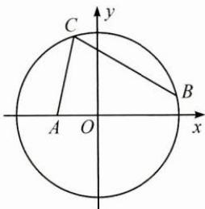

5.【解析】(1)由正弦定理得 $b^{2}+c^{2}-a^{2}=bc$ ，
由余弦定理得 $\cos A=\frac{b^{2}+c^{2}-a^{2}}{2bc}=\frac{1}{2}$ .
因为 $0^{\circ}<A<180^{\circ}$ ，所以 $A=60^{\circ}$ .
(2)由(1)知 $B=120^{\circ}-C$ ,
则 $\sqrt{2}\sin A+\sin(120^{\circ}-C)=2\sin C$ 即 $\frac{\sqrt{6}}{2}+\frac{\sqrt{3}}{2}\cos C+\frac{1}{2}\sin C=2\sin C,$ 可得 $\cos(C+60^{\circ})=-\frac{\sqrt{2}}{2}.$ 由于 $0^{\circ}<C<120^{\circ}$ ，所以 $\sin(C+60^{\circ})=\frac{\sqrt{2}}{2}.$ 故 $\sin C = \sin (C + 60^{\circ} - 60^{\circ})$ $=\sin(C+60^{\circ})\cos60^{\circ}-\cos(C+60^{\circ})\sin60^{\circ}$ $=\frac{\sqrt{6}+\sqrt{2}}{4}.$

## 45 差积互化

1.2 【解析】原式 $= \frac{2\sin 30^{\circ}\cos 20^{\circ}}{-\frac{1}{2}(\cos 90^{\circ} - \cos 20^{\circ})}$ $= \frac{\cos 20^{\circ}}{\frac{1}{2}\cos 20^{\circ}} = 2.$

2. $-\frac{\pi}{2}$ 【解析】 $f(x)=2\sin x\cos(x+\varphi)$ $=\sin(2x+\varphi)+\sin(-\varphi)$ $=\sin(2x+\varphi)-\sin\varphi,x\in\left(0,\frac{\pi}{2}\right),$

则 $2x + \varphi \in (\varphi, \pi + \varphi)$ , 由题意, $(\varphi, \pi + \varphi) \subseteq \left(-\frac{\pi}{2} + 2k\pi, \frac{\pi}{2} + 2k\pi\right)$ , 其中 $k \in \mathbf{Z}$ , 可以取 $k = 0$ , 则 $\varphi = -\frac{\pi}{2}$ .

3.【解析】(1)由题意, $S=\frac{1}{2}ab\sin C=\frac{\sqrt{3}}{4}\times$ 2abcosC,所以tanC= $\sqrt{3}$ .
因为 $0 < C < \pi$ , 所以 $C = \frac{\pi}{3}$ .
(2) $\sin A + \sin B = 2\sin \frac{A + B}{2}\cos \frac{A - B}{2}$ $=2\sin\frac{\pi}{3}\cos\frac{A-\left(\frac{2\pi}{3}-A\right)}{2}$ $=\sqrt{3}\cos\left(A-\frac{\pi}{3}\right)\leqslant\sqrt{3}$ ,
当△ABC为正三角形时取等号，
所以 $\sin A + \sin B$ 的最大值是 $\sqrt{3}$ .

4.【解析】 $\cos\alpha+\cos\beta+\sin(\alpha+\beta)$ $=2\cos\frac{\alpha+\beta}{2}\cos\frac{\alpha-\beta}{2}+2\sin\frac{\alpha+\beta}{2}\cos\frac{\alpha+\beta}{2}$ $=2\cos\frac{\alpha+\beta}{2}\left(\cos\frac{\alpha-\beta}{2}+\sin\frac{\alpha+\beta}{2}\right)$ $\leqslant2\cos\frac{\alpha+\beta}{2}\left(1+\sin\frac{\alpha+\beta}{2}\right)$ ,

其中 $\frac{\alpha+\beta}{2}\in\left(0,\frac{\pi}{2}\right)$ .

令 $f(x)=2\cos x(1+\sin x)$ ,

则 $f'(x)=-4\sin^{2}x-2\sin x+2$ $=-2(\sin x+1)(2\sin x-1)$ , $f(x)$ 在 $\left(0,\frac{\pi}{6}\right)$ 上单调递增,在 $\left(\frac{\pi}{6},\frac{\pi}{2}\right)$ 上单调递减,故 $f(x)$ 在 $\left(0,\frac{\pi}{2}\right)$ 上的最大值为 $f\left(\frac{\pi}{6}\right)=\frac{3\sqrt{3}}{2}$ .

当且仅当 $\cos\frac{\alpha-\beta}{2}=1$ 且 $\frac{\alpha+\beta}{2}=\frac{\pi}{6}$ ,

即 $\alpha=\beta=\frac{\pi}{6}$ 时,

原式取到最大值,最大值为 $\frac{3\sqrt{3}}{2}$ .

## 46 基向量法

1. $\frac{29}{18}$ 【解析】取 $\overrightarrow{AB},\overrightarrow{AD}$ 为一组基底，在等腰梯形 $ABCD$ 中， $CD = AD = BC = 1$ 因为 $\overrightarrow{DF} = \frac{1}{6}\overrightarrow{DC},\overrightarrow{DC} = \frac{1}{2}\overrightarrow{AB},$ 所以 $\overrightarrow{DF} = \frac{1}{12}\overrightarrow{AB}.$ 在 $\triangle ADF$ 中， $\overrightarrow{AF} = \overrightarrow{AD} +\overrightarrow{DF} = \overrightarrow{AD} +\frac{1}{12}\overrightarrow{AB},$ 在梯形 $ABCD$ 中， $\overrightarrow{BC} = \overrightarrow{BA} +\overrightarrow{AD} +\overrightarrow{DC}$ $= -\overrightarrow{AB} +\overrightarrow{AD} +\frac{1}{2}\overrightarrow{AB} = -\frac{1}{2}\overrightarrow{AB} +\overrightarrow{AD},$ 在 $\triangle ABE$ 中， $\overrightarrow{AE} = \overrightarrow{AB} +\overrightarrow{BE} = \overrightarrow{AB} +\frac{2}{3}\overrightarrow{BC}$ $= \overrightarrow{AB} +\frac{2}{3}\left(-\frac{1}{2}\overrightarrow{AB} +\overrightarrow{AD}\right)$ $= \frac{2}{3}\overrightarrow{AB} +\frac{2}{3}\overrightarrow{AD},$ $\overrightarrow{AE}\cdot \overrightarrow{AF} = \left(\frac{2}{3}\overrightarrow{AB} +\frac{2}{3}\overrightarrow{AD}\right)\cdot \left(\frac{1}{12}\overrightarrow{AB} +\overrightarrow{AD}\right)$ $= \frac{1}{18}\overrightarrow{AB^2} +\frac{2}{3}\overrightarrow{AD^2} +\frac{13}{18}\overrightarrow{AB}\cdot \overrightarrow{AD}$ $= \frac{1}{18}\times 2^{2} + \frac{2}{3}\times 1^{2} + \frac{13}{18}\times 2\times 1\times \frac{1}{2}$ $= \frac{29}{18}.$

2. $\frac{2}{3}$ 【解析】取 $\overrightarrow{SA},\overrightarrow{SB},\overrightarrow{SC}$ 为一组基底，由条件知 $|\overrightarrow{SA}| = |\overrightarrow{SB}| = |\overrightarrow{SC}| = 1$ 且三个向量两两夹角均为 $60^{\circ}$ ， $\overrightarrow{SM} \cdot \overrightarrow{BN} = \frac{1}{2} (\overrightarrow{SA} + \overrightarrow{SB}) \cdot (\overrightarrow{SN} - \overrightarrow{SB})$ $= \frac{1}{2} (\overrightarrow{SA} + \overrightarrow{SB}) \cdot \left(\frac{1}{2}\overrightarrow{SC} - \overrightarrow{SB}\right)$ $= \frac{1}{2}\left(\frac{1}{2}\overrightarrow{SA} \cdot \overrightarrow{SC} - \overrightarrow{SA} \cdot \overrightarrow{SB} + \frac{1}{2}\overrightarrow{SB} \cdot \overrightarrow{SC} - \overrightarrow{SB^{2}}\right)$

$= -\frac{1}{2}.$ 又 $|\overrightarrow{SM}| = |\overrightarrow{BN}| = \frac{\sqrt{3}}{2},$ 所以 $\cos \langle \overrightarrow{SM},\overrightarrow{BN}\rangle = \frac{\overrightarrow{SM}\cdot\overrightarrow{BN}}{|\overrightarrow{SM}||\overrightarrow{BN}|}$ $= \frac{-\frac{1}{2}}{\left(\frac{\sqrt{3}}{2}\right)^2} = -\frac{2}{3},$ 故所求余弦值为 $\frac{2}{3}$

3. $\sqrt{11}$ 【解析】在 $\triangle ABC$ 中，由余弦定理得 $\cos \angle ACB = \frac{AC^2 + BC^2 - AB^2}{2 \cdot AC \cdot BC} = \frac{1}{2}$ ，所以 $\angle ACB = 60^\circ$ ，即 $\langle \overrightarrow{BC}, \overrightarrow{CA} \rangle = 120^\circ$ 。同理可求得 $\langle \overrightarrow{CA}, \overrightarrow{AD} \rangle = 120^\circ$ 。又 $AD \perp BC$ ，所以 $\langle \overrightarrow{BC}, \overrightarrow{AD} \rangle = 90^\circ$ 。取 $\overrightarrow{BC}, \overrightarrow{CA}, \overrightarrow{AD}$ 为一组基底，则 $\overrightarrow{BD} = \overrightarrow{BC} + \overrightarrow{CA} + \overrightarrow{AD}$ ，所以 $|\overrightarrow{BD}|^2 = (\overrightarrow{BC} + \overrightarrow{CA} + \overrightarrow{AD})^2 = \overrightarrow{BC^2} + \overrightarrow{CA^2} + \overrightarrow{AD^2} + 2\overrightarrow{BC} \cdot \overrightarrow{CA} + 2\overrightarrow{CA} \cdot \overrightarrow{AD} + 2\overrightarrow{BC} \cdot \overrightarrow{AD} = 2^2 + 3^2 + 4^2 + 2 \times 2 \times 3 \times \cos 120^\circ + 2 \times 3 \times 4 \times \cos 120^\circ + 2 \times 2 \times 4 \times \cos 90^\circ = 11$ ，所以 $|\overrightarrow{BD}| = \sqrt{11}$ 。

4.【解析】(1)取 $\overrightarrow{AC},\overrightarrow{AE},\overrightarrow{AB}$ 为一组基底，
则 $\overrightarrow{BF}=\overrightarrow{BA}+\overrightarrow{AC}+\overrightarrow{CF}=-\overrightarrow{AB}+\overrightarrow{AC}+\overrightarrow{AE}$ .
因为 $\overrightarrow{AC}\cdot\overrightarrow{BF}=\overrightarrow{AC}\cdot(-\overrightarrow{AB}+\overrightarrow{AC}+\overrightarrow{AE})$ $=-\overrightarrow{AC}\cdot\overrightarrow{AB}+\overrightarrow{AC^{2}}+\overrightarrow{AC}\cdot\overrightarrow{AE}$ $=-2\sqrt{3}\times4\times\cos30^{\circ}+12+0=0,$ 所以 $AC\perp BF$ .
(2)因为 $BF=\sqrt{3}$ ,
所以 $|\overrightarrow{BF}|=\sqrt{(-\overrightarrow{AB}+\overrightarrow{AC}+\overrightarrow{AE})^{2}}$ $=\sqrt{\overrightarrow{AB^{2}}+\overrightarrow{AC^{2}}+\overrightarrow{AE^{2}}-2\overrightarrow{AB}\cdot\overrightarrow{AC}+2\overrightarrow{AC}\cdot\overrightarrow{AE}-2\overrightarrow{AB}\cdot\overrightarrow{AE}}$ $=\sqrt{16+12+1-2\times2\sqrt{3}\times4\cos30^{\circ}+0-2\times1\times4\cos\angle EAB}$ $=\sqrt{3}$ ,所以 $\cos\angle EAB=\frac{1}{4}.$ 于是 $\overrightarrow{AC} \cdot \overrightarrow{AB} = 12, \overrightarrow{AC} \cdot \overrightarrow{AE} = 0,$ $\overrightarrow{AB} \cdot \overrightarrow{AE} = 1.$ 设平面 BEF 的一个法向量为 $n = x \overrightarrow{AC} + y \overrightarrow{AE} + z \overrightarrow{AB}$ ,
由于 $\overrightarrow{BE}=\overrightarrow{AE}-\overrightarrow{AB},\overrightarrow{BF}=\overrightarrow{AC}+\overrightarrow{AE}-\overrightarrow{AB}$ ,
所以 $\left\{\begin{aligned}\boldsymbol{n}\cdot\overrightarrow{BE}&=0,\\ \boldsymbol{n}\cdot\overrightarrow{BF}&=0,\end{aligned}\right.$ 即 $\left\{\begin{aligned}4x+5z&=0,\\ z&=0,\end{aligned}\right.$ 取 x=0,y=1,z=0,即 $n=\overrightarrow{AE}.$ 因为 $\overrightarrow{BD}=\overrightarrow{AD}-\overrightarrow{AB}=\overrightarrow{AC}+\overrightarrow{CD}-\overrightarrow{AB}=$ $\overrightarrow{AC}-\frac{3}{2}\overrightarrow{AB},$ 故 $\sin\theta=|\cos\langle\overrightarrow{BD},n\rangle|=\frac{|\overrightarrow{BD}\cdot n|}{|\overrightarrow{BD}||n|}=\frac{\sqrt{3}}{4}.$

## 47 极化恒等式

1. C 【解析】易知 $AB=2\sqrt{3}$ ,
设 AB 的中点为 T，
则 $\overrightarrow{AP} \cdot \overrightarrow{BP} = \overrightarrow{PT^{2}} - \frac{1}{4} \overrightarrow{AB^{2}} = \overrightarrow{PT^{2}} - 3,$ 易知 $0 \leqslant |\overrightarrow{PT}| \leqslant 2$ ，所以 $-3 \leqslant \overrightarrow{PT^{2}} - 3 \leqslant 1$ ，
故 $-3 \leqslant \overrightarrow{AP} \cdot \overrightarrow{BP} \leqslant 1$ ，故选 C.

2. $\frac{5}{8}$ 【解析】由 $a \cdot b = \frac{1}{2}, a \cdot c = 2$ 得 $2a \cdot b + a \cdot c = 3$ ，即 $a \cdot (2b + c) = 3$ . 又 $a \cdot (2b + c) = |a||2b + c|\cos \theta$ （其中 $\theta$ 为向量 $a$ 与 $2b + c$ 的夹角），则 $|2b + c| = \frac{3}{\cos \theta}$ . 所以 $b \cdot c = \frac{1}{8}[(2b + c)^2 - (2b - c)^2]$ $= \frac{1}{8}\left(\frac{9}{\cos^2\theta} - 4\right) \geqslant \frac{5}{8}$ .

3. $-\frac{1}{16}$ 【解析】如图，取 $OB$ 的中点 $D$ ，连接 $PD$ ，则 $\overrightarrow{OP} \cdot \overrightarrow{BP} = \overrightarrow{PD^2} - \overrightarrow{OD^2} = \overrightarrow{PD^2} - \frac{1}{4}$ ，即求 $PD$ 的最小值.由图可知，当 $PD \perp AB$ 时， $PD_{\min} = \frac{\sqrt{3}}{4}$ ，则 $\overrightarrow{OP}\cdot\overrightarrow{BP}$ 的最小值是 $-\frac{1}{16}$ .

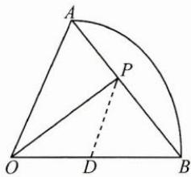

## 48 等高线

1. A 【解析】如图, 由平面向量等高线结论, 当与 BD 平行的直线 l 与圆相切时, $\lambda + \mu$ 最大, 最大值为 3, 故选 A.

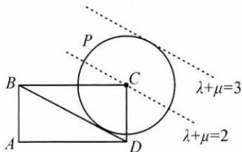

2. $\left[\frac{3}{2},3\right]$ 【解析】 $\overrightarrow{AP}=\alpha\overrightarrow{AB}+\frac{1}{2}\beta(2\overrightarrow{AC})=\alpha\overrightarrow{AB}+\frac{1}{2}\beta\overrightarrow{AC_{1}}$ ，如图，易得 $BC_{1}//EG$ 。过点D作 $BC_{1}$ 的平行直线l，当点P在线段EG上时， $\alpha+\frac{1}{2}\beta$ 最小，最小值为 $\frac{3}{2}$ ，当点P与点D重合时， $\alpha+\frac{1}{2}\beta$ 最大，最大值为3。故所求取值范围为 $\left[\frac{3}{2},3\right]$ 。

3. $\frac{2}{3}$ 【解析】取 $AC$ 的中点 $D$ , 则 $\overrightarrow{AO} = x$ $\overrightarrow{AB} + 2y\overrightarrow{AD}$ , 故 $B, O, D$ 三点共线, 由垂径定理知 $OD \perp AC$ , 故 $\cos \angle BAC = \frac{2}{3}$ .

4. $\left(-\infty,\frac{6\sqrt{13}}{13}-1\right)\cup[4,+\infty)$ 【解析】记 $d=\lambda b+(1-\lambda)c,d$ 的终点的轨迹为线段 BC (B, C 分别为向量 b, c 的终点)，以下略.

## 49 递推法

1. BCD 【解析】由 $a_{6}=1$ 逆推可得 $a_{5}=2$ ， $a_{4}=4, a_{3}=1$ 或 8, $a_{2}=16$ 或 2, $a_{1}=4$ 或 5 或 32，故选 BCD.

2. D 【解析】递推可得 $b_{1}>b_{2}<b_{3}>b_{4}<b_{5}>b_{6}<\cdots$ ，且 $b_{1}>b_{3}>b_{5}>\cdots,b_{2}<b_{4}<b_{6}<\cdots$ ，即奇数项递减，偶数项递增，所有奇数项大于偶数项，则可知选 D.

3.1830 【解析】 $a_{n+1}=2n-1-(-1)^{n}a_{n}$ 令 $b_{n+1}=a_{4n+1}+a_{4n+2}+a_{4n+3}+a_{4n+4}$ 则 $b_{n+1}=a_{4n+1}+a_{4n+2}+a_{4n+3}+a_{4n+4}$ $=a_{4n-3}+a_{4n-2}+a_{4n-1}+a_{4n}+16=b_{n}+16,$ 设 $\{b_{n}\}$ 的前n项和为 $S_{n}$ ,
因为 $b_{1}=a_{1}+a_{2}+a_{3}+a_{4}=10$ 所以 $S_{15}=10\times15+\frac{15\times14}{2}\times16=1830.$

4.(1)40 (2)704
【解析】(1)恰有3个球不一致可列举2种情形,则有 $C_{6}^{3}\times2=40$ 种.
(2) 错排公式推导(递推法): 记 $a_{n}$ 表示 n 个位置全错排的方法数, 不妨将第 $k(k\neq1)$ 号排在第1位, 共 n-1 种选择.
①若1排在k的位置，则相当于剩下n-2个进行错排，共 $a_{n-2}$ 种；
②若1不排在k的位置，则相当于n-1个进行错排，共 $a_{n-1}$ 种.
则有 $a_{n}=(n-1)(a_{n-1}+a_{n-2})$ ,
易得 $a_{1}=0, a_{2}=1, a_{3}=(3-1)(1+0)=2$ ,
类推得 $a_{4}=9, a_{5}=44, a_{6}=265$ .
所以共有 $C_{6}^{3}\times2+C_{6}^{4}\times9+C_{6}^{5}\times44+C_{6}^{6}\times265=704$ 种.

5.【解析】(1) 当 n=1 时， $p_{1}=\frac{1}{3},q_{1}=\frac{2}{3}$ 当 $n = 2$ 时， $p_{2} = \frac{2}{3} \times \frac{2}{3} \times \frac{1}{3} + \frac{1}{3} \times \frac{1}{3} = \frac{4}{27} + \frac{1}{9} = \frac{7}{27},$ $q_{2} = \frac{2}{3} \times \left(\frac{1}{3} \times \frac{1}{3} + \frac{2}{3} \times \frac{2}{3}\right) + \frac{1}{3} \times \frac{2}{3}$ $= \frac{10}{27} + \frac{2}{9} = \frac{16}{27}$ .
(2) $p_{n} = \frac{1}{3} p_{n-1} + \frac{2}{9} q_{n-1},$ $q_{n} = \frac{2}{3} p_{n-1} + \frac{5}{9} q_{n-1} + \frac{2}{3}(1 - p_{n-1} - q_{n-1})$ $= \frac{2}{3} - \frac{1}{9} q_{n-1},$ 所以 $2p_{n} + q_{n} = \frac{2}{3} p_{n-1} + \frac{1}{3} q_{n-1} + \frac{2}{3}$ $= \frac{1}{3}(2p_{n-1} + q_{n-1}) + \frac{2}{3},$ 所以 $2p_{n} + q_{n} - 1 = \frac{1}{3}(2p_{n-1} + q_{n-1} - 1),$ 且 $p(X_{n} = 0) = 1 - p_{n} - q_{n},$ $p(X_{n} = 1) = q_{n}, p(X_{n} = 2) = p_{n},$ 则 $E(X_{n}) = 2p_{n} + q_{n},$ 由题意知 $2p_{1} + q_{1} - 1 = \frac{1}{3},$ 则 $\{2p_{n} + q_{n} - 1\}$ 是首项为 $\frac{1}{3}$ ，公比为 $\frac{1}{3}$ 的等比数列， $2p_{n} + q_{n} - 1 = \left(\frac{1}{3}\right)^{n},$ 所以 $E(X_{n}) = 2p_{n} + q_{n} = 1 + \left(\frac{1}{3}\right)^{n}$ .

## 50 进退互用

1. A 【解析】 $2^{x}-3^{-x}<2^{y}-3^{-y}$ ,
即 $2^{x}-\left(\frac{1}{3}\right)^{x}<2^{y}-\left(\frac{1}{3}\right)^{y}$ ,
构造函数 $f(x)=2^{x}-\left(\frac{1}{3}\right)^{x}$ ，显然 $f(x)$ 是 R 上的增函数，
由 $f(x)<f(y)$ 可知 x<y，

从而 $y-x+1>1,\ln(y-x+1)>0$ ,故选 A.

2. $a \geqslant 4$ 【解析】因为 $PA \perp$ 平面ABCD，所以 $PA \perp DE$ ，又 $PE \perp DE$ ，所以 $DE \perp$ 平面PAE，所以 $DE \perp AE$ . 将空间问题退化成平面问题：在矩形ABCD中，线段BC上存在点E，使得 $DE \perp AE$ ，即以AD为直径的圆与BC有交点，由 $d \leqslant r$ 知 $2 \leqslant \frac{a}{2}$ ，得 $a \geqslant 4$ .

3.32 【解析】本题要研究 $y_{1}^{2} + y_{2}^{2}$ 的最小值, 可以先退一步, 研究 $y_{1}, y_{2}$ 的关系.
设直线 l 的方程为 $x = my + 4$ ,
联立抛物线方程得 $y^{2}-4my-16=0$ ,
从而 $y_{1}y_{2}=-16,y_{1}^{2}+y_{2}^{2}\geqslant2\left|y_{1}y_{2}\right|=32.$

4.【解析】构造差函数 $g(x)=ax^{2}-a-\ln x-\frac{1}{x}+\mathrm{e}^{1-x}$ ,
求导可得 $g'(x)=2ax-\frac{1}{x}+\frac{1}{x^{2}}-e^{1-x}$ .
弱化条件, 投石问路, 考虑区间端点 x=1, $g(1)=0, g(x)>0$ 在 $(1,+\infty)$ 上恒成立的一个必要条件是 $g'(1)=2a-1\geqslant0$ , 得 $a\geqslant\frac{1}{2}$ . 下面证明充分性.
当 $a \geqslant \frac{1}{2}$ 时， $g(x)=a(x^{2}-1)-\ln x-\frac{1}{x}+e^{1-x}$ $\geqslant\frac{1}{2}(x^{2}-1)-\ln x-\frac{1}{x}+e^{1-x}$ 令 $h(x)=\frac{1}{2}(x^{2}-1)-\ln x-\frac{1}{x}+e^{1-x}(x>1)$ ,
则 $h'(x)=x-\frac{1}{x}+\frac{1}{x^{2}}-e^{1-x}$ $>x-\frac{1}{x}+\frac{1}{x^{2}}-\frac{1}{x}>\frac{2}{\sqrt{x}}-\frac{2}{x}>0,$ 所以 $h(x)$ 在 $(1,+\infty)$ 上单调递增，所以 $h(x)>h(1)=0$ ，则 $g(x)>0$ 成立，故 $a \geqslant \frac{1}{2}$ .

## 51 不动点

1. ABC

2. A

3. $a_{n} = \frac{2^{n + 1} + (-1)^{n}}{2^{n} - (-1)^{n}}$ 【解析】构造函数 $f(x)$ $= \frac{x + 2}{x}$ ，求出两个不动点为2，-1.

4.【解析】(1) $a_{n+1}=\frac{a_{n}+1}{6a_{n}}$ .
(2) 解得不动点 $x = \frac{1}{2}$ .
根据图象变化情况观察可得 $\frac{1}{3}\leqslant a_{n}\leqslant\frac{2}{3}$ ，
用数学归纳法证明猜想的正确性(略). $\left|a_{n+1}-a_{n}\right|=\left|\frac{a_{n}+1}{6a_{n}}-\frac{a_{n-1}+1}{6a_{n-1}}\right|$ $=\frac{1}{a_{n-1}+1}\left|a_{n}-a_{n-1}\right|<\frac{3}{4}\left|a_{n}-a_{n-1}\right|$ ,
即 $\sum_{i=1}^{n}\left|a_{i+1}-a_{i}\right|<\frac{\frac{1}{3}}{1-\frac{3}{4}}=\frac{4}{3}.$

## 52 倒序相加法

1. C 【解析】因为 $f(a_{i}) + f(a_{2023-i}) = \frac{2(2 + a_{i}^{2} + a_{2023-i}^{2})}{1 + a_{i}^{2} + a_{2023-i}^{2} + (a_{i}a_{2023-i})^{2}} = 2,$ 所以原式= $2\times1011=2022$ ，故选C.

2. A 【解析】由题意知 $1 \leqslant n \leqslant 9$ ，对数函数部分的求和为零，接下来利用等差数列的求和公式即可.

3. $\frac{89}{2}$ 【解析】利用 $\sin^2 i^\circ + \sin^2 (90^\circ - i^\circ) = \sin^2 i^\circ + \cos^2 i^\circ = 1$ .

4. $\frac{n - 1}{2}$ 【解析】利用 $f(x) + f(1 - x) =$ $\frac{4^x}{4^x + 2} +\frac{4^{1 - x}}{4^{1 - x} + 2} = \frac{8 + 2(4^x + 4^{1 - x})}{8 + 2(4^x + 4^{1 - x})} = 1.$

5.【解析】(1)利用递推关系证明 $b_{n}-b_{n-1}=1$ ，得 $b_{n}=n-\frac{27}{2}$ .

(2) 设 $\{b_{n}\}$ 的前 n 项和为 $S_{n}, \{|b_{n}|\}$ 的前 n 项和为 $T_{n}$ ，则 $T_{20}=S_{20}-2S_{13}=109$ .
(3)由 $a_{n}=1+\frac{2}{2n-27}$ ，利用函数 $y=1+\frac{2}{2x-27}$ 的单调性得出最大项为 $a_{14}=3$ ，最小项为 $a_{13}=-1$ .

## 53 同除一式

1. $-\frac{2}{5}$ 【解析】先化简构造齐次式，用 $\sin \theta \cos \theta = \frac{\sin \theta \cos \theta}{\sin^2\theta + \cos^2\theta}$ ，然后对分子、分母进行同除以 $\cos^2\theta$ 的操作。

2. $\frac{2\sqrt{10}}{5}$ 【解析】 $(2x+y)^{2}=4x^{2}+4xy+$ $y^{2}=\frac{4x^{2}+4xy+y^{2}}{4x^{2}+xy+y^{2}}=1+\frac{3xy}{4x^{2}+xy+y^{2}}.$ 当 $xy=0$ 时, 解得 $2x+y=1$ ;

当 $xy\neq0$ 时, $(2x+y)^{2}=1+\frac{3}{\frac{4x}{y}+\frac{y}{x}+1}$ ,

由基本不等式得 $\left|\frac{4x}{y}+\frac{y}{x}\right|\geqslant 4$ ,

所以 $(2x+y)^{2}\leqslant1+\frac{3}{4+1}=\frac{8}{5}$ ,

即 $2x+y\leqslant\frac{2\sqrt{10}}{5}$ ,

当且仅当 $2x=y=\frac{\sqrt{10}}{5}$ 时等号成立.

综上, $2x+y$ 的最大值是 $\frac{2\sqrt{10}}{5}$ .

3. $-\frac{1}{n}$ 【解析】由 $a_{n+1} = S_{n+1} - S_n$ 可将条件化为 $S_{n+1} - S_n = S_{n+1}S_n$ 两边同除以 $S_nS_{n+1}$ 得 $\frac{1}{S_{n+1}} -\frac{1}{S_n} = -1$ 由此得到数列 $\left\{\frac{1}{S_n}\right\}$ 是等差数列，求得 $S_{n} = -\frac{1}{n}$ .

4.【解析】通过分析条件等式的结构特征，利用同除一式加以变形，构造新数列，求得相邻两项商的关系，找到解题突破口. $\sqrt{a_{n}a_{n-2}}-\sqrt{a_{n-1}a_{n-2}}=2a_{n-1}$ 两边同除以 $\sqrt{a_{n-1}a_{n-2}}$ ，得 $\sqrt{\frac{a_{n}}{a_{n-1}}} = 2\sqrt{\frac{a_{n-1}}{a_{n-2}}} + 1$ ，
即 $\sqrt{\frac{a_{n}}{a_{n-1}}}+1=2\left(\sqrt{\frac{a_{n-1}}{a_{n-2}}}+1\right)$ 令 $\sqrt{\frac{a_{n}}{a_{n-1}}}+1=b_{n}$ ，得 $b_{n}=2b_{n-1}$ ，即数列 $\{b_{n}\}$ 是以2为公比的等比数列，首项 $b_{1}=2$ ，则 $b_{n}=2^{n},\frac{a_{n}}{a_{n-1}}=(2^{n}-1)^{2}$ ，
所以数列 $\{a_{n}\}$ 的通项公式为 $a_{n}=\left\{\begin{aligned}&1,n=0,\\ &(2^{n}-1)^{2}(2^{n-1}-1)^{2}\cdots(2^{1}-1)^{2},&n\geqslant1.\end{aligned}\right.$

## 54 倒置变换

1. $\left(0, \frac{1}{4}\right]$ 【解析】取倒数后换元，令 $t = x - 2, t > 0$ ，转化为对勾函数.

2. $a_{n} = \frac{1}{3n - 2}$ 【解析】取倒数后转化为等差数列.

3. $-\frac{1}{4}$ 【解析】显然 x=0 为方程的一个根。当 $x \neq 0$ 时，分离参数，约去 $|x|$ 后取倒数，转化为函数 $y=\frac{1}{k}$ 与 $y=-(x+4)|x|(x \neq 0)$ 的图象有两个交点。

## 55 两边取对数

1. D 【解析】 $ae^{5}=5e^{a}$ 两边取对数，
可得 $\ln a+5=\ln5+a$ ，即 $\ln a-a=\ln5-5$ 。
同理得 $\ln b - b = \ln 4 - 4, \ln c - c = \ln 3 - 3.$ 设 $f(x)=\ln x-x$ ，则 $f'(x)=\frac{1-x}{x}$ ,
易知 $f(x)$ 在 $(0,1)$ 上单调递增，在 $(1,+\infty)$ 上单调递减，
因为 $f(a)=f(5), f(b)=f(4), f(c)=f(3)$ ,
且 a<5, b<4, c<3，所以 $a, b, c \in (0,1)$ ,又因为 $f(3)>f(4)>f(5)$ ,
所以 $f(c)>f(b)>f(a)$ ,
得 c>b>a ，故选 D.

2. BD 【解析】通过比较 $\lg a, \lg b, \lg c, \lg d$ 可得答案，选 BD.

3.1【解析】设 $M = (\lg 3)^{\lg 3}\cdot 3^{\lg (\log_310)}$ 两边取对数得 $\lg M = \lg (\lg 3)^{\lg 3} + \lg 3^{\lg (\log_310)}$ $= \lg 3\cdot \lg (\lg 3) + \lg 3\cdot \lg (\log_310)$ $= \lg 3\cdot [\lg (\lg 3) + \lg (\lg 3)^{-1}]$ $= \lg 3\cdot [\lg (\lg 3) - \lg (\lg 3)] = 0,$ 所以 $M = 1$ ，即 $(\lg 3)^{\lg 3}\cdot 3^{\lg (\log_310)} = 1.$

4.【解析】 $y=a^{x}(a>1)$ 和 $y=x^{2}$ 的图象在 y 轴左侧一定有一个交点，问题转化为 $a^{x}=x^{2}(a>1)$ 在 $(0,+\infty)$ 上有两个根，即 $x\ln a=2\ln x(a>1)$ ，即 $\frac{\ln a}{2}=\frac{\ln x}{x}(a>1)$ 在 $(0,+\infty)$ 上有两个根。
设 $f(x)=\frac{\ln x}{x}$ ，则 $f'(x)=\frac{1-\ln x}{x^{2}}$ $f(x)$ 在 $(0,e)$ 上单调递增，在 $(e,+\infty)$ 上单调递减，且当 $x\in(e,+\infty)$ 时， $f(x)>0$ .
由图可知，当 $0<\frac{\ln a}{2}<\frac{1}{e}$ ，即 $1<a<e^{\frac{2}{e}}$ 时，
直线 $y=\frac{\ln a}{2}$ 与曲线 $f(x)=\frac{\ln x}{x}$ 在 $(0,+\infty)$ 上有两个交点，所以 a 的取值范围是 $\left(1,\mathrm{e}^{\frac{2}{\mathrm{e}}}\right)$ .

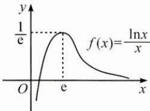

## 56 平方开方

1. $\frac{1}{2}\log_214$

2. $\left[k\pi + \frac{\pi}{2}, k\pi + \pi\right], k \in \mathbf{Z}$ .

3.【解析】 $|2a+b|=\sqrt{(2a+b)^{2}}$ $=\sqrt{4a^{2}+4a\cdot b+b^{2}}$

$$
\begin{array}{l} = \sqrt {1 2 + 1 6 + 4 \times \sqrt {3} \times 4 \times \cos 1 5 0 ^ {\circ}} \\ = 2. \end{array}
$$

4.【解析】(1)由递推公式得， $a_{n}^{2}=a_{n-1}^{2}+\frac{1}{a_{n-1}^{2}}+2,$ $a_{n-1}^{2}=a_{n-2}^{2}+\frac{1}{a_{n-2}^{2}}+2,\cdots,$ $a_{2}^{2}=a_{1}^{2}+\frac{1}{a_{1}^{2}}+2,$ 上述各式相加并化简得， $a_{n}^{2}=a_{1}^{2}+2(n-1)+\frac{1}{a_{1}^{2}}+\frac{1}{a_{2}^{2}}+\cdots+\frac{1}{a_{n-1}^{2}}$ $>2^{2}+2(n-1)=2n+2>2n+1(n\geqslant2)$ 又当 n=1 时， $a_{n}>\sqrt{2n+1}$ 显然成立，
故 $a_{n}>\sqrt{2n+1}(n\in\mathbf{N}^{*})$ .
(2) $b_{n+1}^{2}-b_{n}^{2}=\frac{a_{n+1}^{2}}{n+1}-\frac{a_{n}^{2}}{n}$ $=\frac{1}{n+1}\left(a_{n}^{2}+\frac{1}{a_{n}^{2}}+2\right)-\frac{a_{n}^{2}}{n}$ $=\frac{1}{n+1}\left(2+\frac{1}{a_{n}^{2}}-\frac{a_{n}^{2}}{n}\right)$ $<\frac{1}{n+1}\left(2+\frac{1}{2n+1}-\frac{1}{n}\right)<0,$ 故 $b_{n+1}^{2}<b_{n}^{2}$ ，又 $b_{n}>0$ ，因此 $b_{n+1}<b_{n}$ .

## 57 累差累商

1. C 【解析】由 $na_{n+1}-(n+1)a_{n}=\frac{n}{n+2}$ ,
得 $\frac{a_{n+1}}{n+1}-\frac{a_{n}}{n}=\frac{1}{(n+2)(n+1)}=\frac{1}{n+1}-\frac{1}{n+2}.$ 当 $n\geqslant2$ 时， $\frac{a_{n}}{n}-\frac{a_{n-1}}{n-1}=\frac{1}{n}-\frac{1}{n+1},\cdots,$ $\frac{a_{2}}{2}-\frac{a_{1}}{1}=\frac{1}{2}-\frac{1}{3}$ 由累差迭加法可得 $\frac{a_{n}}{n}-a_{1}=\frac{1}{2}-\frac{1}{n+1}$ .
因为 $a_{1}=\frac{1}{2}$ ，所以 $\frac{a_{n}}{n}=1-\frac{1}{n+1}=\frac{n}{n+1}$ 所以 $a_{n}=\frac{n^{2}}{n+1}(n\geqslant2)$ .
当 n=1 时，也满足上式.
综上知 $a_{n}=\frac{n^{2}}{n+1}$ ，故选 C.

2. B 【解析】因为 $a_{n+1}=\frac{4S_{n}-1}{2n-1}$ ,
所以 $(2n-1)a_{n+1}=4S_{n}-1$ ①， $(2n-3)a_{n}=4S_{n-1}-1(n\geqslant2)$ ②，
①—②得 $(2n-1)a_{n+1}-(2n-3)a_{n}=4a_{n}$ 整理得 $\frac{a_{n+1}}{a_{n}}=\frac{2n+1}{2n-1}(n\geqslant2)$ 则 $a_{n}=\frac{a_{n}}{a_{n-1}}\cdot\frac{a_{n-1}}{a_{n-2}}\cdot\frac{a_{n-2}}{a_{n-3}}\cdot\cdots\cdot\frac{a_{3}}{a_{2}}\cdot\frac{a_{2}}{a_{1}}\cdot a_{1}$ $=\frac{2n-1}{2n-3}\cdot\frac{2n-3}{2n-5}\cdot\frac{2n-5}{2n-7}\cdot\cdots\cdot\frac{5}{3}\cdot\frac{3}{1}\cdot1$ $=2n-1(n\geqslant2)$ .
当 n=1 时，也满足上式.
所以 $a_{n}=2n-1$ ，故选 B.

3. $a_{n}=\frac{2n^{2}+3n+1}{3}$ 【解析】因为 $b_{n}$ 与 $c_{n}$ 平行，
所以 $2a_{n}=(n+1)(-1+a_{n+1}-a_{n})$ ,
整理得 $(n+1)a_{n+1}=(n+3)a_{n}+(n+1)$ ，
两边同时除以 $(n+1)(n+2)(n+3)$ 得， $\frac{a_{n+1}}{(n+2)(n+3)}=\frac{a_{n}}{(n+1)(n+2)}+\frac{1}{(n+2)(n+3)}$ 设 $\frac{a_{n}}{(n+1)(n+2)}=b_{n}$ 则 $b_{n+1}-b_{n}=\frac{1}{(n+2)(n+3)}=\frac{1}{n+2}-\frac{1}{n+3}$ 由累差迭加法可得， $(b_{2}-b_{1})+(b_{3}-b_{2})+\cdots+(b_{n}-b_{n-1})$ $=\left(\frac{1}{3}-\frac{1}{4}\right)+\left(\frac{1}{4}-\frac{1}{5}\right)+\cdots+\left(\frac{1}{n+1}-\frac{1}{n+2}\right)$ 整理得 $b_{n}-b_{1}=\frac{1}{3}-\frac{1}{n+2}$ 而 $b_{1}=\frac{1}{3}$ ，所以 $b_{n}=\frac{2}{3}-\frac{1}{n+2}(n\geqslant2)$ .

当 n=1 时，也满足上式，所以 $b_{n}=\frac{2}{3}-\frac{1}{n+2}$ .
所以 $a_{n}=\frac{2}{3}(n+1)(n+2)-(n+1)$ $=\frac{(n+1)(2n+1)}{3}=\frac{2n^{2}+3n+1}{3}.$ 4. $a_{n}=3-\frac{2}{n}$ 【解析】当 $n\geqslant2$ 时， $a_{n}=\frac{(n-1)a_{n-1}+(n+1)a_{n+1}}{2n}$ ,
则 $2na_{n}=(n-1)a_{n-1}+(n+1)a_{n+1}$ , $(n+1)(a_{n+1}-a_{n})=(n-1)(a_{n}-a_{n-1})$ ,
所以 $\frac{a_{n+1}-a_{n}}{a_{n}-a_{n-1}}=\frac{n-1}{n+1}$ .
设 $b_{n}=a_{n+1}-a_{n}$ ，即 $\frac{b_{n}}{b_{n-1}}=\frac{n-1}{n+1}$ ,
则 $\frac{b_{n}}{b_{n-1}}\cdot\frac{b_{n-1}}{b_{n-2}}\cdot\cdots\cdot\frac{b_{2}}{b_{1}}$ $=\frac{n-1}{n+1}\cdot\frac{n-2}{n}\cdot\cdots\cdot\frac{1}{3}$ 得 $\frac{b_{n}}{b_{1}}=\frac{2}{n(n+1)}$ ，所以 $b_{n}=\frac{2}{n(n+1)}b_{1}$ .
因为 $b_{1}=a_{2}-a_{1}=1$ ,
所以 $b_{n}=\frac{2}{n(n+1)}(n\geqslant2)$ .
当 n=1 时，也满足上式，
所以 $b_{n}=\frac{2}{n(n+1)}$ . $a_{n+1}-a_{n}=b_{n}=\frac{2}{n(n+1)}=2\left(\frac{1}{n}-\frac{1}{n+1}\right)$ . $(a_{n}-a_{n-1})+(a_{n-1}-a_{n-2})+\cdots+(a_{2}-a_{1})=2\left(\frac{1}{n-1}-\frac{1}{n}+\frac{1}{n-2}-\frac{1}{n-1}+\cdots+1-\frac{1}{2}\right)=2\left(1-\frac{1}{n}\right)$ ,
即 $a_{n}-a_{1}=2\left(1-\frac{1}{n}\right)$ ，则 $a_{n}=3-\frac{2}{n}(n\geqslant2)$ .
当 n=1 时，也满足上式，所以 $a_{n}=3-\frac{2}{n}$ .

5.【解析】由 $\frac{2}{S_n} +\frac{1}{b_n} = 2$ 得 $S_{n} = \frac{2b_{n}}{2b_{n} - 1}$ ，且 $b_{n}\neq 0,b_{n}\neq \frac{1}{2},$

取 n=1，由 $S_{1}=b_{1}$ 得 $b_{1}=\frac{3}{2}$ .
由于 $b_{n}$ 为数列 $\{S_{n}\}$ 的前 n 项积，
所以 $\frac{2b_{1}}{2b_{1}-1}\cdot\frac{2b_{2}}{2b_{2}-1}\cdot\cdots\cdot\frac{2b_{n}}{2b_{n}-1}=b_{n}$ $\frac{2b_{1}}{2b_{1}-1}\cdot\frac{2b_{2}}{2b_{2}-1}\cdot\cdots\cdot\frac{2b_{n+1}}{2b_{n+1}-1}=b_{n+1}$ 所以 $\frac{2b_{n+1}}{2b_{n+1}-1}=\frac{b_{n+1}}{b_{n}}.$ 由于 $b_{n+1} \neq 0$ ，所以 $\frac{2}{2b_{n+1}-1} = \frac{1}{b_n}$ ，
即 $b_{n+1}-b_{n}=\frac{1}{2}.$ 所以数列 $\{b_{n}\}$ 是以 $b_{1}=\frac{3}{2}$ 为首项， $d=\frac{1}{2}$ 为公差的等差数列.

## 58 分组求和

1.【解析】(1) $a_{n}=3n-2$ .
(2)由(1)得 $a_{n}+b_{n}=3n-2+\frac{1}{2^{n}}$ ,
则 $T_{n}=\left[1+4+7+\cdots+(3n-2)\right]$ $+\left(\frac{1}{2}+\frac{1}{2^{2}}+\frac{1}{2^{3}}+\cdots+\frac{1}{2^{n}}\right)$ $=\frac{n(1+3n-2)}{2}+\frac{\frac{1}{2}\left(1-\frac{1}{2^{n}}\right)}{1-\frac{1}{2}}$ $=\frac{3n^{2}-n+2}{2}-\frac{1}{2^{n}}.$

2.【解析】(1)略.
(2)由(1)得 $b_{n}=(-1)^{n}$ ,
因为 $b_{n}=a_{n}-2^{n}=(-1)^{n}$ ,
所以 $a_{n}=2^{n}+(-1)^{n}$ ,
所以 $S_{n}=(-1)^{1}+(-1)^{2}+(-1)^{3}+\cdots+(-1)^{n}+2+2^{2}+\cdots+2^{n}=\frac{(-1)[1-(-1)^{n}]}{2}+\frac{2(1-2^{n})}{1-2}=\frac{(-1)^{n}}{2}+2^{n+1}-\frac{5}{2}.$

3.【解析】(1) $a_{n}=n$ .
(2) 当 n 为奇数时, $b_{n}=2^{n}$ ,当 n 为偶数时， $b_{n}=n$ ， $T_{2n}=2+2+2^{3}+4+2^{5}+6+\cdots+2^{2n-1}+2n$ $=(2+4+6+\cdots+2n)+(2+2^{3}+2^{5}+\cdots+2^{2n-1})$ $=\frac{n(2+2n)}{2}+\frac{2-2^{2n+1}}{1-4}$ $=\frac{2^{2n+1}}{3}-\frac{2}{3}+n^{2}+n.$

4.【解析】(1) $a_{n}=3n-2$ .
(2) 因为 $a_{4}=10, a_{34}=100$ , $a_{334}=1000, a_{3334}=10000,$ 所以 $b_{n}=\left\{\begin{aligned}&0,1\leqslant n\leqslant3,\\ &1,4\leqslant n\leqslant33,\\ &2,34\leqslant n\leqslant333,\\ &3,334\leqslant n\leqslant1000,\end{aligned}\right.$ $n\in N^{*}$ ,
所以 $T_{1000}=0\times3+1\times30+2\times300+3\times667=2631.$

## 59 增项减项

1. $\frac{3}{2}$ 【解析】 $y = x + \frac{2}{2x + 1} = \frac{2x + 1}{2} + \frac{2}{2x + 1} - \frac{1}{2} \geqslant 2 - \frac{1}{2} = \frac{3}{2}$ ，当且仅当 $x = \frac{1}{2}$ 时取等号.

2. A 【解析】对于 A, B, $2^{a} + 2a = 2^{b} + 3b > 2^{b} + 2b$ ，利用函数 $f(x) = 2^{x} + 2x$ 的单调性易得 a > b，故选 A.

3. $\frac{1}{16}$ 【解析】分子和分母同乘 $\sin 20^{\circ}$ ，达到化简的目的. $\cos 20^{\circ} \cos 40^{\circ} \cos 60^{\circ} \cos 80^{\circ}$ $= \frac{\sin 20^{\circ} \cos 20^{\circ} \cos 40^{\circ} \cos 60^{\circ} \cos 80^{\circ}}{\sin 20^{\circ}}$ $= \frac{\frac{1}{8} \sin 160^{\circ} \cos 60^{\circ}}{\sin 20^{\circ}} = \frac{1}{16}$ .

4. $\frac{2\sqrt{2} - \sqrt{3}}{6}$ 【解析】因为 $\alpha$ 是第一象限角， $\cos \left(\alpha + \frac{\pi}{3}\right) = \frac{1}{3}$ ，

所以 $\alpha +\frac{\pi}{3}$ 也是第一象限角， $\sin \left(\alpha +\frac{\pi}{3}\right) = \frac{2\sqrt{2}}{3},$ $\sin \alpha = \sin \left(\alpha +\frac{\pi}{3} -\frac{\pi}{3}\right)$ $= \frac{1}{2}\sin \left(\alpha +\frac{\pi}{3}\right) - \frac{\sqrt{3}}{2}\cos \left(\alpha +\frac{\pi}{3}\right)$ $= \frac{2\sqrt{2} - \sqrt{3}}{6}.$

5.【解析】增项减项，将已知数列化为等比数列或者类等比数列.
因为 $x_{n}^{2}+x_{n}=3x_{n+1}^{2}+2x_{n+1}>2x_{n+1}^{2}+2x_{n+1}=2(x_{n+1}^{2}+x_{n+1})$ ,
则 $x_{n}^{2}+x_{n}<2\times\left(\frac{1}{2}\right)^{n-1}=\left(\frac{1}{2}\right)^{n-2}$ ,
当 n=1 时， $x_{1}=\left(\frac{1}{2}\right)^{1-2}$ 所以 $x_{n}\leqslant\left(\frac{1}{2}\right)^{n-2}$ .
因为 $x_{n}^{2}+x_{n}=3x_{n+1}^{2}+2x_{n+1}<4x_{n+1}^{2}+2x_{n+1}=(2x_{n+1})^{2}+2x_{n+1}$ 又 $y=x^{2}+x$ 在 $(0,+\infty)$ 上为增函数，
所以 $x_{n}<2x_{n+1}$ 所以 $x_{n}\geqslant x_{1}\left(\frac{1}{2}\right)^{n-1}=\left(\frac{1}{2}\right)^{n-1}$ 综上，得证.

## 60 数学归纳法

1.【解析】(1)由题意可得 $a_2 = 5, a_3 = 7$ ，猜想 $a_n = 2n + 1$ ，用数学归纳法证明.
①当 $n = 1$ 时， $a_1 = 3$ ，成立.
②假设当 $n = k (k \in \mathbb{N}^*)$ 时， $a_k = 2k + 1$ ，那么当 $n = k + 1$ 时， $a_{k+1} = 3a_k - 4k = 3(2k + 1) - 4k = 2k + 3 = 2(k + 1) + 1$ 也成立.
则对任意的 $n \in \mathbb{N}^*$ ，都有 $a_n = 2n + 1$ 成立.
(2)略.

2.【解析】(1)用数学归纳法证明 $x_{n}>0$ .
①当 n=1 时， $x_{1}=1>0$ .

②假设当 $n = k (k \in \mathbf{N}^*)$ 时， $x_k > 0$ ，那么当 $n = k + 1$ 时，若 $x_{k+1} \leqslant 0$ ，则 $0 < x_k = x_{k+1} + \ln (1 + x_{k+1}) \leqslant 0$ ，矛盾，故 $x_{k+1} > 0$ 。因此 $x_n > 0 (n \in \mathbf{N}^*)$ 。所以 $x_n = x_{n+1} + \ln (1 + x_{n+1}) > x_{n+1}$ ，因此 $0 < x_{n+1} < x_n$ 。（2）略。（3） $\frac{1}{2^{n-1}} \leqslant x_n$ 容易证明，可利用数学归纳法证明 $x_n \leqslant \frac{1}{2^{n-2}}$ 成立（略）。

3.【解析】用数学归纳法证明.
①当 n=1 时，一个圆把平面分成两部分，又 $f(1)=2$ ，故命题成立.
②假设当 $n=k(k\in\mathbf{N}^{*})$ 时，命题成立，即 k 个圆把平面分成 $f(k)=k^{2}-k+2$ 个部分，那么当 $n=k+1$ 时，第 $k+1$ 个圆与原来 k 个圆都相交于两点，且无任意三圆相交于同一点，于是第 $k+1$ 个圆与前 k 个圆有 2k 个交点，第 $k+1$ 个圆被分成 2k 段弧，每段弧把原区域分成两部分，因此平面区域在原基础上增加了 2k 块.
于是 $f(k+1)=f(k)+2k$ $=k^{2}-k+2+2k$ $=(k+1)^{2}-(k+1)+2,$ 即当 $n=k+1$ 时，命题成立.
由①②知，命题对任意正整数 n 都成立.

4.【解析】(1)(3)略.
(2) 由题意, 不妨设 $a_{k}(k \in \mathbb{N}^{*})$ 是 3 的倍数, 用数学归纳法证明对任意 $n \geqslant k, a_{n}$ 是 3 的倍数.
①当 n=k 时， $a_{k}$ 是 3 的倍数.
②假设 $a_{t}(t \geqslant k)$ 是 3 的倍数，
则由 $a_{n+1}=\left\{\begin{aligned}&2a_{n},&a_{n}\leqslant18,\\ &2a_{n}-36,a_{n}>18,\end{aligned}\right.$ 得 $a_{t+1}=2a_{t}$ 或 $a_{t+1}=2a_{t}-36$ ,
所以 $a_{t+1}$ 是 3 的倍数.

根据①②得，对任意 $n \geqslant k, a_n$ 是3的倍数. 当 $k = 1$ 时， $M$ 的所有元素都是3的倍数. 当 $k > 1$ 时，因为 $a_k = 2a_{k-1}$ 或 $a_k = 2a_{k-1} - 36$ ，所以 $2a_{k-1}$ 是3的倍数，即 $a_{k-1}$ 是3的倍数，类似可得 $a_{k-2}, a_{k-3}, a_{k-4}, \cdots, a_1$ 都是3的倍数. 所以对任意 $n \geqslant 1, a_n$ 是3的倍数，得证.

## 61 错位相减

1.【解析】(1)由 $S_{6}=3(a_{1}+a_{6})=3(a_{3}+a_{4})=3a_{4}=9$ ，得 $a_{4}=3, a_{3}=0$ ，
故数列 $\{a_{n}\}$ 的公差 d=3，
即 $a_{n}=a_{3}+(n-3)d=3n-9.$ 由叠加法可求得 $b_{n}=2^{n}$ .
(2) $T_{n}=(-6)\times2+(-3)\times2^{2}+\cdots$ $+(3n-12)2^{n-1}+(3n-9)2^{n}$ , $2T_{n}=(-6)\times2^{2}+(-3)\times2^{3}+\cdots$ $+(3n-12)2^{n}+(3n-9)2^{n+1}$ 错位相减得 $T_{n}=(3n-12)2^{n+1}+24.$ 设 $c_{n}=(3n-12)2^{n+1}$ ，显然当 $n\geqslant4$ 时， $c_{n}\geqslant0,T_{n}\geqslant24$ 且单调递增.
而 $c_{1}=-36,c_{2}=-48,c_{3}=-48,$ 故 $T_{n}$ 的最小值为 $T_{2}=T_{3}=-24$ .

2.【解析】(1)由已知得公比 q=2，
故 $a_{n}=a_{2}\cdot2^{n-2}=4\cdot2^{n-2}=2^{n}$ 由 $S_{n}=na_{n}$ ，得 $b_{1}=2$ ，
当 $n \geqslant 2$ 时， $b_{n}=S_{n}-S_{n-1}=n\cdot2^{n}-(n-1)2^{n-1}$ $=(n+1)2^{n-1}$ $b_{1}=2$ 也适合上式，
则 $b_{n}=(n+1)2^{n-1}(n\in\mathbf{N}^{*})$ .
(2) $\frac{b_{n+1}}{a_{n}a_{n+1}}=\frac{(n+2)2^{n}}{2^{n}\cdot2^{n+1}}=(n+2)\frac{1}{2^{n+1}}$ 设 $T_{n}=3\times\frac{1}{2^{2}}+4\times\frac{1}{2^{3}}+5\times\frac{1}{2^{4}}+\cdots$ $+ (n+2)\frac{1}{2^{n+1}}$ $\frac{1}{2}T_{n}=3\times\frac{1}{2^{3}}+4\times\frac{1}{2^{4}}+\cdots+(n+1)\frac{1}{2^{n+1}}$ $+ (n+2)\frac{1}{2^{n+2}},$ 两式相减得 $\frac{1}{2}T_{n}=3\times\frac{1}{2^{2}}+\frac{1}{2^{3}}+\frac{1}{2^{4}}+\cdots$ $+\frac{1}{2^{n+1}}-(n+2)\frac{1}{2^{n+2}}=1-(n+4)\frac{1}{2^{n+2}},$ 所以 $T_{n}=2-(n+4)\frac{1}{2^{n+1}}<2.$

3.【解析】由题意得函数 $f(x)$ 是偶函数，且有唯一零点，所以 $f(0)=0$ ，即 $a_{n+1}=2a_{n}+1$ ，所以 $\{a_{n}+1\}$ 是以 2 为首项，2 为公比的等比数列，故 $a_{n}+1=2^{n}$ ，则 $n^{2}(a_{n}+1)=n^{2}\cdot2^{n}$ .
设数列 $\left\{n^{2}(a_{n}+1)\right\}$ 的前 n 项和为 $S_{n}$ ， $S_{n}=1^{2}\cdot2^{1}+2^{2}\cdot2^{2}+\cdots+n^{2}\cdot2^{n}$ , $2S_{n}=1^{2}\cdot2^{2}+2^{2}\cdot2^{3}+\cdots+n^{2}\cdot2^{n+1}$ 两式相减得 $-S_{n}=1\cdot2+3\cdot2^{2}+5\cdot2^{3}+\cdots+(2n-1)2^{n}-n^{2}\cdot2^{n+1}$ 其中一部分再次利用错位相减法求和，
可得 $S_{n}=(n^{2}-2n+3)2^{n+1}-6$ .

## 62 解析法

1.9 【解析】以 B 为坐标原点，BC 所在直线为 x 轴建立平面直角坐标系.
设 $C(a,0)$ ，则 $D\left(\frac{1}{2},\frac{\sqrt{3}}{2}\right)$ ， $A\left(-\frac{1}{2}c,\frac{\sqrt{3}}{2}c\right)$ .
因为 A, D, C 三点共线，则 $k_{AD}=k_{CD}$ ,
得到 $a+c=ac$ ，即 $\frac{1}{a}+\frac{1}{c}=1$ .
由基本不等式求得 $4a + c$ 的最小值为 9.

2. $\frac{\pi}{4}; 2\sqrt{2}$ 【解析】以 $AB$ 的中点为原点建立平面直角坐标系, 根据 $AC = \sqrt{2} BC$ 得到动点 $C$ 的轨迹方程, 当直线 $AC$ 与轨迹相切时, $\angle CAB$ 有最大值.

3. A 【解析】在立体图形中, 过点 C 作 CG ⊥ BD 于点 G, 连接 OG.
再将图形展开成平面, 则在平面 ABC 中, CO ⊥ BD, 且 O, G, C 三点共线, 以 C为坐标原点， $\overrightarrow{CA}$ 方向为 $x$ 轴正方向建立平面直角坐标系，设点 $D(t,0)$ 。直线 $CO$ 的方程为 $y = tx$ ，直线 $AB$ 的方程为 $y = -\frac{\sqrt{3}}{3} x + 1$ ，解得交点 $O$ 的横坐标为 $x = \frac{\sqrt{3}}{\sqrt{3} t + 1}$ 。根据 $OB = \frac{2\sqrt{3}}{3} x = \frac{2}{\sqrt{3} t + 1}$ 且 $t \in \left(\frac{\sqrt{3}}{3}, \sqrt{3}\right)$ ，可得 $OB \in \left(\frac{1}{2}, 1\right)$ ，故选 A.

## 63 点差法

1. A 【解析】应用点差法将直线 AB 的斜率 k 用 m 表示, 根据点 $M(1, m)$ 在椭圆内, 即 $3 + 4m^{2} < 12$ , 解得 $0 < m < \frac{3}{2}$ , 则 $k = -\frac{3}{4m} < -\frac{1}{2}$ . 故选 A.

2.2 【解析】设 $A(x_{1}, y_{1})$ , $B(x_{2}, y_{2})$ ，利用点差法得到 $k = \frac{y_{1} - y_{2}}{x_{1} - x_{2}} = \frac{4}{y_{1} + y_{2}}$ .
取 AB 的中点 $M'(x_{0}, y_{0})$ ，分别过点 A, B 作准线 x = -1 的垂线，垂足分别为 $A'$ , $B'$ .
由抛物线性质得 $\left|MM'\right|=\frac{1}{2}\left(\left|AA'\right|+\left|BB'\right|\right)$ ，进而得到斜率 k=2。

3. $\frac{x^2}{6} + \frac{y^2}{3} = 1$ 【解析】利用点差法求得直线 $OP$ 的斜率与 $a, b$ 的关系，根据椭圆中 $a^2 = b^2 + c^2$ 得解.

4.【解析】用点差法得 $AB$ 的中点 $M(x_0, y_0)$ 满足 $y_0 = 6x_0$ ，由 $AB$ 的中点 $M$ 在 $l$ 上得 $y_0 = 4x_0 + m$ 。因此求得 $M\left(\frac{m}{2}, 3m\right)$ 。又点 $M$ 必在椭圆内部，则 $3x_0^2 + 2y_0^2 < 6$ ，即 $3\left(\frac{m}{2}\right)^2 + 2(3m)^2 < 6$ ，解得 $-\frac{2\sqrt{2}}{5} < m < \frac{2\sqrt{2}}{5}$ 。

## 64 设而不求

1. B 【解析】联立直线 x=a 和渐近线 $y=\pm\frac{b}{a}x$ ，求出 $|DE|=2b$ ，
则 $S_{\triangle ODE} = \frac{1}{2} |DE| a = ab = 8$ ,
则 $2c=2\sqrt{a^{2}+b^{2}}\geqslant2\sqrt{2ab}=8$ 当且仅当 $a=b=2\sqrt{2}$ 时取等号，
故选 B.

2. $\frac{56}{13}$ 【解析】设点 $A(x_{1},y_{1}),B(x_{2},y_{2})$ ，联立直线方程 $y = \sqrt{13} (x - 1)$ 和 $y^{2} = 4x$ 消去 $y$ 可得 $13x^{2} - 30x + 13 = 0$ 利用韦达定理可得 $x_{1} + x_{2} = \frac{30}{13}$ 结合弦长公式可得， $|AB| = x_1 + x_2 + p = \frac{30}{13} + 2 = \frac{56}{13}$

3. $2x + y - 1 = 0$ 【解析】设交点 $A(x_{1},y_{1})$ ， $B(x_{2},y_{2})$ ，将点 $A$ 的坐标分别代入方程，联立 $(x_{1} - 2)^{2} + (y_{1} - 1)^{2} = 4$ 和 $x_{1}^{2} + y_{1}^{2} = 1$ ，可得 $2x_{1} + y_{1} - 1 = 0$ ，同理可得 $2x_{2} + y_{2} - 1 = 0$ ，从而求得过交点的直线方程为 $2x + y - 1 = 0$

4.【解析】易知 $g'(x)=-\frac{1+x+\ln x}{(1+x)^{2}},x>0,$ 设 $u(x)=1+x+\ln x, x>0,$ 因为 $u(x)$ 在 $(0,+\infty)$ 上单调递增， $u\left(\frac{1}{\mathrm{e}^{2}}\right)=1+\frac{1}{\mathrm{e}^{2}}-2<0,u(1)=2>0,$ 所以存在 $x_{0}\in\left(\frac{1}{\mathrm{e}^{2}},1\right)$ 使 $1+x_{0}+\ln x_{0}=0$ 且 $u(x)$ 在 $(0,x_{0})$ 上小于 0，在 $(x_{0},+\infty)$ 上大于 0，所以 $g(x)$ 在 $(0,x_{0})$ 上单调递增，在 $(x_{0},+\infty)$ 上单调递减，
所以 $g(x)$ 在 $x=x_{0}$ 处取最大值， $g(x_{0})=\frac{\ln x_{0}}{1+x_{0}}-\ln x_{0}=\frac{-1-x_{0}}{1+x_{0}}-\ln x_{0}$ $=-1-\ln x_{0}=x_{0}$

## 65 参数法

1.【解析】原解析式可化为 $(x-3\cos\beta)^{2}+(y-2\sin\beta)^{2}=9\cos^{2}\beta+4\sin^{2}\beta,$ 则圆心为 $(3\cos\beta,2\sin\beta)$ ，设圆心为 $(x,y)$ ，
则 $\left\{\begin{aligned}&x=3\cos\beta,\left\{\begin{aligned}&\frac{x^{2}}{9}=\cos^{2}\beta,\\&y=2\sin\beta,\left\{\begin{aligned}&\frac{y^{2}}{4}=\sin^{2}\beta,\end{aligned}\right.\end{aligned}\right.\right.$ 得 $\frac{x^{2}}{9}+\frac{y^{2}}{4}=1.$

2.【解析】(1)根据题意,焦点F到准线的距离p=2,因此C的方程为 $y^{2}=4x$ .
(2)根据题意有 $F(1,0)$ ，设 $P(4t^{2},4t)$ ，
则由 $\overrightarrow{PQ}=9\overrightarrow{QF}$ 得 $Q\left(\frac{4t^{2}+9}{10},\frac{2t}{5}\right)$ ,
因此 $k_{\infty}=\frac{\frac{2t}{5}}{\frac{4t^{2}+9}{10}}=\frac{4t}{4t^{2}+9}\leqslant\frac{1}{3}$ 当 $t=\frac{3}{2}$ 时取等号，
故所求斜率的最大值为 $\frac{1}{3}$ .

3.【解析】(1)p=2.
(2)设 $A(4a,4a^{2})$ , $B(4b,4b^{2})$ ，且 a>b，
则 $AB: y = (a + b)x - 4ab$ , $P(2(a+b),4ab)$ ,
从而 $\overrightarrow{PA}=(2(a-b),4a(a-b))$ , $\overrightarrow{PB}=(-2(a-b),-4b(a-b))$ ,
由三角形面积公式可得 $S_{\triangle PAB}$ $=\frac{1}{2}\cdot4(a-b)^{2}\cdot|1\cdot(-2b)-2a\cdot(-1)|$ $=4(a-b)^{3}$ .
由点 P 在圆 M 上，
得 $4(a+b)^{2}+(4ab+4)^{2}=1$ .
设 $a+b=s,a-b=t$ ,
则 $4s^{2}+(s^{2}-t^{2}+4)^{2}=1$ , $t^{2}=s^{2}+4\pm\sqrt{1-4s^{2}}$ $=\frac{1-(1-4s^{2})}{4}+4\pm\sqrt{1-4s^{2}}$ 当 s=0 时，t 取得最大值 $\sqrt{5}$ ，
此时 $\triangle PAB$ 的面积的最大值为 $20\sqrt{5}$ .

## 66 插空法

1. C 【解析】先排不受限的 6 人, 有 $\mathrm{A}_{6}^{6}$ 种, 在 6 个人形成的 7 个空档中选取 4 个排甲、乙、丙、丁 4 人, 有 $\mathrm{A}_{7}^{4}$ 种, 故共有 $\mathrm{A}_{6}^{6} \mathrm{~A}_{7}^{4}$ 种. 故选 C.

2. B 【解析】4个数字中被重复使用的数字有4种，所以符合题意的五位数共有 $4A_{3}^{3}C_{4}^{2}=4\times36=144$ 个. 故选B.

3.48 【解析】解法1（直接法）：先排高一学生，有 $\mathrm{A}_2^2$ 种. $①$ 高一学生中间为高三学生，有 $\mathrm{A}_4^2$ 种； $②$ 高一学生中间无高三学生，有 $\mathrm{C}_2^1\mathrm{C}_2^1\mathrm{C}_3^1$ 种.所以共有 $\mathrm{A}_2^2 (\mathrm{A}_4^2 +\mathrm{C}_2^1\mathrm{C}_2^1\mathrm{C}_3^1) = 48$ 种.解法2（间接法）：5名学生全排列，有 $\mathrm{A}_5^5$ $= 120$ 种，再去掉高一、高二学生中相邻的情况. $①$ 当2名高一学生和2名高二学生分别相邻时，有 $\mathrm{A}_2^2\mathrm{A}_2^2\mathrm{A}_3^3 = 24$ 种； $②$ 当2名高一学生相邻且2名高二学生不相邻时，有 $\mathrm{A}_2^2\mathrm{A}_2^2\mathrm{A}_3^2 = 24$ 种； $③$ 当2名高一学生不相邻且2名高二学生相邻时，有 $\mathrm{A}_2^2\mathrm{A}_2^2\mathrm{A}_3^2 = 24$ 种.所以共有 $120 - 24 - 24 - 24 = 48$ 种.

4.576 【解析】分以下三种不同情况：
①将“甲女女乙”（甲乙可以互换）看成一个整体：有 $A_{2}^{2}A_{4}^{2}(A_{4}^{4}-2A_{3}^{3})=288$ 种；
②将“甲女丙女乙”（甲乙可以互换）看成一个整体：有 $A_{2}^{2}A_{4}^{2}A_{3}^{3}=144$ 种；
③将“甲女女丙乙”（甲乙可以互换，丙一直与乙相邻）看成一个整体：有 $A_{2}^{2}A_{4}^{2}A_{3}^{3}=144$ 种.
所以共有 $288 + 144 + 144 = 576$ 种.

## 67 捆绑法

1. D 【解析】4人进入接种室的顺序共有 $A_{4}^{4}=24$ 种.

①甲第二个被叫到且乙、丙被相邻叫到

的方法数有 $\mathrm{A}_2^2 = 2$ 种；

②甲第三个被叫到且乙、丙被相邻叫到的方法数有 $A_{2}^{2}=2$ 种；

③甲第四个被叫到且乙、丙被相邻叫到的方法数有 $2A_{2}^{2}=4$ 种.
所以甲不被第一个叫到且乙、丙被相邻叫到的概率为 $\frac{2+2+4}{24}=\frac{1}{3}$ . 故选 D.

2.24 【解析】根据题意，将 2,4 看成一个整体，与 1,3,5 进行全排列，有 $A_{2}^{2}A_{4}^{4}=48$ 种排法；将 2,4 看成一个整体，将 1,5 看成一个整体，与 3 进行全排列，有 $A_{2}^{2}A_{2}^{2}A_{3}^{3}=24$ 种排法.
故有 48-24=24 种排法.

3.2400 【解析】第一步:生物排第一节或最后一节,有2种方法;
第二步:数学和英语相邻,有 $5A_{2}^{2}=10$ 种方法;
第三步: 排剩下的 5 节课, 有 $A_{5}^{5}=120$ 种方法.
共有 $2 \times 10 \times 120 = 2400$ 种方法.

4.【解析】根据题意，记演出的顺序依次为1到6号位置，则甲排在1,2,3号位置.
①甲排在1号位置，则丙、丁有 $4A_{2}^{2}$ 种情况，剩下3个节目有 $A_{3}^{3}=6$ 种编排方法，则此时有48种编排方法；
②甲排在2号位置，则丙、丁有 $3A_{2}^{2}$ 种情况，剩下3个节目有 $A_{3}^{3}=6$ 种编排方法，则此时有36种编排方法；
③甲排在3号位置，同②有36种编排方法。所以符合题意的编排方法有 $36+36+48=120$ 种。

## 68 隔板法

1.【解析】满足解题模型 1, 即相当于将 12 个相同的小球分给 8 个盒子, 每个盒子中必须有小球, 求共有几种不同的分法. 故共有 $C_{12-1}^{8-1}=C_{11}^{7}=330$ 种选法.

2.【解析】满足解题模型2.可以考虑先分给每个班级1个排球，此时问题转化为“把13个相同的排球分给3个班级，每班至少分到1个”，故有 $C_{13-1}^{3-1}=C_{12}^{2}=66$ 种分法.

3.【解析】通项为 $Aa^{m}b^{n}c^{p}$ ，满足 $m+n+p=9$ ，相当于“把9个相同的小球分给3个盒子，允许某些盒子是空盒”，满足解题模型2，故有 $C_{9+3-1}^{3-1}=C_{11}^{2}=55$ 项.

4.【解析】优先在2,3号盒子中分别放入1个和2个小球，转化成“把17个相同的小球放入编号为1,2,3的3个盒子中，每个盒子中至少放1个小球”，满足解题模型3，故有 $C_{20-3-1}^{3-1}=C_{16}^{2}=120$ 种放法.

5.【解析】由 $x_{1} \geqslant -1, x_{2} \geqslant 3, x_{3} \geqslant -2, x_{4} \geqslant 2$ 知， $x_{1} + 2 \geqslant 1, x_{2} - 2 \geqslant 1, x_{3} + 3 \geqslant 1, x_{4} - 1 \geqslant 1,$ 得 $(x_{1} + 2) + (x_{2} - 2) + (x_{3} + 3) + (x_{4} - 1)$ $= 14$ ，视小括号里面为整体，满足解题模型3，故有 $\mathrm{C}_{14-1}^{4-1} = \mathrm{C}_{13}^{3} = 286$ 组整数解.

## 69 等体积法

1. $\frac{\sqrt{6}}{6}$ 【解析】由题意得 $EF \parallel CC_{1}$ , 故四边形 $FCC_{1}E$ 是平行四边形, 所以 $EC_{1} // FC$ , 又 $EC_{1} \subset$ 平面 $AC_{1}E$ , $FC \not\subset$ 平面 $AC_{1}E$ , 所以 $FC //$ 平面 $AC_{1}E$ , 则直线 $CF$ 到平面 $AC_{1}E$ 的距离即为点 $F$ 到平面 $AC_{1}E$ 的距离, 设为 $h$ . 由 $V_{F-AC_{1}E}=V_{C_{1}-AEF}$ , 得 $\frac{1}{3}S_{\triangle AC_{1}E} \cdot h=\frac{1}{3}S_{\triangle AEF} \cdot B_{1}C_{1}$ , 得 $h=\frac{S_{\triangle AEF} \cdot B_{1}C_{1}}{S_{\triangle AC_{1}E}}=\frac{\frac{1}{4}}{\frac{\sqrt{6}}{4}}=\frac{\sqrt{6}}{6}$ .

2.【解析】(1)略.
(2) $V_{N-BCM}=\frac{1}{2}V_{P-BCM}=\frac{1}{2}V_{P-BCA}$ $=\frac{1}{2}\cdot\frac{1}{3}\cdot S_{\triangle ABC}\cdot PA=\frac{4\sqrt{5}}{3}.$

3.【解析】(1)略.
(2) 将包装盒补形成长方体 ABCD-A₁B₁C₁D₁，如图，
其中 AB=BC=8, AA₁=4√3，
则 $V_{A-A_{1}HE}=\frac{1}{3}S_{\triangle A_{1}HE}\cdot AA_{1}=\frac{32\sqrt{3}}{3}$ 故包装盒的容积 $V = V_{长方体} - 4V_{A-A_{1}HE} = \frac{640\sqrt{3}}{3}$ .

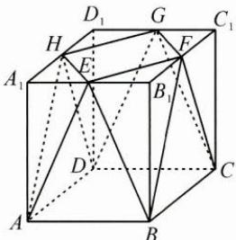

4.【解析】(1)由题意知 $PO \perp OA, PO \perp OB,$ $OA \cap OB = O, OA \subset$ 平面 $AOB, OB \subset$ 平面 $AOB,$ 所以 $PO \perp$ 平面 $AOB,$ 又 $PO = 2OA = 4,$ 所以 $PA = PB = 2\sqrt{5}, AB = 2\sqrt{2},$ $S_{\triangle PAB} = \frac{1}{2} \times 2\sqrt{2} \times \sqrt{(2\sqrt{5})^2 - (\sqrt{2})^2} = 6.$ 设点 $O$ 到平面 $PAB$ 的距离为 $d$ ，由 $V_{O - PAB} = V_{P - OAB}$ 得 $\frac{1}{3} \times d \times 6 = \frac{1}{3} \times 4$ $\times \frac{1}{2} \times 2 \times 2$ ，解得 $d = \frac{4}{3}$ . (2)通过等体积法 $V_{C - PAB} = V_{P - ABC}$ 求点 $C$ 到平面 $PAB$ 的距离 $h_C.$ $PA = PB = 2\sqrt{5}, AB = 2\sqrt{2}$ ，则 $S_{\triangle PAB} = 6$ 因为 $\widehat{AC} = \frac{1}{3}\widehat{AB}, \angle AOB = 90^\circ,$ 所以 $\angle AOC = 30^\circ, \angle BOC = 60^\circ,$ 解得 $AC = \sqrt{6} - \sqrt{2}, BC = 2,$ 在 $\triangle ABC$ 中， $\angle ACB = 135^\circ, S_{\triangle ABC} = \sqrt{3} - 1,$ 则由 $\frac{1}{3} S_{\triangle PAB} \cdot h_C = \frac{1}{3} S_{\triangle ABC} \cdot PO,$

得 $h_c = \frac{2\sqrt{3} - 2}{3}$ , 又 $PC = PA = 2\sqrt{5}$ , 所以直线 $PC$ 与平面 $PAB$ 所成的角的正弦值 $\sin \varphi = \frac{h_c}{PC} = \frac{\sqrt{15} - \sqrt{5}}{15}$ .

5.【解析】(1)因为M,N分别为PC,CA的中点,所以 $MN\parallel PA$ ,因为 $BM\perp MN$ ,所以 $PA\perp BM$ .
取 BC 的中点 D，连接 PD，AD，如图.
因为 P-ABC 为正三棱锥，所以 $BC \perp PD, BC \perp AD$ ，又 $PD \cap AD = D$ ，所以 $BC \perp$ 平面 PAD，所以 $BC \perp PA$ .
又 $BM \cap BC = B$ ，所以 $PA \perp$ 平面 PBC，
则 $V_{A-PBC}=\frac{1}{3}S_{\triangle PBC}\cdot PA=\frac{1}{3}\times2\times2=\frac{4}{3}$ 设点 P 到平面 ABC 的距离为 d，
则 $V_{P-ABC}=\frac{1}{3}S_{\triangle ABC}\cdot d=\frac{2\sqrt{3}}{3}d$ 因为 $V_{A-PBC}=V_{P-ABC}$ ，所以 $d=\frac{2\sqrt{3}}{3}$ ，
所以点 P 到平面 ABC 的距离为 $\frac{2\sqrt{3}}{3}$ .

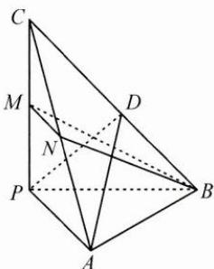

(2)由(1)知 $PA \perp$ 平面PBC, $PA = PB = PC = 2$ , $AB = BC = AC = 2\sqrt{2}$ , 所以 $PB \perp PC$ , 在 Rt△PBC 中, $MB = \sqrt{5}$ , 又 $MN = \frac{1}{2}PA = 1$ , 且 $BM \perp MN$ , 所以 $BN = \sqrt{6}$ , 所以在△MNB中, $BN$ 边上的高 $h_M = \frac{\sqrt{30}}{6}$ . 因为 $V_{M-BCN} = \frac{1}{2}V_{P-BCN}$ , 所以点M到平面 ABC 的距离等于点 P 到平面 ABC 的距离的一半，
则点 M 到平面 ABC 的距离 $d_{M}=\frac{1}{2}d=\frac{\sqrt{3}}{3}$ ，
所以平面 BMN 与平面 ABC 夹角的正弦值为 $\sin\theta=\frac{d_{M}}{h_{M}}=\frac{\sqrt{10}}{5}$ ,
故所求余弦值为 $\cos\theta=\frac{\sqrt{15}}{5}$ .

## 70 补形法

1.【解析】如图, 将四棱锥 A-BCDE 补形为长方体, 则平面 ADE 即为长方体的对角面 ADEH, 平面 ABD 即为长方体的一个梯形截面, 二面角 B-AD-E 即为对角面 ADEH 与截面 ABD 的夹角.
过点 B 作 $BJ \perp EH$ , 过点 J 作 $JK \perp AD$ ,
连接 BK, 则 $\angle BKJ$ 为二面角的平面角, $BJ=\frac{\sqrt{3}}{3},JK=DE=1,\tan\angle BKJ=\frac{\sqrt{3}}{3}$ 从而二面角 B-AD-E 的大小为 $\frac{\pi}{6}$ .

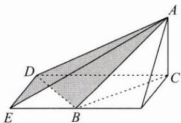

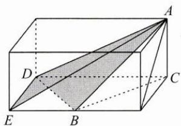

2.【解析】因为 BC=3, PB=4, PC=5, 所以 $\triangle PBC$ 为直角三角形, 如图 1, 构建底面为 $3 \times 4$ 的长方体, 则可将三棱锥放入长方体内, 使得 B, C, P 为长方体的顶点, 点 A 在长方体的上底面上.

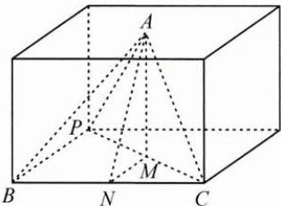
图1

因为 AB = AC = AP = 3，则点 A 在底面上的射影到点 B, C, P 距离相等，即 M 为点 A 在底面的上射影。显然，平面 AMN 与侧面平行。
如图 2, 取棱的中点 E, 连接 AE, EP, 则 $\angle APE$ 等于直线 AP 与平面 AMN 所成角。因为 AP = 3, BC = 2EA = 3，所以 $\angle APE = 30^{\circ}$ 。

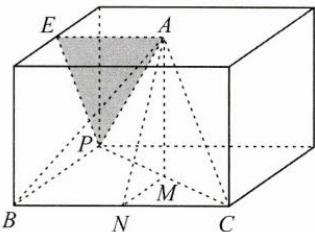
图 2

3.【解析】如图1,将四棱锥P-ABCD补形为棱长为1的正方体,则l为正方体的棱,PB为正方体的体对角线,平面QCD为正方体绕轴CD旋转的截面.

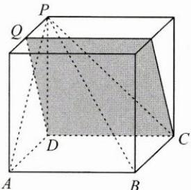
图 1

翻转正方体,以平面 QPD 为底面,如图 2,
作 PB 的平行线 MC, 则 MC 与平面 QCD 所成角 $\theta$ 等于 $PB$ 与平面 $QCD$ 所成角. 设点 $M$ 到平面 $QCD$ 的距离为 $d$ , 则 $\sin \theta = \frac{d}{MC} = \frac{d}{\sqrt{3}} \leqslant \frac{\sqrt{2}}{\sqrt{3}} = \frac{\sqrt{6}}{3}$ .

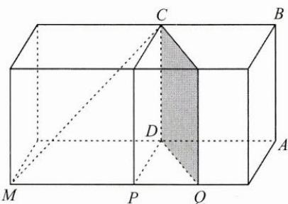
图2

4.【解析】本题中的几何体是一个底面为直角三角形的斜三棱柱，侧面 $A_{1}ACC_{1}$ 为菱形，且垂直于底面，问题是求直线 $EF$ 与平面 $A_{1}BC$ 所成角的余弦值，因此，需要探寻 $E, F, A_{1}, B, C$ 这五个点的位置关系。既然如此，直接将这五个点迁移到长方体中，重新构建几何体。如图1，作长方体 $ABCD - A_{2}B_{2}C_{2}D_{2}$ ，其中 $AB = AA_{2} = \sqrt{3}a, BC = a$ ，则由题意可得 $A_{1}$ 为 $A_{2}C_{2}$ 的中点，又 $A_{1}F \parallel \frac{1}{2} AB$ ，所以 $F$ 为 $B_{2}C_{2}$ 的中点。

图1

取 $A_{2}B_{2}$ 的中点 $M, C_{2}D_{2}$ 的中点 $N$ ，如图2，则平面 $A_{1}BC$ 即为平面 $BCNM$ ，又因为 $AM \parallel EF$ ，所以 $\angle AMB$ 即为所求线面角。在正方形 $ABB_{2}A_{2}$ 中，可得 $\cos \angle AMB = \frac{3}{5}$ 。

图2

## 71 辅助平面法

1. $2\sqrt{5} + 3\sqrt{2}$ 【解析】如图，构造辅助平面 $BDQP \parallel$ 平面 $AMN$ ，得到截面梯形，计算梯形的周长即可.

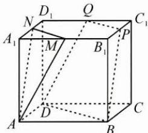

2.【解析】(1) 易知 $AD \parallel$ 平面 BCS, 得点 A 到平面 BCS 的距离等价于点 D 到平面 BCS 的距离, 再证明 $DS \perp$ 平面 BCS, 计算得 $DS = \sqrt{2}$ .

(2)如图,取BC的中点M,AM的中点H,CD的中点G,容易证明 $EH\perp$ 平面ABCD,得 $\angle EGH$ 是二面角E-CD-A的平面角,计算得 $\tan\angle EGH=\frac{\sqrt{3}}{3}$ ,所以 $\angle EGH=\frac{\pi}{6}$ .

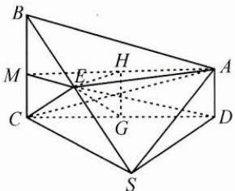

3.【解析】(1)略.

(2)如图,设 $AA_{1}=2a$ , 取 BC 的中点 F, 连接 DF, 作 $EH\perp DF$ , 连接 CH, 可证明平面 ADEF⊥平面 BDC，即平面 ADEF 起到辅助平面的作用，可以帮助我们找到过点 E 的平面 BDC 的垂线 EH. $\angle ECH=30^{\circ}$ 是 $B_{1}C$ 与平面 BCD 所成的角， $\sin\angle ECH=\frac{EH}{EC}=\frac{2a}{\sqrt{1+2a^{2}}}\sqrt{2+4a^{2}}=\frac{1}{2}$ 解得 $a=\frac{\sqrt{2}}{2}$ .
可证 $BC \perp$ 平面 ADEF，
则 $\angle DFE$ 是二面角 $D-BC-B_{1}$ 的平面角，
计算得 $\angle DFE = 45^{\circ}$ ，即 $\cos\angle DFE = \frac{\sqrt{2}}{2}$ .

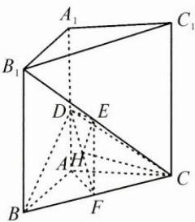
72 模型法

1. A 【解析】取 AB 的中点 $O'$ （如图），由等腰直角三角形的性质可知 $\triangle ABC$ 的外接圆圆心为 $O'$ .
由于点 A, B, C 均在球 O 上，故 $O'O \perp$ 平面 ABC，即 $O'O$ 为三棱锥 O-ABC 的底面 ABC 上的高，从而在 $\triangle O'AO$ 中，计算 $O'O$ ，进而得三棱锥的体积。易知选 A.

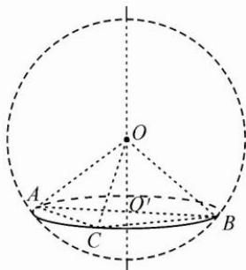

2. $\frac{\sqrt{3}}{3}$ 【解析】当球内接四棱锥的底面是正方形时,其体积最大.
设底面边长为 a，中心为 $O'$ ， $O'O = h$ ，底面

ABCD外接圆的半径为 $r$ 则 $r = \frac{\sqrt{2}}{2} a,1 = r^2 +h^2,$ 体积 $V = \frac{1}{3} Sh = \frac{2}{3} (h - h^3),0 <   h <   1,$ 求导可知当 $h = \frac{\sqrt{3}}{3}$ 时 $V$ 取得最大值.

3. $\frac{\sqrt{3}}{2}$ 【解析】设 $A(-a,0), P(x_1,y_1)$ ， $Q(-x_1,y_1)(y_1 \neq 0)$ ，则由椭圆方程可知 $a^2 - x_1^2 = \frac{a^2}{b^2} y_1^2$ ，故 $k_{AP} \cdot k_{AQ} = \frac{y_1^2}{a^2 - x_1^2} = \frac{b^2}{a^2} = 1 - e^2 = \frac{1}{4}$ ，得 $e = \sqrt{1 - \frac{b^2}{a^2}} = \frac{\sqrt{3}}{2}$ .

4.【解析】由模型法可知 $k_{PA} \cdot k_{PB} = e^{2} - 1$ $= -\frac{1}{4}.$ 设直线 $PA$ 的斜率为 $k$ ，
则直线 $PB: y = -\frac{1}{4k}x + 1$ ，
联立椭圆方程得 $B\left(\frac{8k}{1 + 4k^2}, \frac{4k^2 - 1}{1 + 4k^2}\right)$ ， $PB$ 的中点 $M\left(\frac{4k}{1 + 4k^2}, \frac{4k^2}{1 + 4k^2}\right)$ ，
从而 $PB$ 的中垂线方程为： $y - \frac{4k^2}{1 + 4k^2} = 4k\left(x - \frac{4k}{1 + 4k^2}\right).$ 令 $x = 0$ ，得 $y_N = -\frac{12k^2}{1 + 4k^2}.$ 由点 $N$ 在椭圆内得 $k \in \left(-\frac{\sqrt{2}}{4}, 0\right) \cup \left(0, \frac{\sqrt{2}}{4}\right).$

## Mathematics 高中数学 思想方法导引

关注“浙大数学优辅”B站观看名师公益讲座

关注“浙大数学优辅”微信公众号

分享“浙大数学优辅”培优资讯

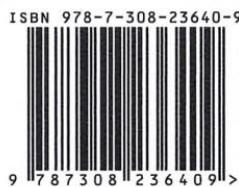

定价：59.80元
