<!-- source-part:1 pages:1-80 -->

$$
\vert A B \vert = \frac {2 P}{\sin^ {2} \theta}
$$

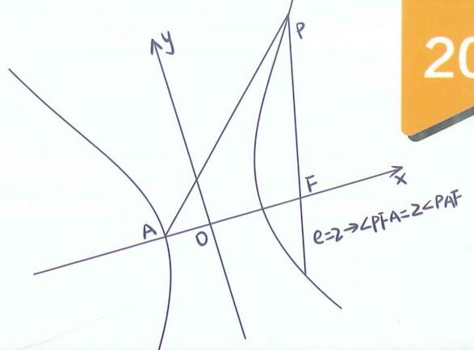

高中数学新思路
圆锥曲线专题 基本技能篇老唐说题团队教研产品
《高考数学满分突破 - 秒系列123》
《高中数学新思路 - 复习专题第一轮》
《高中数学新思路 - 复习专题第二轮》
《高中数学新思路 - 同步系列123》
《高中数学新思路 - 导数专题》
《高中数学新思路 - 圆锥曲线专题》
《MST新思路高中数学新定义 组合与
《高中物理新思路 力学篇》
《高中物理新思路 电学篇》
《高中物理新思路 综合实验篇》

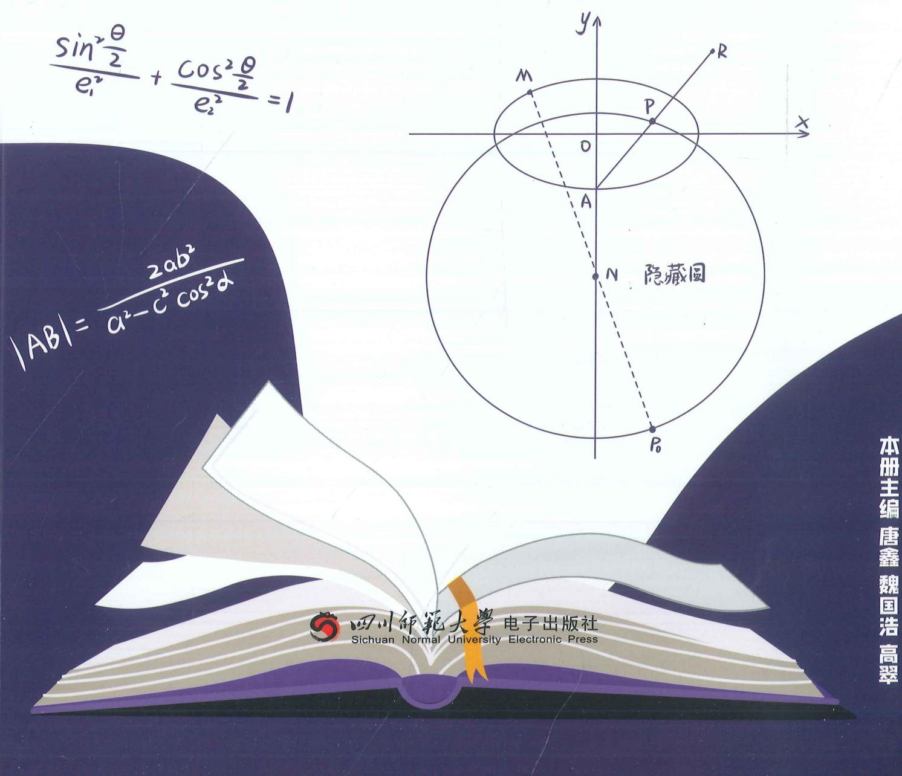

$e\cos \theta  = \frac{\lambda  - 1}{\lambda  + 1}$

$$
\vert A B \vert = \frac {2 P}{\sin^ {2} \theta}
$$

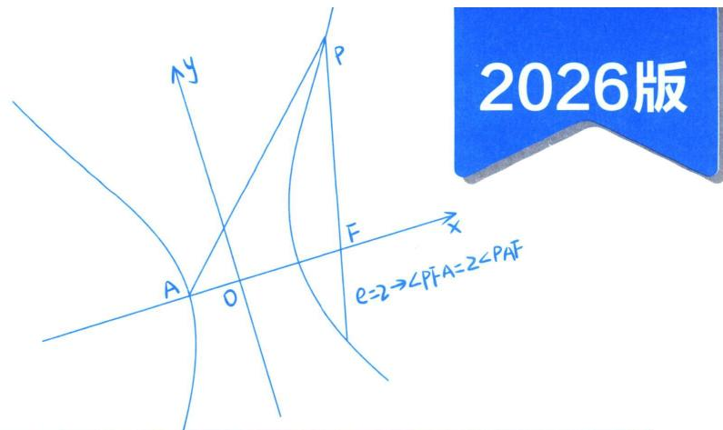

高中数学新思路
圆锥曲线专题 基本技能篇

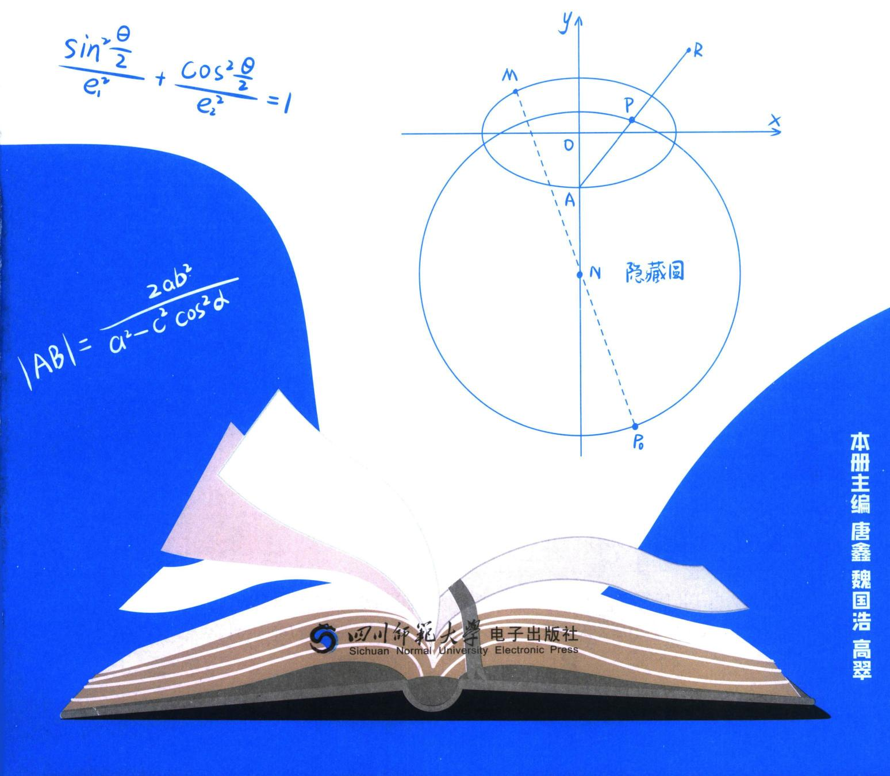

本册主编 唐鑫 魏国浩 高翠

# 高中数学新思路 圆锥曲线专题

主编 唐鑫 魏国浩 高翠

责任编辑 胡丽娜

封面设计 老唐说题工作室

出版发行 四川师范大学电子出版社

社 址 四川省成都市锦江区静安路5号

邮政编码 610068

电话 028-84767799(总编室) 028-84769668(发行部)

网址 www.scnup.com

光盘生产 大连华录影音实业有限公司

手册印制 长沙湘之印彩色印刷有限公司

文本尺寸 $210 \mathrm{~mm} \times 285 \mathrm{~mm}$

印 张 24

字 数 400 千字

版 次 2023年11月第1版

印 次 2025年7月第3次印刷

I S B N 978-7-89541-110-4

本手册为电子出版物配套手册,为尊重阅读习惯而制,如发生质量问题,读者请与我们联系

本出版物中部分未能联系上的图文作者请与本社联系,以便支付稿酬

■版权所有 侵权必究■

# 《高中数学新思路 圆锥曲线专题》编委会

主编 唐鑫 魏国浩 高翠

副主编 张羊利 郭润仙 熊翼 李弦裴

王仁正 杜松奎 程海波 李俊虎

李惟清 施小平 樊晨源 谭鸣

陈庆安 老 K 廖志发

编 委 丁兆龙 吴 斌 徐剑锋 高 斌

吴家伟 周晓燕 刘恺锐 张凯莉

向茂荣 秦伟见 庞 博 翟学强

李诗瑾 谭林华 唐阳 付笛生

蔡 涛 罗毕壬 任 升 梁士伟

罗 成 王 奎 陈 金 钱立达

王雷 赵军芳 韩壮壮 向涛

魏长松 冯齐友 唐自辉 赵拾伟

卫才良 兰天浩 梅议文 王佳星

罗传奇 欧阳斌斌

## 序言

圆锥曲线专题序言

数学之道，岂止算筹？格物明理，斯文为舟。纵横捭阖，以通天地之悠；吐纳风云，而穷数理之秋。璇玑运晷，数理昭回；游刃肯綮，妙析毫微，割圆裁斗，定于交轨；参变通幽，成于圆锥。

增第四定义于后，融焦点三角之妙，统离心变换于巧。以离心率为纲，贯椭圆双曲于一体；借三角形为刃，破焦点范围之连环。暗合阴阳消长，明察轨迹浮沉。用三角恒等，假化斜劈正；引向量投影，统变直为曲。

溯形演之精微，纳乾坤于轨则。昔贤穷其妙理，今士骋以新思，独辟蹊径，巧运机杼。析题剖疑，不囿陈规，化繁为简，参数统类。代数几何，相资为用；动静虚实，互证其真。一题巧变，展思维之活络；诸法归宗，显数理之贯通。摄星汉之辉，写翕张之势。规天地之度，融万象之和。解题之道，如曲径通幽，唯变所适，恰妙契自然。是书既成，脱窠臼而骋怀，方法已定，凌题海以明道。

育者国本所系；师者大道之枢。杏坛朽木奔走，讲席俗夫驱驰。执笔而画地自囚，持书而坐井观天。不思创新，变直播小王子；罔顾教研，成嘴炮之匠人。庸师不黜，数学难兴。教案积尘，岁岁陈言如故；课件老旧，年年照本宣科。题海沉浮，见新题则摇头；思维僵化，闻创新则蹙额，以懒惰为常态，视敷衍为本分。或怠惰成性，甘作知识贩夫；或功利熏心，沦为圈金机器。未闻教学相长之道，遑论春风化雨之功？误人子弟而不惭，混迹教坛而无愧。此等庸师，实为学蠹！数理昭昭，岂容昏昏之师？算法浩浩，安能混混而教？

探轨于焦准，骋思于玄黄。融合齐次化，协调曲线系，定比点差之奇，隐藏轨迹之基，纳射影几何，通点线配极，斯定线定点，破面积之比。二倍角度翻译，三类对合一体。向量旋转于形模，三角换元来作楫；悉藏玄奥，妙解玄机。

砖砾粗朴，敢效昆山之片玉；刍荛浅陋，聊引君子之清音。投顽石于渊，冀得连城之璧；振微声于谷，愿闻黄钟之鸣。故拙辞既展，期雅论纷披；寸心虽微，望群贤毕至；虽瓦缶先鸣，盼金声而应。

——MST 教研组

2025. 7. 1

唐鑫 昵称老唐，MST《老唐说题》创始人，《高考数学满分突破》系列丛书主编，《高中数学新思路》系列丛书主编。善于归纳总结并提炼精髓，将复杂问题简单化，抽象问题形象化和具体化。

受邀于衡水二中，正定中学，青岛二中，烟台一中，安阳一中，昆明一中，遵义四中，柳铁一高，钦州二中，惠东高级中学等国内重点高中讲座，广受好评！

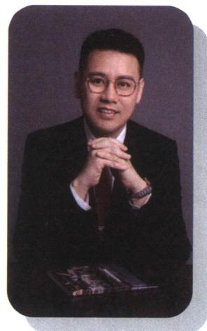

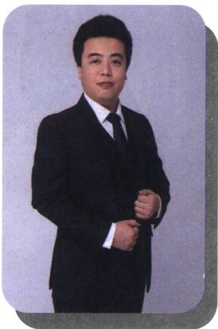

## 魏国浩

南开大学硕士研究生毕业，中学数学教师；山东理工大学特聘讲师，数学奥林匹克竞赛教练员，中国数学会会员；曾任多家教育研究所兼职研究员，多家教辅主编及编委。MST《老唐说题》创始人之一。

针对高中各年级数学教学有丰富的经验，教学成绩显著，善于发现学生的闪光点，对学生进行有的放矢的教育。

善于钻研更快、更巧的高中数学解题方法并推广应用，以自己独有的方法推导并整理《平面法向量的求法》《一步搞定错位

相减》《导数双变量问题综合探究》等五十余种高考题中独有的解法，并归纳整理《高考解题黄金模板》系列共54篇解题方法以及相关应用。

## 高翠

向华 毕业于华中师范大学数学系，毕业至今一直在惠东高级中学任教，从教十余年，她始终以一颗热爱数学、热爱学生之心坚守教育教学一线，有11年实验班教学经验，多名学子考入上海交大、浙江大学、武汉大学、南京大学、华中科技大学、中山大学等名校，深受学生、家长、同行的一致好评，是县骨干教师、优秀班主任、优秀备课组长，也是县名师工作室成员。

在教学教研方面，她勤于思考、善于钻研，先后在惠州市说课比赛中荣获一等奖；惠州市优秀论文评选中荣获一等奖；惠东县解题比赛、说题比赛、综合能力大赛中均荣获第一名；参与多项市县课题研究。

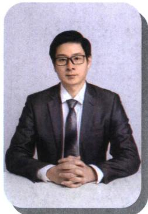

## 熊翼

熙 異 重庆八中高级教师，重庆市优秀班主任，重庆市骨干教师，重庆市渝北区优秀青年干部，教育部新时代中小学学科领军教师示范性培训(2023—2024)培养对象，全国高中青年教师赛课一等奖(现场展示最优秀选手)。

《班主任理论与实践》第三期封面人物。三次受邀做客《重庆卫视科教频道》。

工作 18 年，担任班主任工作 18 年，18 次被评为“优秀班主任”，7 年初中，11 年高中，8 届毕业班，连续三轮毕业班，带出三名重庆市状元，全国唯一。

## 张羊利

张千利 MST《老唐说题》团队创始人之一，MST《高考数学满分突破》、《高中数学新思路》系列从书主编。广东省重点中学教师，在各大自媒体(ID：利哥数学)有广大的影响力。先后受邀到浙江省天台中学、贵州省遵义四中、云南省昆明一中、云南师大附中镇雄中学、广西柳铁一中、河北省衡水二中、四川省德阳五中、广西省钦州二中、广东省惠东高级中学、湖南省郴州一中、河南省实验中学、河南省郑州四中、河南省洛阳一高、山东省菏泽一中、河北省邢台一中、湖南省湘潭县一中、山西省康杰中学、广东省清远一中等众多学校开展讲座，深受广大师生的好评。

## 郭润仙

高中数学高级教师。所教班级数学高考成绩一直名列大理州第一；曾带出2011届李仕强、杨施薇大理州高考文理状元，2014届杨佯等多名大理州高考状元；培养了杨施薇、余建希、丰峰等多名清华、北大学子；辅导的蔡金明、马遥等多名学生获省级数学竞赛奖。

参与了省内外重要数学刊物的编辑，主编《高中数学同步周练（AB卷）》，《高中数学兵法500条》和《数学教学通讯》增刊的编委。发表数十篇论文。

## 李弦裴

学张农 为学溪教育创始人，数学老师、学业规划师、心理咨询师、全球职业规划师。MST 老唐说题系列图书主编、副主编、《四川走进名校小升初历年招生考试真题》副主编、《四川走进名校摸底分班真卷》副主编。MST 老唐说题核心成员(分管学业规划部、出版部、四川总部)、四川壹牛家长圈首席课程顾问、四川金榜路志愿特邀学科讲座老师、四川清北家长圈首席规划布局专家。从事成都教育领域十余年，是超两百

位清北复交浙学生的老师。善长解决中等生、优生压轴题板块的归纳总结、细节提升等问题，对于高三学生擅长从学生课业强度、心理适应以及刷题方案分析给出高效学习方案。

## 王仁正

新疆维吾尔自治区特级教师，正高职称；上海师范大学和喀什大学硕士生导师，自治区第十一批突出贡献优秀专家，自治区“天山英才”教学名师，喀什地区教学名师。长期从事高中数学教育与研究，曾获自治区级、地区级、县市级竞赛课、优质课一等奖30次，研究成果获奖50余项，获奖和发表论文40余篇，主持和参与各类课题17余项。

## 杜松奎

杜秋奎 高中数学教师，高评委专家，省市区优秀教师、班主任，特级教师，县级优秀党员、优秀基层党支部书记、十佳青年、兼职教研员等，家庭教育指导师，师范大学研究生导师，客座讲师、校外实习生指导教师，高中生创新能力大赛全国优秀指导教师，科创优秀指导师，校竞赛教研组组长，青年教师指导师，名师工作室指导师，数学奥赛教练，一直致力于教育教学研究和师资培养，以及优生培养与研究，参与国家、省、市级课题和教学专题研究，有30多篇文章获奖或刊发，有10多个课题结题，有3项课题获政府奖，与教育同行研究高考强基计划培训，解决学生成长中的一些问题，探索家校共育。

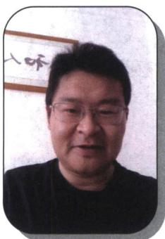

## 程海波

在海波 来自中国教育名城——湖北黄冈，学生时代，便在全国初中数学竞赛、全国高中数学联赛中获奖，2006年大学数学系毕业后，便从事高中数学教学工作，目前，在头条、抖音、腾讯、B站等各大平台累计粉丝超过100万！从教18年来，桃李满天下，带出了几百名学生考入牛津、剑桥、哈佛、斯坦福、港大、清华、北大等常青藤名校，无数学生考入985,211等全国高校，上课生动有趣、思维活跃，方法独特新颖，善于因材施教、举一反三，深受学生们喜爱，独特的教学方法与体系，造福全国无数学子！

座右铭：没有教不好的学生，只有不会教的老师！愿一生致力于数学教育，帮助全国更多的学生！

## 李俊虎

李俊虎 毕业于长沙理工大学数学系，参与编写 MST 新思路系列图书。在高中一线教学多年，教学风格严谨幽默，被学生称为虎哥。在教学中发现高中教考分离严重，高层次学生难以从日常教学中获取足够养分，因而转型教学设计研究。加入 MST 后，深入挖掘探路，找点，放缩，定比点差等方法，从一个更深的角度去探讨题目的逻辑。受邀于山东日照一中，莱芜一中，章丘四中，攸县一中，灵璧中学，河南清北集训营讲座，深受好评，助力芊芊孩子战胜高考圆锥导数压轴题。

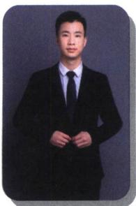

## 李惟清

荣获高等数学竞赛、数学建模竞赛全国奖项，硕士研究生毕业。从事高中数学教学十余年，大批学生考入清北、C9名校，985、211。擅长进行教学体系设计，构建知识架构体系，化繁为简的处理高考重点难点，独创“核心考点题型归纳教学法”和“高考数学速解法”；擅长一题多解，培养学生做题的综合能力，引导学生探索数学、钻研数学！独立编写《高中数学常考必考题型清单》，参与编写MST《老唐说题》系列丛书中《高中数学新思路——导数专题》《高中数学新思路——圆锥曲线专题》。

## 施小平

安徽宣城人，理学硕士，助理研究员，长期从事中、高考及竞赛数学解题教学研究。2018年以来在《数学教学》《数学通讯》《数理天地》《中学生数学》等期刊发表论文数篇。在今日头条、抖音、百家号、B站上免费开设高考数学每日一题系列讲题，讲题风格由浅入深、通俗易懂，深受广大学生喜爱！

## 樊晨源

吴辰亦 高中数学联赛金牌教练，毕业于中山大学数学系。参与编写《高考数学满分突破》系列，《高中数学新思路》系列书籍，浙大优学特邀作者，于《中等数学》、《数学进展》等国家级报刊发表专著论文十余篇。曾担任某 Top 级在线平台首席讲师，十年一线教龄，带领无数学子圆梦清北等一流学府；执教毕业班的高考数学平均分屡次突破 140+，并有多名满分考生。

中学高级教师，常年在示范高中高三任教并负责年级管理，培养出多名清华、北大学生。市教书育人楷模、青年科技人才、基础教育名师、五一劳动奖章获得者，全国高中数学联赛省级优秀辅导员。

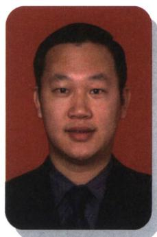

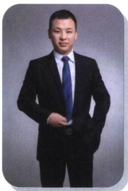

## 徐剑锋

毕业于湖南大学，高考数学142，曾获江西省高中数学联赛一等奖。现任广州市某重点中学数学教师，任教10余年，具有深厚的学科素养，对教育及教学有自己独到的理解。

获广州市优秀教师，广州市高考数学科突出贡献奖等称号。获广州市数学教师解题比赛一等奖，广州市数学教师讲题比赛一等奖。主持广东省省级课题《新高考能力素养培育与数学教学模式优化的研究》顺利结题，并获广东省课题研究一等奖。

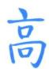

潜心教学 22 年，深入教学一线，教学风格独特，曾获区级教学新秀、优秀复课教师。一直专注于教学能力的研读与实践，善于激发学生兴趣，调动学生学习热情。始终秉持爱心与责任共举，助力学生知识与能力同行，连续 15 年担任毕业班数学教学，工作成绩显著，是学生追逐梦想的指明灯和引路人。

## 目录

## 基本技能篇

## 第1章 圆锥曲线三定义

第一节 椭圆双曲的轨迹翻译（第一定义） … 1
一、椭圆第一定义 …… 1
二、椭圆焦点弦 …… 4
三、双曲线第一定义 …… 9
四、双曲线焦长公式 …… 12

第二节 椭圆双曲的比值模型（第二定义） …… 15
一、椭圆第二定义关于“比” …… 15
二、双曲线第二定义关于“比” …… 15
三、第二定义与 $|PF_{1}| \cdot |PF_{2}|$ 相关的结论 …… 18
四、双曲线倍角定理 …… 20

第三节 椭圆双曲的斜率转化（第三定义） …… 23
一、椭圆第三定义关于“积” …… 23
二、双曲线第三定义之“积” …… 26
三、第三定义与中点弦转化 …… 27
四、第三定义转化为斜率比 …… 28

第四节 圆锥曲线的第四定义 …… 31
第五节 抛物线的焦准翻译 …… 34
一、焦点弦与焦半径公式 …… 34
二、焦准斜率关系与转化 …… 38

第六节 长度最值问题之声东击西 …… 40
一、椭圆最值问题 …… 40
二、双曲线最值问题 …… 41
三、抛物线最值问题 …… 41
四、阿氏圆反演与圆锥曲线最值问题 …… 43

第七节 截口曲线与祖暅原理 …… 46
一、截口曲线形成的圆锥曲线…… 46
二、丹德林双球模型与离心率…… 48
1. 基本数据与离心率转化 …… 48
2. 离心率与截面角之间的关系 …… 49
三、祖暅原理…… 54

## 第2章 离心率

第一节 弦长体系下的焦长模型与焦比定理 … 56
1. 椭圆的焦比定理 …… 56
2. 双曲线焦比定理之交一支类型 …… 56
3. 双曲线焦比定理之交两支类型 …… 57
一、通径相关的离心率…… 57
二、焦点弦的化斜为直…… 58
三、焦点弦比值与离心率…… 60
四、焦点弦构造等腰三角形速解策略…… 62
1. 隐藏的 2a 型…… 62
2. 双曲线的 4a 底边等腰三角形…… 63
五、椭圆与双曲线的焦弦直角体与离心率…… 65
六、焦点弦的平行四边形对称化构造…… 68
第二节 几何性质下的渐近线模型 …… 70
一、焦点到渐近线距离构造特征三角形…… 70
1. 利用对称性构造直角三角形 …… 71
2. 与焦长综合的渐近线三角形 …… 72
3. 与渐近线平行的焦点弦问题 …… 73
4. 小圆中位线与 2a 的数据构造…… 74

二、渐近线相似三角形比值与离心率……75
三、大圆与渐近线交点构造坐标特征三角形 …… 77
四、渐近线隐藏的面积和向量积定值……79
五、渐近线焦长公式推导方案……82

第三节 长度与角度下的离心率范围约束……83
一、短轴端点处 $\angle F_{1}PF_{2}$ 张角最大……83
二、直角 $\angle F_{1}PF_{2}$ 的约束 ……85
三、向量乘积与极化恒等式的约束……85
四、弦长与角度范围约束……86
第一类：双曲线焦点弦最短在实轴顶点 ……86
第二类：最短焦点弦是通径的约束 ……87
第三类：最大角为锐角的限制 ……88
第四类：渐近线夹角限定原点三角形形状
……88

五、圆心角 $\angle AOB$ 为直角在椭圆内的约束 ……88
1. 椭圆 $\frac{1}{d^{2}}=\frac{1}{a^{2}}+\frac{1}{b^{2}}$ ……88
2. 双曲线 $\frac{1}{d^{2}}=\frac{1}{a^{2}}-\frac{1}{b^{2}}$ ……89
六、中垂线定理与离心率限定……91

第3章 几何视角下的焦点三角形

第一节 角度语言与坐标语言下的焦点三角形 ……93
一、椭圆焦点三角形的性质……93
二、双曲线焦点三角形性质……96
三、椭圆焦点三角形两底角半角与离心率转化
……98
四、双曲线焦点三角形两底角半角与离心率转化
……99
五、椭圆双曲线共焦点问题 ……101

第二节 几何光学性质下的焦点三角形 ……104
一、光学性质概念 ……104
二、光学性质切线法线定理 ……104
三、光学性质与中垂线截距定理 ……109

第三节 三角形四心性质的应用 ……112
一、椭圆焦点三角形内心与离心率 ……112二、椭圆焦点三角形旁心轨迹 …… 113
三、双曲线焦点三角形内心轨迹与双切圆 … 115
1. 内心轨迹方程 …… 115
2. 离心率问题 …… 117
3. 大焦点三角形内切圆切于焦点 …… 118
4. 双切圆问题 …… 120
四、双曲线焦点三角形旁心与离心率 …… 123

第四节 焦点三角形与大小圆问题 …… 125
一、以圆锥曲线焦半径为直径的圆的性质 … 125
二、光学定理与大圆小圆问题 …… 128
1. 椭圆的大圆 …… 128
2. 大圆性质拓展 …… 129
3. 双曲线的小圆 …… 129

第4章 小题新题型与多选的综合题方法篇

第一节 切线与切点弦 …… 131
一、切线与切点弦的极点极线方程 …… 131
1. 二次曲线的替换法则 …… 131
2. 切线切点弦的极点极线代数定义 … 131
3. 切线切点弦的几何意义 …… 131
二、切线方程和切点弦方程求法的书写过程 … 134
三、抛物线切线方程与阿基米德三角形 …… 137
1. 抛物线的切线方程 …… 137
2. 抛物线切线与阿基米德三角形性质与结论 …… 141
3. 特殊的阿基米德三角形 …… 142
四、阿基米德三角形的面积问题 …… 144
五、新定义下的阿基米德三角形的面积与等比数列 …… 147

第二节 坐标旋转与曲线转换 …… 152
一、向量旋转公式与图像转化 …… 152
二、等轴双曲线与反比例函数转化 …… 156
三、非等轴双曲线的仿射换元 …… 159
四、退化二次曲线中点点差法 …… 161
1. 中点弦存在定理 …… 161

第一节 抛物线两点联立式方程 …… 201
一、抛物线两点联立式同构与定点定值 …… 201
二、两点联立式下的双切圆 …… 208
三、两点联立式下的彭塞列闭合 …… 209
四、两点联立式下的极点极线证明 …… 210
五、两点联立式下的平行弦同构 …… 212
第二节 斜率同构式与坐标同构式的应用 … 216
一、坐标点式同构和斜率同构区别 …… 216
二、圆锥曲线上的双切圆斜率同构 …… 217
三、双切椭圆双曲线的斜率同构 …… 218
四、双切椭圆的蒙日圆 …… 218
五、由内准圆引起的斜率同构 …… 222
六、斜率和积为定值的同构 …… 223

2. 双曲线弦与渐近线弦共中点类型 … 163
五、渐近切线三角形面积与向量积问题 …… 166
第三节 圆锥曲线之间的交点 …… 169
一、由定义和交点坐标构造的混合型 …… 169
二、由斜率关系和共焦点构造的混合型 …… 173
三、由斜率关系和中点弦构造的混合型 …… 176
四、由圆锥曲线和三角代入计算的混合型 … 178

## 第5章 常规韦达联立

## 第6章 联立之同构方程

七、坐标同解同构方程(外接圆) …… 225
八、双切曲线的斜率同解同构 …… 227
第三节 比值参数同构 …… 229
比值参数 $\lambda + \mu, \frac{1}{\lambda} + \frac{1}{\mu}$ 同构 …… 229

第 7 章 圆锥曲线常规数据处理方法

第一节 齐次化处理斜率和积问题 …… 232
一、点 $P(x_0, y_0)$ 在圆锥曲线上的斜率和积为定值问题 …… 232
二、点 $P(x_0, y_0)$ 在圆锥曲线外的斜率和积为定值问题 …… 236
1. 以原点为公共顶点的内切圆问题 … 236
2. 以原点为公共顶点的斜率等比问题 ……
…… 237
3. 以坐标轴为角平分线的齐次化构造 ……
…… 238

第二节 隐藏的斜率和积问题 …… 239
一、同轴轴点弦+顶点角隐藏的斜率之积 … 239
二、隐藏的斜率之比 …… 242
三、高考题中隐藏的斜率和与积关系 …… 243
四、平行于坐标系的中点斜率翻译 …… 245

第三节 点差法与中垂线问题 …… 247
一、点差法与中点弦 …… 247
二、点差法与隐藏的中点轨迹问题 …… 248
1. 求隐藏轨迹方程的交轨法 …… 248
2. 斜率双用与双中点连线过定点问题 … 250
三、点差法与中垂线问题 …… 252
四、焦点弦中垂线特殊性质 …… 255

第四节 定比点差法 …… 259
一、定比分点概念 …… 259
二、调和点列与定比点差法 …… 259
1. 调和点列的概念 …… 259
2. 调和点列的性质 …… 260
3. 定比分点和调和分点支配下的圆锥曲线 …… 260

三、定比点差法与轴点弦的三炮齐鸣 …… 262
1. 三炮齐鸣破解中点截距定理 …… 263
2. 三炮齐鸣破解角平分线定理 …… 264
3. 三炮齐鸣破解单轴点弦交中点的定点定值问题 …… 265
四、非轴点弦三炮齐鸣数据 …… 268

第8章 联立计算高阶篇

第一节 长度参数与直线参数方程 …… 271
一、直线的参数方程形式与性质 …… 271
二、直线参数方程与四点共圆 …… 273
三、参数方程破解类圆幂定理 …… 274
四、参数方程解决共线分弦定点定值 …… 275
五、对称轴上任意点分弦平方和成定值问题 … 277

第二节 单动点与圆锥曲线参数方程 …… 278
一、圆锥曲线参数换元形式 …… 278
二、单动点三角换元解决二次曲线上的距离问题 …… 279
三、隐藏的轨迹方程与单动点三角换元 …… 280
四、三角换元破解切线单动点 …… 282
五、万能三角代换与顶点弦速解 …… 286

第三节 复数变换与三角旋转 …… 288
一、复数的模与辐角表示圆锥曲线方程 …… 288
二、复数变换处理平行问题 …… 288
三、复数代换下圆锥曲线中的垂直问题 …… 289
四、复数代换下的切线几何性质挖掘 …… 291
五、复数旋转下的等腰直角三角形 …… 293

第四节 直线系和圆系方程 …… 295
一、直线系方程 …… 295
二、过直线与圆交点的圆系方程 …… 296
三、相交两圆的公共弦 …… 297
四、过圆与圆交点的圆系方程 …… 297
五、过圆和切点的圆系方程 …… 298

第五节 二次曲线系与四点共圆 …… 298一、四点共圆曲线系原理 …… 298
二、圆幂定理反推四点共圆 …… 299
三、四点共圆的充要条件与数据 …… 300
四、外接圆与隐藏第四点的四点共圆 …… 302

第六节 二次曲线方程与四点联立曲线系 … 306
一、退化二次曲线对称轴不与坐标轴平行的曲线系 …… 306
二、用曲线系方程破解高考极点极线题型 … 307
三、用曲线系速解坎迪定理 …… 309
四、曲线上三点构造切线的适配曲线系方程速解斜率和积 …… 312
五、曲线系挖掘四点形斜率关系与隐藏轨迹 … 313
六、用曲线系破解彭塞列闭合定理 …… 314
七、双曲线退化二次曲线系方程 …… 315
八、用退化二次曲线系方程破解浙江21高考压轴题 …… 319

第9章 圆锥曲线跨界综合

第一节 圆锥曲线与立体几何综合 …… 320
一、隐藏圆的空间构造 …… 320
二、椭圆柱的几何综合 …… 322
三、折叠问题与圆锥曲线 …… 324

第二节 圆锥曲线与三角函数的综合 …… 327
一、联立构造三角的二次方程 …… 327
二、积化和差与和差化积综合应用 …… 328
1. 积化和差 …… 328
2. 和差化积 …… 328

第三节 圆锥曲线与导数的综合 …… 331
一、求交点个数 …… 331
二、对数均值与中值斜率的综合应用 …… 334
第四节 圆锥曲线与数列综合(上) …… 337
一、交点坐标分类构造数列 …… 337
二、构造递推式证明数列单调性与裂项放缩 … 338
三、斜率关系构造定点与数列递推 …… 341

## 技能强化篇

第一节 反比例对合方程解决圆锥曲线与数列综合 …… 342

一、两点对合式构造双曲线中的等比数列 … 343

二、非等轴双曲线的仿射换元 …… 344

三、抛物线两点对合式构造等差等比数列 … 349

第二节 抛物线切线对合与两点对合数列构造综合 …… 353

一、抛物线蝴蝶定理 …… 353

二、切线与对合不动点 …… 356

三、平移顶点的抛物线两点对合方程 …… 358

第三节 椭圆双曲线的两点对合式 …… 359

一、椭圆与双曲线的两点对合式 …… 359

1. 椭圆两点对合式 …… 359

2. 双曲线右支的两点对合式 …… 360

3. 双曲线左支的两点对合式 …… 360

4. 双曲线左右两支的两点对合式 …… 361

二、对合方程简化单动点模型 …… 361

1. 椭圆 …… 361

2. 双曲线 …… 361

三、对合方程简化斜率关系模型 …… 362

四、两点对合方程简化相切圆问题 …… 365

五、两点对合方程简化轮换对称问题 …… 366

第11章 从定比点差到极点极线

第一节 单比与交比 …… 370

一、单比的概念及性质 …… 370

1. 单比的定义 …… 370

2. $\lambda + \mu$ 为定值的参数同构与点差法 … 370二、单比与交比 …… 372
1. 单比角元形式 …… 372
2. 交比的概念及性质 …… 372
3. 交比的射影不变性 …… 373
三、调和点列与定比点差 …… 377
1. 调和点列的概念 …… 377
2. 调和点列的性质 …… 377
3. 定比分点和调和分点支配下的圆锥曲线 …… 378
四、定点（极点）在坐标轴上的定比点差 … 379
类型一：定点（极点）在 x 轴 …… 379
类型二：定点（极点）在 y 轴 …… 380
五、定点（极点）不在坐标轴上的定比点差 … 382
第二节 极点极线定义与自极三角形 …… 384
一、极点极线的定义 …… 384
1. 二次曲线的替换法则 …… 384
2. 极点极线的代数定义 …… 385
3. 极点极线的几何意义 …… 385
二、极点极线定理证明 …… 386
1. 梅涅劳斯定理 …… 386
2. 梅涅劳斯定理的逆定理 …… 387
3. 塞瓦定理 …… 387
4. 塞瓦定理的逆定理 …… 387
三、极点极线的配极性质 …… 388
四、完全四边形与自极三角形 …… 388
1. 完全四边形定义 …… 388
2. 极点极线的综合模型——自极三角形 …… 388
第三节 蝴蝶定理与坎迪定理 …… 394
一、蝴蝶定理 …… 394

二、坎迪定理 …… 395
三、坎迪定理中点推论 …… 397
四、利用对称和焦弦常数构造斜率关系 …… 400

第12章 调和点列与调和线束定理与对合关系

第一节 调和点列与点的对合 …… 403
调和共轭定理 …… 403

第二节 调和线束两大定理的应用 …… 407
一、调和线束平行中点定理 …… 407
1. 利用调和梯形角度解读 …… 408
2. 射影到与坐标轴平行线的中点 …… 409
3. 调和等腰梯形对称构造 …… 412
4. 射影到斜线找中点与平行 …… 417
二、调和线束斜率公式 …… 419
1. 平行于坐标系的中点斜率翻译 …… 420
2. 斜率等差与斜率倒数等差模型 …… 427
3. 由自极三角形构造的射影中心和调和线束斜率坐标翻译 …… 430

第三节 角平分线与调和点列 …… 433
一、斜率和为0与内外角平分线解读 …… 433
二、内外角平分线与焦准模型 …… 435
1. 椭圆外角平分线与焦准模型 …… 435
2. 双曲线内角平分线与焦准模型 …… 435
3. 双外角平分线垂直模型 …… 435
三、内外角平分线隐藏阿氏圆 …… 437
隐藏的角平分线与阿氏圆构造 …… 438

第四节 斜率对合与斜率翻译 …… 440
一、斜率对合的原理 …… 440
1. 对合轴与对合中心的选取 …… 441
2. 斜率对合的基本作图原理 …… 441
二、对合中心在无穷远点的特殊值 …… 447
1. 当 $k_{1}+k_{2}=0$ 时，第三条边斜率为定值 …… 447

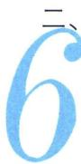

2. 当 $k_{1}k_{2} = \pm \frac{b^{2}}{a^{2}}$ 时，第三条边斜率为定值
...... 448
三、和型对合 $k_{1} + k_{2}$ 的三种模型 …… 449
1. 射影中心与一对合不动点横坐标相同
...... 449
2. 两对合不动点横坐标相同 …… 449
3. 射影中心与对合中心横坐标相同 … 450
四、倒数和型 $\frac{1}{k_1} + \frac{1}{k_2}$ 对合的三种模型 …… 450
1. 射影中心与一对合不动点纵坐标相同
...... 450
2. 两对合不动点纵坐标相同 …… 452
3. 射影中心与对合中心纵坐标相同 … 452
五、顶点角+同轴轴点弦的对合方程 …… 454
1. 两类对合中心在坐标轴上的对合模型
...... 454
2. 对合中心在坐标轴上的面积转化 … 461
3. 对合中心在坐标轴上的斜率与共圆转化
...... 463
六、积型 $k_{1}k_{2}$ 对合的多解问题 …… 466
1. 射影中心在曲线上的直角构造 …… 466
2. 射影中心未知的调和线束由 $k_{3} + k_{4} = 0$ 构造定值 …… 466
3. 射影中心未知的斜率乘积为定值的多解问题 …… 469
4. 费雷格(Fregier)定理 …… 469
七、对合方程 $ak_{1}k_{2} + b(k_{1} + k_{2}) + c = 0$ …… 471
1. 由调和线束斜率公式转化 …… 471
2. 中点平行弦模型 …… 473
第五节 斜率积的三次对合 …… 474
一、椭圆内接三角形的外心斜率定理 …… 474
二、等轴双曲线轮换对合与隐藏的垂心 …… 476
三、等轴双曲线反演与二阶曲线外心 …… 478
四、三次方程韦达定理与三次齐次化方程 … 478

第六节 从笛沙格定理到帕斯卡定理 …… 481

一、笛沙格对合 …… 482

二、帕斯卡（Pascal）定理及其逆定理…… 484

1. 寻找帕斯卡第六点 …… 485

2. 圆锥线的切线 …… 485

3. 帕斯卡圆锥曲线的内接四点形 …… 486

第七节 帕斯卡定理与对偶定理布利安桑定理……

…… 492

一、布利安桑（Brianchon）定理与退化二次曲线联立 …… 492

1. 对偶的两个定理——布利安桑定理与帕斯卡定理比较 …… 492

2. 外切五边形的布利安桑点 …… 493

3. 外切四边形的布利安桑点 …… 493

4. 外切三边形的布利安桑点 …… 493

二、热尔岗点 …… 494

三、退化二次曲线的布利安桑点 …… 495

四、双曲线渐近线和共轭直径 …… 495

第13章 新定义下的斜率调整与仿射

第一节 斜率调整法 …… 497

一、曲线上双定点单动点斜率调整原理 …… 497

二、斜率调整与斜率表示 …… 499

三、斜率调整与对合的综合 …… 500

四、斜率调整背景——斯坦纳定理 …… 502

1. 点的斯坦纳定理 …… 504

2. 线的斯坦纳定理 …… 504

第二节 仿射法与面积转化 …… 505

一、仿射法与面积变化 …… 505

二、切点圆面积最值 …… 511

三、斜率乘积 $-\frac{b^{2}}{a^{2}}$ 能仿射成直角的面积定值问题 …… 516

四、重心三角形面积定值问题 …… 520
五、直径三角形面积最值问题 …… 521

第一节 过焦点弦的面积问题 …… 524

一、焦长转化为面积和差 …… 524

1. 焦长公式 …… 524

2. 面积之和 …… 524

3. 面积之差 …… 524

二、焦点弦中点连线隐藏定点与面积转化 … 528

三、焦点弦用角度转化斜率与面积 …… 529

四、焦弦中垂线与隐藏面积问题 …… 530

五、隐藏的焦弦常数与三角形面积比值转化 …… 533

六、焦弦的截距与面积转化问题 …… 537

七、焦点准线关联与面积比值转化 …… 538

八、焦半径与定比点差转化面积比值 …… 539

第二节 坐标面积公式与面积最值 …… 541

一、坐标面积公式推导 …… 541

二、坐标面积公式与柯西不等式求最值 …… 543

第三节 面积比值转化问题 …… 545

一、利用极点极线关系将坐标转化面积比 … 545

二、隐藏定点的斜率关系构造面积最值问题 …… 547

三、隐藏调和线束斜率关系与面积转化 …… 550

四、由中点隐藏轨迹方程构造面积最值问题 …… 552

五、由单动点三角换元构造面积比 …… 555

六、共轭点面积等比中项模型 …… 559

![[高中/总复习/专题/2026版高中《mst老唐说题》圆锥曲线专题（数学）/上册/第01章_圆锥曲线四定义/第01章_圆锥曲线四定义.md]]
![[高中/总复习/专题/2026版高中《mst老唐说题》圆锥曲线专题（数学）/上册/第02章_离心率/第02章_离心率.md]]
![[高中/总复习/专题/2026版高中《mst老唐说题》圆锥曲线专题（数学）/上册/第03章_几何视角下的焦点三角形/第03章_几何视角下的焦点三角形.md]]
![[高中/总复习/专题/2026版高中《mst老唐说题》圆锥曲线专题（数学）/上册/第04章_小题新题型与多选的综合题方法篇/第04章_小题新题型与多选的综合题方法篇.md]]
![[高中/总复习/专题/2026版高中《mst老唐说题》圆锥曲线专题（数学）/上册/第05章_常规韦达联立/第05章_常规韦达联立.md]]
![[高中/总复习/专题/2026版高中《mst老唐说题》圆锥曲线专题（数学）/上册/第06章_联立之同构方程/第06章_联立之同构方程.md]]
![[高中/总复习/专题/2026版高中《mst老唐说题》圆锥曲线专题（数学）/上册/第07章_圆锥曲线常规数据处理方法/第07章_圆锥曲线常规数据处理方法.md]]
![[高中/总复习/专题/2026版高中《mst老唐说题》圆锥曲线专题（数学）/上册/第08章_联立计算高阶篇/第08章_联立计算高阶篇.md]]
![[高中/总复习/专题/2026版高中《mst老唐说题》圆锥曲线专题（数学）/上册/第09章_圆锥曲线跨界综合/第09章_圆锥曲线跨界综合.md]]
