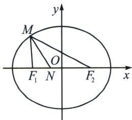

> [!faq]- 《圆锥曲线专题(上册)》例题解析
>
> > [!success]- **【答案】** A
>
> > [!note]- **【分析】**
> > 本题未单列分析。
>
> > [!note]- **【解析】**
> > 解析 解法一：因为 $\angle F_{1}MF_{2}$ 的角平分线交线段 $F_{1}F_{2}$ 于点 $N$ ，椭圆 $C: \frac{x^{2}}{2} + y^{2} = 1$ 的两个焦点分别为 $F_{1}, F_{2}$ ，所以 $\angle F_{1}MN = \angle NMF_{2}$ ，所以由正弦定理得 $\frac{|MF_{1}|}{\sin\angle MNF_{1}} = \frac{|F_{1}N|}{\sin\angle F_{1}MN}$ ，又因为 $\sin \angle MNF_{1} = \sin \angle MNF_{2}$ ，不妨设 $|MF_{2}| = x, |ON| = n$ ，如图：
> > 
> > 则 $\frac{2a - x}{x} = \frac{c - n}{c + n}$ , 解得 $x = \frac{a(c + n)}{c}$ , 所以 $\frac{|MF_1|}{|NF_1|} = \frac{x}{c + n} = \frac{\frac{a(c + n)}{c}}{c + n} = \frac{a}{c} = \frac{a}{\sqrt{a^2 - b^2}}$ , 由题意 $a = \sqrt{2}$ , $b = 1$ , 所以 $\frac{|MF_1|}{|NF_1|} = \frac{\sqrt{2}}{\sqrt{2 - 1}} = \sqrt{2}$ .
> > 解法二：由内角平分线定理， $\frac{|MF_1|}{|MF_2|} = \frac{|NF_1|}{|NF_2|}$ ，则 $\frac{|MF_1|}{|NF_1|} = \frac{|MF_2|}{|NF_2|} = \frac{|MF_1| + |MF_2|}{|NF_1| + |NF_2|} = \frac{2a}{2c} = \sqrt{2}$
> >
> > 故选 **A**.
