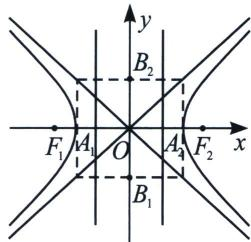

## 三、双曲线第一定义

平面内与两个定点 $F_{1}$ 、 $F_{2}$ 的距离的差的绝对值等于常数且小于 $\left|F_{1}F_{2}\right|$ 的点的轨迹；其中，两个定点叫做双曲线的焦点，焦点间的距离叫做焦距.

注意: $|PF_{1}| - |PF_{2}| = 2a$ 与 $|PF_{2}| - |PF_{1}| = 2a (a > 0)$ 分别表示双曲线的一支。若有“绝对值”，点的轨迹表示双曲线的两支；若无“绝对值”，点的轨迹仅为双曲线的一支；

根据 $\left|\sqrt{(x + c)^2 + y^2} -\sqrt{(x - c)^2 + y^2}\right| = 2a$ ，化简得： $\frac{x^2}{a^2} -\frac{y^2}{b^2} = 1(a,b > 0).$

注意 1. 双曲线的标准方程: $\left\{ \begin{array}{l} \frac{x^2}{a^2} - \frac{y^2}{b^2} = 1 (a, b > 0) \Leftrightarrow \text { 中心在原点，焦点在 } x \text { 轴上； } \\ \frac{y^2}{a^2} - \frac{x^2}{b^2} = 1 (a, b > 0) \Leftrightarrow \text { 中心在原点，焦点在 } y \text { 轴上。 } \end{array} \right.$

2. 顶点： $A_{1}(-a,0)$ ， $A_{2}(a,0)$ .

3. 实轴和虚轴 实轴长为 $2a$ ，虚轴长为 $2b$ ;

4. 焦点 $F_{1}(-c,0)$ , $F_{2}(c,0)$ .

5. 焦距 $\left|F_{1}F_{2}\right|=2c(c>0)$ ，满足关系式： $c^{2}=a^{2}+b^{2}$

6. 离心率 $e = \frac{c}{a} (e > 1)$ ，离心率越大，开口越大；

7. $P$ 为双曲线上一点, 则 $\overrightarrow{PF_1} \cdot \overrightarrow{PF_2} = |\overrightarrow{PO}|^2 - c^2 \in [-b^2, +\infty)$ (利用极化恒等式证明).

![[高中/总复习/专题/2026版高中《mst老唐说题》圆锥曲线专题（数学）/上册/第01章_圆锥曲线四定义/第一节_椭圆双曲的轨迹翻译_第一定义/三_双曲线第一定义/例题/Q00048319.md]]
![[高中/总复习/专题/2026版高中《mst老唐说题》圆锥曲线专题（数学）/上册/第01章_圆锥曲线四定义/第一节_椭圆双曲的轨迹翻译_第一定义/三_双曲线第一定义/例题/Q00048320.md]]
![[高中/总复习/专题/2026版高中《mst老唐说题》圆锥曲线专题（数学）/上册/第01章_圆锥曲线四定义/第一节_椭圆双曲的轨迹翻译_第一定义/三_双曲线第一定义/例题/Q00048321.md]]
![[高中/总复习/专题/2026版高中《mst老唐说题》圆锥曲线专题（数学）/上册/第01章_圆锥曲线四定义/第一节_椭圆双曲的轨迹翻译_第一定义/三_双曲线第一定义/例题/Q00048322.md]]
![[高中/总复习/专题/2026版高中《mst老唐说题》圆锥曲线专题（数学）/上册/第01章_圆锥曲线四定义/第一节_椭圆双曲的轨迹翻译_第一定义/三_双曲线第一定义/例题/Q00048323.md]]
![[高中/总复习/专题/2026版高中《mst老唐说题》圆锥曲线专题（数学）/上册/第01章_圆锥曲线四定义/第一节_椭圆双曲的轨迹翻译_第一定义/三_双曲线第一定义/例题/Q00048324.md]]
