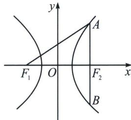

<!-- question-source:start -->
例16（2024·新课标Ⅰ卷）设双曲线 C: $\frac{x^{2}}{a^{2}} - \frac{y^{2}}{b^{2}} = 1 (a > 0, b > 0)$ 的左、右焦点分别为 $F_{1}$ ， $F_{2}$ ，过 $F_{2}$ 作

9 老唐说题

平行于 y 轴的直线交 C 于 A, B 两点，若 $\left|F_{1}A\right|=13,\left|AB\right|=10$ ，则 C 的离心率为 \_\_\_\_.

<!-- question-source:end -->

![[高中/总复习/专题/2026版高中《mst老唐说题》圆锥曲线专题（数学）/上册/第01章_圆锥曲线四定义/第一节_椭圆双曲的轨迹翻译_第一定义/三_双曲线第一定义/例题/answers/Q00048320A1.md]]
