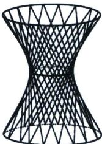
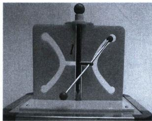
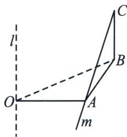

<!-- question-source:start -->
例19（湖北省武汉市武昌区2025届高三下学期5月质量检测(三模)T14）在几何中，单叶双曲面是一种典型的直纹面如图1所示，因其具有优良的稳定性和美观性，常被应用于大型建筑结构(如广州电视塔). 单叶双曲面的形成过程可通过“双曲狭缝”演示：如图2，直杆 $m$ 与固定轴 $l$ 成一定夹角，且均和连杆垂直. 当

## 高中数学 新思路 圆锥曲线专题

直杆 m 绕固定轴 l 旋转时，其轨迹形成单叶双曲面。若用过单叶双曲面固定轴的平面截取该曲面，所得交线为双曲线的一部分。在某科技馆的演示中，立板上的双曲狭缝即为直杆运动轨迹（双曲面）被立板面截取的双曲线的一部分，因此直杆旋转时可始终穿过两条弯曲的狭缝。若直杆 m 与固定轴 l 所成角的大小为 $30^{\circ}$ ，则该双曲线的离心率为 \_\_\_\_。

  
图 1

  
图 2

<!-- question-source:end -->

![[高中/总复习/专题/2026版高中《mst老唐说题》圆锥曲线专题（数学）/上册/第01章_圆锥曲线四定义/第一节_椭圆双曲的轨迹翻译_第一定义/三_双曲线第一定义/例题/answers/Q00048323A1.md]]
