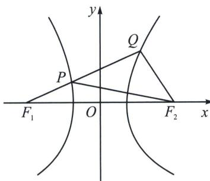

> [!faq]- 《圆锥曲线专题(上册)》例题解析
>
> > [!success]- **【答案】** 详见解析
>
> > [!note]- **【分析】**
> > 本题未单列分析。
>
> > [!note]- **【解析】**
> > 解析 双曲线 $C: \frac{x^2}{2} - \frac{y^2}{14} = 1$ 中, 实半轴长 $a = \sqrt{2}$ , 虚半轴长 $b = \sqrt{14}$ , 半焦距 $c = 4$ , 如图:
> > 
> > 由双曲线定义知 $|PF_1| = |QF_1| - |QP| = |QF_1| - |QF_2| = 2a = 2\sqrt{2}$ ，则 $|PF_2| = 2a + |PF_1| = 4\sqrt{2}$ ， $|F_1F_2| = 2c = 8$ ， $\triangle PF_1F_2$ 中，由余弦定理得 $\cos \angle PF_1F_2 = \frac{|PF_1|^2 + |F_1F_2|^2 - |PF_2|^2}{2|PF_1| \cdot |F_1F_2|} = \frac{(2\sqrt{2})^2 + 8^2 - (4\sqrt{2})^2}{2 \cdot 2\sqrt{2} \cdot 8} = \frac{5\sqrt{2}}{8}$ 。故答案为 $\frac{5\sqrt{2}}{8}$ 。
