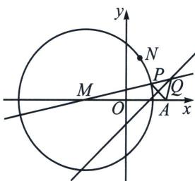
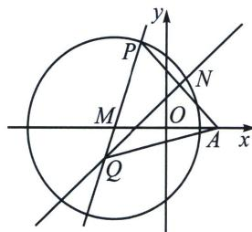

> [!faq]- 《圆锥曲线专题(上册)》例题解析
>
> > [!success]- **【答案】** $(x + 6)^2 + y^2 = 100 (x \neq 2$ 且 $y \neq 6)$ ; $\frac{x^2}{25} - \frac{y^2}{11} = 1 (x \neq -50$ 且 $y \neq -33)$
>
> > [!note]- **【解析】**
> > 解析 因为等腰三角形 MNP 的顶点为 $M(-6, 0)$ ，底边的一个端点为 $N(2, 6)$ ，另一个端点为 P，
> >
> > 所以 $|MP| = |MN| = \sqrt{(-6 - 2)^2 + (0 - 6)^2} = 10$ ，故点 $P$ 的轨迹是以 $M$ 为圆心，10 为半径的圆 ( $x \neq 2$ 且 $y \neq 6$ )，故点 $P$ 的轨迹方程为 $(x + 6)^2 + y^2 = 100 (x \neq 2$ 且 $y \neq 6)$ 。因为线段 $PA$ 的垂直平分线与直线 $PM$ 交于点 $Q$ ，所以 $|QP| = |QA|$ 。又 $|AM| = 12 > 6$ ， $|PM| = 10$ ，所以点 $A$ 在圆 $M$ 外，线段 $PA$ 的垂直平分线与直线 $PM$ 的交点 $Q$ 在线段 $MP$ 的延长线或反向延长线上。当点 $Q$ 在线段 $MP$ 的延长线上时，如下图所示。
> >
> > 
> >
> > 
> >
> > 此时， $|QM| - |QA| = |QM| - |QP| = |MP| = 10$ ；当点 $Q$ 在线段 $PM$ 的延长线上时，如上右图所示.
> >
> > 此时， $|QA|-|QM|=|QP|-|QM|=|MP|=10$ ，综上， $||QM|-|QA||=10$ ，即动点Q到两个定点M与A的距离之差的绝对值为10。又 $|AM|=12>10$ ，所以点Q的轨迹是以点M和A为焦点的双曲线，其中2a=10，2c=12，所以 $a^{2}=25$ ， $c^{2}=36$ ， $b^{2}=11$ ，所以双曲线方程为 $\frac{x^{2}}{25}-\frac{y^{2}}{11}=1$ 。
> >
> > 当点 P 为 $(2, 6)$ 时，线段 PA 的垂直平分线 l 的方程为 $y = \frac{2}{3}x + \frac{1}{3}$ ，直线 PM 的方程为 $y = \frac{3}{4}x + \frac{9}{2}$ ，
> >
> > 直线 l 与直线 PM 的交点为 $(-50, -33)$ ，故动点 Q 的轨迹方程为 $\frac{x^{2}}{25}-\frac{y^{2}}{11}=1 (x \neq -50 \text{ 且 } y \neq -33)$ .
> >
> > 故答案为 $(x + 6)^2 + y^2 = 100 (x \neq 2$ 且 $y \neq 6)$ ; $\frac{x^2}{25} - \frac{y^2}{11} = 1 (x \neq -50$ 且 $y \neq -33)$ .
