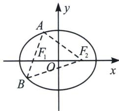

## 二、椭圆焦点弦

若过焦点的直线与椭圆相交于两点 A 和 B， $\angle AF_{1}F_{2}$ 为 $\alpha$ ，则称线段 $|AB|$ 为焦点弦.

①如图， $\left|AF_{1}\right|=\frac{b^{2}}{a-c\cos\alpha}$ ; $\left|BF_{1}\right|=\frac{b^{2}}{a+c\cos\alpha}$ ;

当焦点弦过左焦点时，焦点弦的长度 $|AB| = \frac{2ab^2}{a^2 - c^2\cos^2\alpha} = \frac{2ab^2}{b^2 + c^2\sin^2\alpha}$

当焦点弦过右焦点时，有 $|AB| = \frac{2ab^2}{a^2 - c^2\cos^2\alpha} = \frac{2ab^2}{b^2 + c^2\sin^2\alpha}$

②过椭圆焦点的所有弦中通径通过焦点且与长轴垂直的焦点弦最短，通径为 $2ep = \frac{2b^2}{a}$ ( $p$ 为焦准距).

③4a 体：过椭圆 $\frac{x^{2}}{a^{2}} + \frac{y^{2}}{b^{2}} = 1 (a > b > 0)$ 的左焦点 $F_{1}$ 的弦 AB 与右焦点 $F_{2}$ 围成的三角形 $\triangle ABF_{2}$ 的周长是 4a；

证明：
(1)如图所示， $\left|AF_{1}\right|+\left|AF_{2}\right|=2a;\left|BF_{1}\right|+\left|BF_{2}\right|=2a$ ，故 $\left|AB\right|+\left|AF_{2}\right|+\left|BF_{2}\right|=4a$ ；

(2)设 $\left|AF_{1}\right|=m;\left|BF_{1}\right|=n;\left|AF_{2}\right|=2a-m;\left|BF_{2}\right|=2a-n$ ；由余弦定理得

$m^2 + (2c)^2 - (2a - m)^2 = 2m \cdot (2c)\cos \alpha$ ；整理得 $|AF_1| = \frac{b^2}{a - c\cos \alpha}$

同理： $n^2 +(2c)^2 -(2a - n)^2 = 2n\cdot (2c)\cos (180^\circ -\alpha)$ ；整理得 $\left|BF_1\right| = \frac{b^2}{a + c\cos\alpha}$

两式相加得，则过焦点的弦长： $|AB|=m+n=\frac{2ab^{2}}{a^{2}-c^{2}\cos^{2}\alpha}=\frac{2ab^{2}}{b^{2}+c^{2}\sin^{2}\alpha}$

![[高中/总复习/专题/2026版高中《mst老唐说题》圆锥曲线专题（数学）/上册/第01章_圆锥曲线四定义/第一节_椭圆双曲的轨迹翻译_第一定义/二_椭圆焦点弦/例题/Q00048306.md]]
![[高中/总复习/专题/2026版高中《mst老唐说题》圆锥曲线专题（数学）/上册/第01章_圆锥曲线四定义/第一节_椭圆双曲的轨迹翻译_第一定义/二_椭圆焦点弦/例题/Q00048307.md]]
![[高中/总复习/专题/2026版高中《mst老唐说题》圆锥曲线专题（数学）/上册/第01章_圆锥曲线四定义/第一节_椭圆双曲的轨迹翻译_第一定义/二_椭圆焦点弦/例题/Q00048308.md]]
![[高中/总复习/专题/2026版高中《mst老唐说题》圆锥曲线专题（数学）/上册/第01章_圆锥曲线四定义/第一节_椭圆双曲的轨迹翻译_第一定义/二_椭圆焦点弦/例题/Q00048946.md]]
![[高中/总复习/专题/2026版高中《mst老唐说题》圆锥曲线专题（数学）/上册/第01章_圆锥曲线四定义/第一节_椭圆双曲的轨迹翻译_第一定义/二_椭圆焦点弦/例题/Q00048947.md]]
![[高中/总复习/专题/2026版高中《mst老唐说题》圆锥曲线专题（数学）/上册/第01章_圆锥曲线四定义/第一节_椭圆双曲的轨迹翻译_第一定义/二_椭圆焦点弦/例题/Q00048310.md]]
![[高中/总复习/专题/2026版高中《mst老唐说题》圆锥曲线专题（数学）/上册/第01章_圆锥曲线四定义/第一节_椭圆双曲的轨迹翻译_第一定义/二_椭圆焦点弦/例题/Q00048311.md]]
![[高中/总复习/专题/2026版高中《mst老唐说题》圆锥曲线专题（数学）/上册/第01章_圆锥曲线四定义/第一节_椭圆双曲的轨迹翻译_第一定义/二_椭圆焦点弦/例题/Q00048312.md]]
