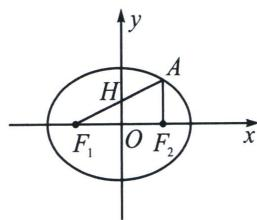

<!-- question-source:start -->
例7 (2024·九江三模)已知椭圆 $C: \frac{x^{2}}{a^{2}} + \frac{y^{2}}{b^{2}} = 1 (a > b > 0)$ 的左右焦点分别为 $F_{1}, F_{2}$ , 过 $F_{1}$ 且倾斜角为 $\frac{\pi}{6}$ 的直线交 $C$ 于第一象限内一点 $A$ . 若线段 $AF_{1}$ 的中点在 $y$ 轴上, $\triangle AF_{1}F_{2}$ 的面积为 $2\sqrt{3}$ , 则 $C$ 的方程为 ( )
A. $\frac{x^{2}}{3} + y^{2} = 1$ B. $\frac{x^{2}}{3} + \frac{y^{2}}{2} = 1$ C. $\frac{x^{2}}{9} + \frac{y^{2}}{3} = 1$ D. $\frac{x^{2}}{9} + \frac{y^{2}}{6} = 1$

## 高中数学 新思路 圆锥曲线专题
<!-- question-source:end -->

![[高中/总复习/专题/2026版高中《mst老唐说题》圆锥曲线专题（数学）/上册/第01章_圆锥曲线四定义/第一节_椭圆双曲的轨迹翻译_第一定义/二_椭圆焦点弦/例题/answers/Q00048306A1.md]]
