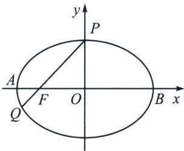

<!-- question-source:start -->
例9 (2024·河南信阳模拟)已知椭圆 $C: \frac{x^2}{a^2} + \frac{y^2}{b^2} = 1 (a > b > 0)$ 的上顶点为 $P$ ，左焦点为 $F$ ，直线 $PF$ 与 $C$ 的另一个交点为 $Q$ ，若 $|PF| = 3|QF|$ ，则 $C$ 的离心率 $e =$ （ ） A. $\frac{1}{3}$ B. $\frac{\sqrt{3}}{3}$ C. $\frac{1}{2}$ D. $\frac{\sqrt{2}}{2}$

<!-- question-source:end -->

![[高中/总复习/专题/2026版高中《mst老唐说题》圆锥曲线专题（数学）/上册/第01章_圆锥曲线四定义/第一节_椭圆双曲的轨迹翻译_第一定义/二_椭圆焦点弦/例题/answers/Q00048308A1.md]]
