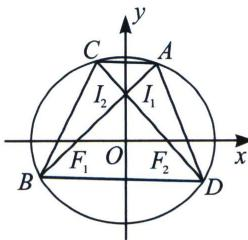

<!-- question-source:start -->
例12（2022·多选·枣庄模拟）已知椭圆 $E: \frac{x^2}{4} + \frac{y^2}{3} = 1$ ，过椭圆 $E$ 的左焦点 $F_1$ 的直线 $l_1$ 交 $E$ 于 $A, B$ 两点（点 $A$ 在 $x$ 轴的上方），过椭圆 $E$ 的右焦点 $F_2$ 的直线 $l_2$ 交 $E$ 于 $C, D$ 两点，则 （）

A. 若 $\overrightarrow{AF_1} = 2\overrightarrow{F_1B}$ , 则 $l_{1}$ 的斜率 $k = \frac{\sqrt{6}}{2}$ B. $|AF_1| + 4|BF_1|$ 的最小值为 $\frac{27}{4}$ C. 以 $AF_{1}$ 为直径的圆与圆 $x^{2} + y^{2} = 4$ 相切 D. 若 $l_{1} \perp l_{2}$ , 则四边形 $ADBC$ 面积的最小值为 $\frac{288}{49}$
<!-- question-source:end -->

![[高中/总复习/专题/2026版高中《mst老唐说题》圆锥曲线专题（数学）/上册/第01章_圆锥曲线四定义/第一节_椭圆双曲的轨迹翻译_第一定义/二_椭圆焦点弦/例题/answers/Q00048310A1.md]]
