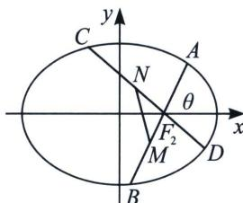

<!-- question-source:start -->
例13（2022·威海二模）已知 $P(\sqrt{2}, \sqrt{3})$ 是椭圆 $C: \frac{x^2}{a^2} + \frac{y^2}{b^2} = 1 (a > b > 0)$ 上一点，以点 $P$ 及椭圆的左、右焦点 $F_1$ 、 $F_2$ 为顶点的三角形面积为 $2\sqrt{3}$ .

(1)求椭圆 C 的标准方程;

(2) 过 $F_{2}$ 作斜率存在且互相垂直的直线 $l_{1} 、 l_{2}$ , $M$ 是 $l_{1}$ 与 $C$ 两交点的中点, $N$ 是 $l_{2}$ 与 $C$ 两交点的中点, 求 $\triangle MNF_{2}$ 面积的最大值.

<!-- question-source:end -->

![[高中/总复习/专题/2026版高中《mst老唐说题》圆锥曲线专题（数学）/上册/第01章_圆锥曲线四定义/第一节_椭圆双曲的轨迹翻译_第一定义/二_椭圆焦点弦/例题/answers/Q00048311A1.md]]
