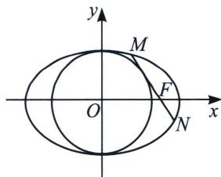

<!-- question-source:start -->
例14 (2021·新高考Ⅱ)已知椭圆 C 的方程为 $\frac{x^{2}}{a^{2}} + \frac{y^{2}}{b^{2}} = 1 (a > b > 0)$ ，右焦点为 $F(\sqrt{2}, 0)$ ，且离心率为 $\frac{\sqrt{6}}{3}$ .

(1)求椭圆 C 的方程;

(2)设 M, N 是椭圆 C 上的两点，直线 MN 与曲线 $x^{2} + y^{2} = b^{2} (x > 0)$ 相切．证明：M, N, F 三点共线的充要条件是 $\left|MN\right| = \sqrt{3}$ .

(1)解: 由题意可得, 椭圆的离心率 $\frac{c}{a} = \frac{\sqrt{6}}{3}$ , 又 $c = \sqrt{2}$ , 所以 $a = \sqrt{3}$ , 则 $b^{2} = a^{2} - c^{2} = 1$ ,

故椭圆的标准方程为 $\frac{x^{2}}{3}+y^{2}=1$ ;

(2)证明: 先证明充分性, 当 $|MN| = \sqrt{3}$ 时, 设直线 $MN$ 的方程为 $x = ty + s$ , 此时圆心 $O(0, 0)$ 到直线 $MN$ 的距离 $d = \frac{|s|}{\sqrt{t^2 + 1}} = 1$ , 则 $s^2 - t^2 = 1$ , 联立方程组 $\left\{ \begin{array}{l} x = ty + s \\ \frac{x^2}{3} + y^2 = 1 \end{array} \right.$ , 可得 $(t^2 + 3)y^2 + 2tsy + s^2 - 3 = 0$ ,

则 $\Delta = 4t^{2}s^{2} - 4(t^{2} + 3)(s^{2} - 3) = 12(t^{2} - s^{2} + 3) = 24$ ，因为 $|MN| = \sqrt{1 + t^2} \cdot \frac{\sqrt{24}}{t^2 + 3} = \sqrt{3}$ ，所以 $t^{2} = 1$ ， $s^{2} = 2$ ，因为直线 $MN$ 与曲线 $x^{2} + y^{2} = b^{2}(x > 0)$ 相切，所以 $s > 0$ ，则 $s = \sqrt{2}$ ，则直线 $MN$ 的方程为 $x = ty + \sqrt{2}$ 恒过焦点 $F(\sqrt{2}, 0)$ ，故 $M, N, F$ 三点共线，所以充分性得证.

若 M, N, F 三点共线时，设 $\left|MF\right|=m;$ $\left|NF\right|=n;$ $\left|MF_{1}\right|=2a-m;$ $\left|NF_{1}\right|=2a-n;$ $\angle MFO=\alpha,$

由余弦定理得 $m^2 + (2c)^2 - (2a - m)^2 = 2m \cdot (2c)\cos \alpha$ ；整理得 $|MF| = \frac{b^2}{a - c\cos \alpha}$

同理： $n^2 +(2c)^2 -(2a - n)^2 = 2n\cdot (2c)\cos (180^\circ -\alpha)$ ；整理得 $\mid NF\mid = \frac{b^2}{a + c\cos\alpha}$

两式相加得，则过焦点的弦长： $|MN| = m + n = \frac{2ab^2}{a^2 - c^2\cos^2\alpha} = \frac{2\sqrt{3}}{3 - 2\cos^2\alpha}$

则圆心 $O(0, 0)$ 到直线 $MN$ 的距离为 $d = c\sin \alpha = 1$ ，解得 $\sin \alpha = \frac{\sqrt{2}}{2}$ ，所以 $|MN| = \frac{2\sqrt{3}}{3 - 1} = \sqrt{3}$ ；

所以必要性成立；综上所述，M，N，F三点共线的充要条件是 $|MN|=\sqrt{3}$ .

<!-- question-source:end -->

![[高中/总复习/专题/2026版高中《mst老唐说题》圆锥曲线专题（数学）/上册/第01章_圆锥曲线四定义/第一节_椭圆双曲的轨迹翻译_第一定义/二_椭圆焦点弦/例题/answers/Q00048312A1.md]]
