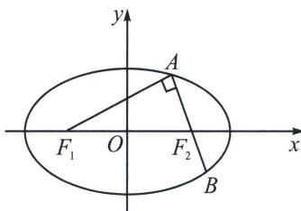

<!-- question-source:start -->
例⑪（2024·浙江一模）已知 $F_{1}$ ， $F_{2}$ 分别为椭圆 $C: \frac{x^{2}}{a^{2}} + \frac{y^{2}}{b^{2}} = 1 (a > b > 0)$ 的左右焦点，过 $F_{2}$ 的一条直线与 $C$ 交于 $A, B$ 两点，且 $AF_{1} \perp AB, |BF_{2}| = 1$ ，则椭圆长轴长的最小值是 ( )
A. $4 \sqrt{2}$ B. $3 + 2 \sqrt{2}$ C. 6
D. $4 + 2 \sqrt{2}$

<!-- question-source:end -->

![[高中/总复习/专题/2026版高中《mst老唐说题》圆锥曲线专题（数学）/上册/第01章_圆锥曲线四定义/第一节_椭圆双曲的轨迹翻译_第一定义/二_椭圆焦点弦/例题/answers/Q00048947A1.md]]
