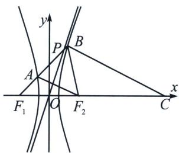

<!-- question-source:start -->
例24（2024·永州三模）已知 $F_{1}$ , $F_{2}$ 分别是双曲线 $\frac{x^{2}}{a^{2}} - \frac{y^{2}}{b^{2}} = 1 (a > 0, b > 0)$ 的左、右焦点，点 $O$ 为坐标原点，过 $F_{1}$ 的直线分别交双曲线左、右两支于 $A$ , $B$ 两点，点 $C$ 在 $x$ 轴上， $\overrightarrow{CB} = 3 \overrightarrow{F_{2} A}$ , $BF_{2}$ 平分 $\angle F_{1} B C$ ，其中一条渐近线与线段 $A B$ 交于点 $P$ ，则 $\sin \angle P O F_{2} =$ ( )

A. $\frac{\sqrt{41}}{7}$ B. $\frac{\sqrt{42}}{7}$ C. $\frac{\sqrt{43}}{7}$ D. $\frac{2 \sqrt{11}}{7}$

<!-- question-source:end -->

![[高中/总复习/专题/2026版高中《mst老唐说题》圆锥曲线专题（数学）/上册/第01章_圆锥曲线四定义/第一节_椭圆双曲的轨迹翻译_第一定义/四_双曲线焦长公式/例题/answers/Q00048328A1.md]]
