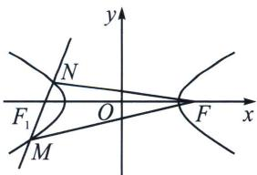

> [!faq]- 《圆锥曲线专题(上册)》例题解析
>
> > [!success]- **【答案】** D
>
> > [!note]- **【分析】**
> > 本题未单列分析。
>
> > [!note]- **【解析】**
> > 解析 连接 $MF, NF$ ，由题意可得 $a = 2, b = 1, c = \sqrt{5}$ ，则 $|MF_1| = \frac{b^2}{a - c\cos\theta}, |NF_1| = \frac{b^2}{a + c\cos\theta}$
> > 
> > $\overrightarrow{MF_1} = 3\overrightarrow{F_1N}$ ，则 $\frac{b^2}{a - c\cos\theta} = \frac{3b^2}{a + c\cos\theta}$ ，所以 $e\cos \theta = \frac{\sqrt{5}}{2}\cos \theta = \frac{1}{2}$ ，故 $|\cos \theta | = \frac{\sqrt{5}}{5}$
> >
> > 故选 **D**.
