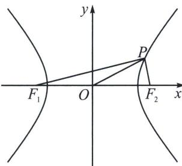

> [!faq]- 《圆锥曲线专题(上册)》例题解析
>
> > [!success]- **【答案】** AC
>
> > [!note]- **【解析】**
> > 解析 对于 A, $a^{2}=3$ , $b^{2}=1$ , $c^{2}=4$ ，所以 $F_{1}(-2,0)$ , $F_{2}(2,0)$ ，由 $|OP|=2$ 得 $|OP|=\frac{1}{2}$ $|F_{1}F_{2}|$ ， $\angle F_{1}PF_{2}=90^{\circ}$ ，所以 $\triangle PF_{1}F_{2}$ 为直角三角形，故 A 正确；
> >
> > 对于 B，构造通径直角三角形，当 $P\left(2, \frac{\sqrt{3}}{3}\right)$ 时，满足 $\frac{4}{3} - \frac{1}{3} = 1$ ， $|OP| = \sqrt{4 + \frac{1}{3}} = \frac{\sqrt{39}}{3} > 2$ ， $\left|PF_{2}\right|=\frac{\sqrt{3}}{3}$ ，所以 $\left|PF_{2}\right|^{2}+\left|OF_{2}\right|^{2}=\left|OP\right|^{2}$ ，即 $\angle PF_{2}F_{1}=90^{\circ}$ ，所以 $\triangle PF_{1}F_{2}$ 为直角三角形，故B错误；
> >
> > 
> >
> > 对于C，不妨设点 $P$ 在双曲线右支上时，则 $\left|PF_{2}\right| < \left|PF_{1}\right|$ ，只能是 $\left|PF_{2}\right| = \left|F_{1}F_{2}\right| = 4$ ，或 $\left|PF_{1}\right| = \left|F_{1}F_{2}\right| = 4$ ，当 $\left|PF_{2}\right| = \left|F_{1}F_{2}\right| = 4$ 时，可得 $\left|PF_{1}\right| = 2\sqrt{3} + \left|PF_{2}\right| = 2\sqrt{3} + 4$ ，利用中线定理 $\frac{\left|PF_{1}\right|^{2} + \left|PF_{2}\right|^{2}}{2} = |OP|^2 + |OF_2|^2$ ，解得 $|OP| = \sqrt{18 + 8\sqrt{3}}$ ，当 $\left|PF_{1}\right| = \left|F_{1}F_{2}\right| = 4$ ，可得 $\left|PF_{2}\right| = 4 - 2\sqrt{3}$ ，利用中线定理 $\frac{\left|PF_{1}\right|^{2} + \left|PF_{2}\right|^{2}}{2} = |OP|^2 + \left|OF_{2}\right|^2$ ，解得 $|OP| = \sqrt{18 - 8\sqrt{3}}$ ，综上△ $PF_{1}F_{2}$ 为等腰三角形时， $|OP| = \sqrt{18 - 8\sqrt{3}}$ 或 $\sqrt{18 + 8\sqrt{3}}$ ，故C正确；
> >
> > 对于 D，设 $\triangle PF_{1}F_{2}$ 外接圆半径为 R，由正弦定理得 $\frac{|F_{1}F_{2}|}{\sin\angle F_{1}PF_{2}}=2R=\frac{8\sqrt{3}}{3}$ ，所以 $\sin\angle F_{1}PF_{2}=\frac{\sqrt{3}}{2}$ ，则 $\angle F_{1}PF_{2}=60^{\circ}$ 或 $\angle F_{1}PF_{2}=120^{\circ}$ ，当 $\angle F_{1}PF_{2}=60^{\circ}$ ，则 $S_{\triangle PF_{1}F_{2}}=\frac{b^{2}}{\tan30^{\circ}}=c|y_{P}|\Rightarrow|y_{P}|=\frac{\sqrt{3}}{2}$ （双曲线焦点三角形面积公式 $S=\frac{b^{2}}{\tan\frac{\angle F_{1}PF_{2}}{2}}$ ），所以 $x_{P}^{2}=\frac{21}{4}$ ， $|OP|=\sqrt{6}$ ，当 $\angle F_{1}PF_{2}=120^{\circ}$ ，则 $S_{\triangle PF_{1}F_{2}}=\frac{b^{2}}{\tan60^{\circ}}=c$ $|y_{P}|\Rightarrow|y_{P}|=\frac{\sqrt{3}}{6}$ ，所以 $x_{P}^{2}=\frac{13}{4}$ ， $|OP|=\frac{\sqrt{30}}{3}$ ，所以 $|OP|=\frac{\sqrt{30}}{3}$ ，故D错误。
> >
> > 故选 **AC**.
