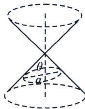

## 一、截口曲线形成的圆锥曲线

圆锥曲线就可以看作圆锥被一个平面所截得到的截口曲线.

如图，设圆锥的轴截面顶角为 $2\theta$ ，圆锥的轴与截面所成的角为 $\alpha$ ，其中 $\alpha, \theta \in \left(0, \frac{\pi}{2}\right)$ .

当 $\alpha > \theta$ 时，截口曲线为椭圆，平面两侧的圆锥内切球与平面的切点为两焦点。；当 $\alpha = \theta$ 时，截口曲线为抛物线，平面一侧的圆锥内切球与平面的切点为焦点；当 $\alpha < \theta$ 时，截口曲线为双曲线，平面两侧的圆锥内切球与平面的切点为两焦点.

![[高中/总复习/专题/2026版高中《mst老唐说题》圆锥曲线专题（数学）/上册/第01章_圆锥曲线四定义/第七节_截口曲线与祖暅原理/一_截口曲线形成的圆锥曲线/例题/Q00048383.md]]
![[高中/总复习/专题/2026版高中《mst老唐说题》圆锥曲线专题（数学）/上册/第01章_圆锥曲线四定义/第七节_截口曲线与祖暅原理/一_截口曲线形成的圆锥曲线/例题/Q00048384.md]]
![[高中/总复习/专题/2026版高中《mst老唐说题》圆锥曲线专题（数学）/上册/第01章_圆锥曲线四定义/第七节_截口曲线与祖暅原理/一_截口曲线形成的圆锥曲线/例题/Q00048385.md]]
![[高中/总复习/专题/2026版高中《mst老唐说题》圆锥曲线专题（数学）/上册/第01章_圆锥曲线四定义/第七节_截口曲线与祖暅原理/一_截口曲线形成的圆锥曲线/例题/Q00048386.md]]
![[高中/总复习/专题/2026版高中《mst老唐说题》圆锥曲线专题（数学）/上册/第01章_圆锥曲线四定义/第七节_截口曲线与祖暅原理/一_截口曲线形成的圆锥曲线/例题/Q00048387.md]]
![[高中/总复习/专题/2026版高中《mst老唐说题》圆锥曲线专题（数学）/上册/第01章_圆锥曲线四定义/第七节_截口曲线与祖暅原理/一_截口曲线形成的圆锥曲线/例题/Q00048388.md]]
