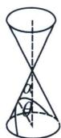
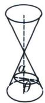
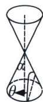
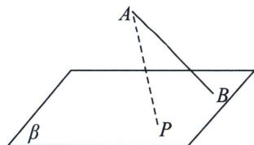

<!-- question-source:start -->
例1 (2023·多选·广东期末)用一个垂直于圆锥的轴的平面去截圆锥, 截口曲线(截而与圆锥侧面的交线)是一个圆, 用一个不垂直于轴的平面截圆锥, 当截面与圆锥的轴的夹角 $\theta$ 不同时, 可以得到不同的截口曲线, 它们分别是椭圆、抛物线、双曲线. 因此, 我们将圆、椭圆、抛物线、双曲线统称为圆锥曲线. 记圆锥轴截面半顶角为 $\alpha$ , 截口曲线形状与 $\theta$ , $\alpha$ 有如下关系: 当 $\theta > \alpha$ 时, 截口曲线为椭圆; 当 $\theta = \alpha$ 时, 截口曲线为抛物线: 当 $\theta < \alpha$ 时, 截口曲线为双曲线. 其中 $\theta$ , $\alpha \in \left(0, \frac{\pi}{2}\right)$ , 现有一定线段 $AB$ , 其与平面 $\beta$ 所成角 $\varphi$ (如图), $B$ 为斜足, $\beta$ 上一动点 $P$ 满足 $\angle BAP = \gamma$ , 设 $P$ 点在 $\beta$ 的运动轨迹是 $\Gamma$ , 则 ( )

  
图1

  
图2

A. 当 $\varphi = \frac{\pi}{4}, \gamma = \frac{\pi}{6}$ 时, $\Gamma$ 是椭圆 B. 当 $\varphi = \frac{\pi}{3}, \gamma = \frac{\pi}{6}$ 时, $\Gamma$ 是双曲线 C. 当 $\varphi = \frac{\pi}{4}, \gamma = \frac{\pi}{4}$ 时, $\Gamma$ 是抛物线 D. 当 $\varphi = \frac{\pi}{3}, \gamma = \frac{\pi}{4}$ 时, $\Gamma$ 是圆
<!-- question-source:end -->

![[高中/总复习/专题/2026版高中《mst老唐说题》圆锥曲线专题（数学）/上册/第01章_圆锥曲线四定义/第七节_截口曲线与祖暅原理/一_截口曲线形成的圆锥曲线/例题/answers/Q00048383A1.md]]
