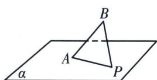
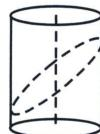

<!-- question-source:start -->
例2 如图 AB 是平面 $\alpha$ 的斜线段，A 为斜足，若点 P 在平面 $\alpha$ 内运动，使得 $\triangle ABP$ 的面积为定值，则动点 P 的轨迹是
( ). A. 圆 B. 椭圆 C. 一条直线 D. 两条平行直线

<!-- question-source:end -->

![[高中/总复习/专题/2026版高中《mst老唐说题》圆锥曲线专题（数学）/上册/第01章_圆锥曲线四定义/第七节_截口曲线与祖暅原理/一_截口曲线形成的圆锥曲线/例题/answers/Q00048384A1.md]]
