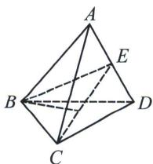

> [!faq]- 《圆锥曲线专题(上册)》例题解析
>
> > [!success]- **【答案】** B
>
> > [!note]- **【解析】**
> > 解析 如图，根据正四面体性质，取 $AD$ 中点 $E$ ，连接 $BE, CE.$ 因为正四面体ABCD，所以 $AD \perp BC$ ，所以 $AD \perp$ 平面 $BCE$ ，又 $BP \perp AD$ ，所以点 $P$ 在平面 $BCE$ 内，
> >
> > 
> >
> > 因为 $\triangle PAD$ 的面积为定值, 可得点 $P$ 到直线 $AD$ 的距离为定值, 故点 $P$ 在以 $AD$ 为轴的圆柱面上, 由于平面 $BCE$ 与圆柱的轴垂直, 故点 $P$ 的轨迹为圆.
> >
> > 故选 **B**.
