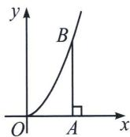
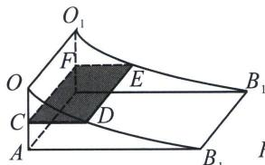
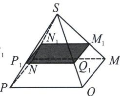
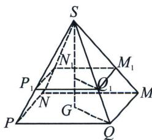

<!-- question-source:start -->
例15（2024·浑南区期中）如图
(1)所示，已知点 $B$ 在抛物线 $y = x^{2}$ 上，过 $B$ 作 $BA \perp x$ 轴于点 $A$ ，且 $OA = a$ 。将曲边三角形 $OAB$ 如图
(2)所示放置，并将曲边三角形 $OAB$ 沿平面 $OAB$ 的垂线方向平移一个单位长度（即 $AA_{1} = 1$ ），得到相应的几何体 $OAB - O_{1}A_{1}B_{1}$ 。取一个底面面积为 $a^{2}$ 高为 $a$ 的正四棱锥 $S - MNPQ$ 放在平面 $ABB_{1}A_{1}$ 上如图
(3)所示，这时，平面 $OO_{1}S //$ 平面 $ABB_{1}A_{1}$ ，现用平行于平面 $ABB_{1}A_{1}$ 的任意一个平面去截这两个几何体，截面分别为矩形 $CDEF$ ，四边形 $M_{1}N$ ， $P_{1}Q_{1}$ ，截面与平面 $OO_{1}S$ 的距离为 $x_{0} (0 < x_{0} < a)$ ），试用祖暅原理，曲边三角形 $OAB$ 的面积为 （）

  
图
（1）

  
图
(3)

A. $\frac{1}{3} a^3$ B. $\frac{1}{3} a^2$ C. $a^3$ D. $a^2$

(2)中, 当 $OC = x_{0}$ 时, $CD = x_{0}^{2}$ , 而 $CF = AA_{1} = 1$ , 则矩形 $CDEF$ 的面积 $S_{CDEF} = CD \cdot CF = x_{0}^{2}$ , 在正四棱锥 $S - MNPQ$ 中, 截面四边形 $M_{1}N_{1}P_{1}Q_{1}$ 为正方形, 其中心为 $G_{1}$ ,

令正方形 MNPQ 的中心为 G，则点 S， $G_{1}$ ，G 共线，连接 $G_{1}Q_{1}$ ，GQ， $SG_{1}=x_{0}$ ，SG=a，如图，平面 $M_{1}N_{1}P_{1}Q_{1}$ // 平面 MNPQ，平面 $M_{1}N_{1}P_{1}Q_{1} \cap$ 平面 SGQ = G₁Q₁，平面 MNPQ ∩ 平面 SGQ = GQ，
因此 $G_{1}Q_{1} \parallel GQ$ ，有 $\frac{Q_{1}M_{1}}{QM}=\frac{SQ_{1}}{SQ}=\frac{SG_{1}}{SG}=\frac{x_{0}}{a}$ ，于是 $\frac{S_{M_{1}N_{1}P_{1}Q_{1}}}{S_{MNPQ}}=\frac{Q_{1}M_{1}^{2}}{QM^{2}}=\frac{x_{0}^{2}}{a^{2}}$

而 $S_{MNPQ}=a^{2}$ ，则 $S_{M_{1}N_{1}P_{1}Q_{1}}=x_{0}^{2}=S_{CDEF}$ ，由祖暅原理知 $V_{OAB-O_{1}A_{1}B_{1}}=V_{S-MNPQ}=\frac{1}{3}a^{2}\cdot a=\frac{1}{3}a^{3}$

而几何体 $OAB-O_{1}A_{1}B_{1}$ 可视为以曲边三角形 OAB 为底面，高为 $AA_{1}$ 的柱体，其体积 $V_{OAB-O_{1}A_{1}B_{1}}=S_{OAB}\cdot AA_{1}=S_{OAB}$ ，所以曲边三角形 OAB 的面积 $S_{OAB}=\frac{a^{3}}{3}$ 。故选 A.
<!-- question-source:end -->

![[高中/总复习/专题/2026版高中《mst老唐说题》圆锥曲线专题（数学）/上册/第01章_圆锥曲线四定义/第七节_截口曲线与祖暅原理/三_祖暅原理/例题/answers/Q00048396A1.md]]
