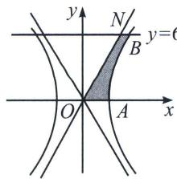

<!-- question-source:start -->
例14 (2024·海淀区三模)我国南北朝时期的数学家祖暅提出体积的计算原理(祖暅原理): “幂势既同, 则积不容异.”“势“即是几何体的高, “幂”是截面积, 意思是: 如果两等高的几何体在同高处的截面积相等, 那么这两个几何体的体积相等. 已知双曲线 $C$ 的焦点在 $x$ 轴上, 离心率为 $\sqrt{5}$ , 且过点 $(2, 2\sqrt{3})$ , 则双曲线的渐近线方程为 \_\_\_\_. 若直线 $y=0$ 与 $y=6$ 在第一象限内与双曲线及其渐近线围成如图阴影部分所示的图形, 则该图形绕 $y$ 轴旋转一周所得几何体的体积为 \_\_\_\_.

图（2）  

<!-- question-source:end -->

![[高中/总复习/专题/2026版高中《mst老唐说题》圆锥曲线专题（数学）/上册/第01章_圆锥曲线四定义/第七节_截口曲线与祖暅原理/三_祖暅原理/例题/answers/Q00052975A1.md]]
