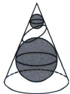
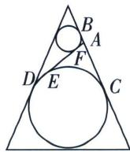
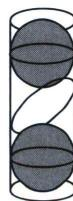
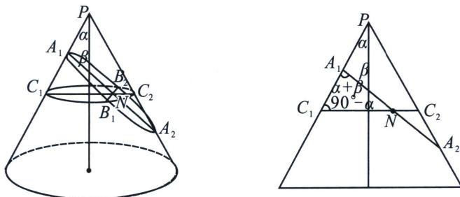

## 二、丹德林双球模型与离心率

丹德林(G·Dandelin)利用双球模型证明了平面 $\alpha$ 与圆锥侧面的交线为椭圆，双球与平面 $\alpha$ 切点 $E$ ， $F$ 为此椭圆的两个焦点，这两个球也称为Dandelin双球.

## 1. 基本数据与离心率转化

如图
(1)，在圆锥内放两个大小不同且不相切的球，使得它们分别与圆锥的侧面、底面相切，用与两球都相切的平面截圆锥的侧面得到截口曲线是椭圆．理由如下：如图
(2)，若两个球分别与截面相切于点 E，F，在得到的截口曲线上任取一点 A，过点 A 作圆锥母线，分别与两球相切于点 C，B，由球与圆的几何性质，得 $\left|AE\right|=\left|AC\right|$ ， $\left|AF\right|=\left|AB\right|$ ，所以 $\left|AE\right|+\left|AF\right|=\left|AC\right|+\left|AB\right|=\left|BC\right|=2a$ ，且 $2a>\left|EF\right|$ ，由椭圆定义知截口曲线是椭圆，切点 E，F 为焦点，具体离心率计算我们参考例题.

这个结论在圆柱中也适用, 如图
(3), 在一个高为 $h$ , 底面半径为 $r$ 的圆柱体内放球, 球与圆柱底面及侧面均相切. 若一个平面与两个球均相切, 则此平面截圆柱所得的截口曲线也为一个椭圆, 则 $2a = h - 2r$ , $b$

  
图
(1)

  
图
(2)

  
图
(3)

## 2. 离心率与截面角之间的关系

在空间中，已知圆锥 O 是由 $l'$ 围绕 l 旋转得到的，我们把 l 称为轴，轴与母线所成角为 $\alpha$ 。用平面 $\pi$ 截圆锥，得到的截口曲线取决于平面与圆锥轴 l 所成的线面角 $\beta$ （显然，当 $\pi$ 与 l 平行时， $\beta=0$ ），具体关系如下：

(1) 若 $\beta > \alpha, 0 < \frac{\cos \beta}{\cos a} < 1$ ，平面 $\pi$ 截圆锥面所得截口曲线为椭圆；

(2) 若 $\beta = \alpha, \frac{\cos \beta}{\cos a} = 1$ ，平面 $\pi$ 截圆锥面所得截口曲线为抛物线：

(3) 若 $\beta < \alpha, \frac{\cos \beta}{\cos \alpha} > 1$ ，平面 $\pi$ 截圆锥面所得截口曲线为双曲线.

这个比值 $\frac{\cos\beta}{\cos\alpha}$ 就是圆锥曲线的离心率，离心率是一个比.

证明：

作图如上, 不妨考虑截面为椭圆的情况, 记椭圆的长轴为 $A_{1} A_{2}$ , 短轴 $B_{1} B_{2}$ , 椭圆中心为 $N$ , 长半轴长为 $a$ , 短半轴长为 $b$ , 作以 $C_{1} C_{2}$ 为直径且垂直于轴的圆截面, 则在截面圆中, 由相交弦定理可得 $b^{2} = N B_{1} \cdot N B_{2} = N C_{1} \cdot N C_{2}$ 作圆锥的轴截面等腰三角形如图:

在 $\triangle A_{1}NC_{1}$ 中，由正弦定理可得 $\frac{A_{1}N}{\sin(90^{\circ}-\alpha)}=\frac{NC_{1}}{\sin(\alpha+\beta)}=\frac{a}{\sin(90^{\circ}-\alpha)}$ ，同理，在 $\triangle A_{2}NC_{2}$ 中，由正弦定理可得 $\frac{A_{2}N}{\sin(90^{\circ}+\alpha)}=\frac{NC_{2}}{\sin(\beta-\alpha)}=\frac{a}{\sin(90^{\circ}+\alpha)}$ ，整理可得 $NC_{1}\cdot NC_{2}=a^{2}\frac{\sin(\beta+\alpha)\sin(\beta-\alpha)}{\cos^{2}\alpha}=b^{2}$ ，所以离心率 $e^{2}=1-\frac{b^{2}}{a^{2}}=1-\frac{\sin(\beta+\alpha)\sin(\beta-\alpha)}{\cos^{2}\alpha}=1-\frac{\sin^{2}\beta-\sin^{2}\alpha}{\cos^{2}\alpha}=\frac{\cos^{2}\beta}{\cos^{2}\alpha}$ ，综上，离心率的表达式为 $e=\frac{\cos\beta}{\cos\alpha}$ .

![[高中/总复习/专题/2026版高中《mst老唐说题》圆锥曲线专题（数学）/上册/第01章_圆锥曲线四定义/第七节_截口曲线与祖暅原理/二_丹德林双球模型与离心率/例题/Q00048389.md]]
![[高中/总复习/专题/2026版高中《mst老唐说题》圆锥曲线专题（数学）/上册/第01章_圆锥曲线四定义/第七节_截口曲线与祖暅原理/二_丹德林双球模型与离心率/例题/Q00048390.md]]
![[高中/总复习/专题/2026版高中《mst老唐说题》圆锥曲线专题（数学）/上册/第01章_圆锥曲线四定义/第七节_截口曲线与祖暅原理/二_丹德林双球模型与离心率/例题/Q00048391.md]]
![[高中/总复习/专题/2026版高中《mst老唐说题》圆锥曲线专题（数学）/上册/第01章_圆锥曲线四定义/第七节_截口曲线与祖暅原理/二_丹德林双球模型与离心率/例题/Q00048952.md]]
![[高中/总复习/专题/2026版高中《mst老唐说题》圆锥曲线专题（数学）/上册/第01章_圆锥曲线四定义/第七节_截口曲线与祖暅原理/二_丹德林双球模型与离心率/例题/Q00048953.md]]
![[高中/总复习/专题/2026版高中《mst老唐说题》圆锥曲线专题（数学）/上册/第01章_圆锥曲线四定义/第七节_截口曲线与祖暅原理/二_丹德林双球模型与离心率/例题/Q00048393.md]]
![[高中/总复习/专题/2026版高中《mst老唐说题》圆锥曲线专题（数学）/上册/第01章_圆锥曲线四定义/第七节_截口曲线与祖暅原理/二_丹德林双球模型与离心率/例题/Q00048394.md]]
