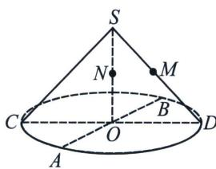

<!-- question-source:start -->
例7 (2024·多选·汕头二模)用一个不垂直于圆锥的轴的平面截圆锥, 当圆锥的轴与截面所成的角不同时, 可以得到不同的截口曲线, 也即圆锥曲线. 探究发现: 当圆锥轴截面的顶角为 $2 \alpha$ 时, 若截面与轴所成的角为 $\beta$ , 则截口曲线的离心率 $e = \frac{\cos \beta}{\cos \alpha}$ . 例如, 当 $\alpha = \beta$ 时, $e = 1$ , 由此知截口曲线是抛物线. 如图, 圆锥 $SO$ 中, $M 、 N$ 分别为 $SD 、 SO$ 的中点, $AB 、 CD$ 为底面的两条直径, 且 $AB \perp CD 、 AB = 4 , SO = 2 .$ 现用平面 $\gamma$ 截该圆锥, 则

A. 若 $MN \subset \gamma$ ，则截口曲线为圆  
B. 若 $\gamma$ 与 $SO$ 所成的角为 $60^{\circ}$ ，则截口曲线为椭圆或椭圆的一部分  
C. 若 $M, A, B \in \gamma$ ，则截口曲线为抛物线的一部分  
D. 若截口曲线是离心率为 $\sqrt{2}$ 的双曲线的一部分，则 $O \notin \gamma$
<!-- question-source:end -->

![[高中/总复习/专题/2026版高中《mst老唐说题》圆锥曲线专题（数学）/上册/第01章_圆锥曲线四定义/第七节_截口曲线与祖暅原理/二_丹德林双球模型与离心率/例题/answers/Q00048389A1.md]]
