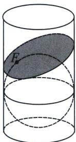
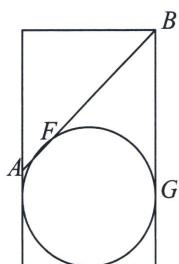

<!-- question-source:start -->
例8 (2023·广东期末)圆锥曲线与空间几何体具有深刻而广泛的联系。如图所示, 底面半径为 1 , 高为 3 的圆柱内放有一个半径为 1 的球, 球与圆柱下底面相切, 作不与圆柱底面平行的平面 $\alpha$ 与球相切于点 $F$ , 若平面 $\alpha$ 与圆柱侧面相交所得曲线为封闭曲线 $\tau$ , $\tau$ 是以 $F$ 为一个焦点的椭圆, 则 $\tau$ 的离心率的取值范围是 ( )

A. $\left[\frac{3}{5}, 1\right)$ B. $(0, \frac{3}{5}]$ C. $(0, \frac{4}{5}]$ D. $\left[\frac{4}{5}, 1\right)$
<!-- question-source:end -->

![[高中/总复习/专题/2026版高中《mst老唐说题》圆锥曲线专题（数学）/上册/第01章_圆锥曲线四定义/第七节_截口曲线与祖暅原理/二_丹德林双球模型与离心率/例题/answers/Q00048390A1.md]]
