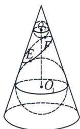
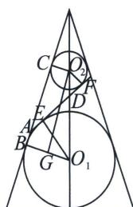

<!-- question-source:start -->
例9 (2023·广州一模)如图是数学家 GerminalDandelin 用来证明一个平面截圆锥得到的截口曲线是椭圆的模型。在圆锥内放两个大小不同的小球，使得它们分别与圆锥的侧面与截面都相切，设图中球 $O_{1}$ ，球 $O_{2}$ 的半径分别为 4 和 2，球心距离 $\left|O_{1}O_{2}\right|=2\sqrt{10}$ ，截面分别与球 $O_{1}$ ，球 $O_{2}$ 相切于点 $E$ ， $F(E, F$ 是截口椭圆的焦点），则此椭圆的离心率等于 \_\_\_\_。

<!-- question-source:end -->

![[高中/总复习/专题/2026版高中《mst老唐说题》圆锥曲线专题（数学）/上册/第01章_圆锥曲线四定义/第七节_截口曲线与祖暅原理/二_丹德林双球模型与离心率/例题/answers/Q00048391A1.md]]
