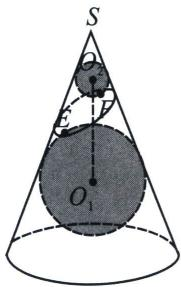
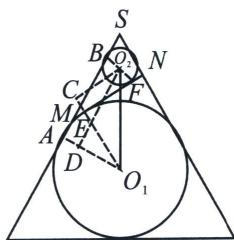

<!-- question-source:start -->
例12 (2024·多选·日照一模)如图是数学家GerminalDandelin用来证明一个平面截圆锥侧面得到的截口曲线是椭圆的模型(称为“Dandelin双球”). 在圆锥内放两个大小不同的小球, 使得它们分别与圆锥的侧面、截面相切, 截面分别与球 $O_{1}$ , 球 $O_{2}$ 切于点 $E$ , $F(E, F$ 是截口椭圆 $C$ 的焦点). 设图中球 $O_{1}$ , 球 $O_{2}$ 的半径分别为 4 和 1 , 球心距 $\left|O_{1}O_{2}\right|=\sqrt{34}$ , 则

A. 椭圆 $C$ 的中心不在直线 $O_{1} O_{2}$ 上

B. $|EF|=4$

C. 直线 $O_{1}O_{2}$ 与椭圆 $C$ 所在平面所成的角的正弦值为 $\frac{5\sqrt{34}}{34}$

D. 椭圆 $C$ 的离心率为 $\frac{3}{5}$
<!-- question-source:end -->

![[高中/总复习/专题/2026版高中《mst老唐说题》圆锥曲线专题（数学）/上册/第01章_圆锥曲线四定义/第七节_截口曲线与祖暅原理/二_丹德林双球模型与离心率/例题/answers/Q00048393A1.md]]
