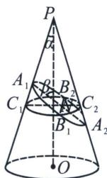
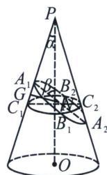

<!-- question-source:start -->
例13（2024·信阳模拟）如图，已知圆锥 $PO$ 的轴 $PO$ 与母线所成的角为 $\alpha$ ，过 $A$ 的平面与圆锥的轴所成的角为 $\beta$ ，该平面截这个圆锥所得的截面为椭圆 $C$ ，椭圆 $C$ 的长轴为 $A_{1}A_{2}$ ，短轴为 $B_{1}B_{2}$ ，长半轴长为 3， $C$ 的中心为 $N$ ，再以 $B_{1}B_{2}$ 为弦且垂直于 $PO$ 的圆截面，记该圆与直线 $PA_{1}$ 交于 $C_{1}$ ，与直线 $PA_{2}$ 交于 $C_{2}$ ，设 $\cos \alpha = 3\cos \beta$ .

(1)求椭圆 C 的焦距;

(2)椭圆 C 左右焦点分别为 $F_{1}$ ， $F_{2}$ ，C 上不同两点 A，B，满足 $\overrightarrow{F_{1}A} = \lambda \overrightarrow{F_{2}B} (\lambda > 0)$ ，设直线 $F_{1}B$ ， $F_{2}A$ 交于点 Q， $S_{\triangle QAB} = 1$ ，求四边形 $ABF_{2}F_{1}$ 的面积.

(1) 过 $N$ 作 $NG \perp PC_{1}$ 于点 $G$ , 因为 $\angle C_{1}A_{1}N = \alpha + \beta, |NA_{1}| = a$ , 所以 $|NG| = a\sin (\alpha + \beta)$ , $b^{2} = |NB_{1}|^{2}$ , 因为 $\angle C_{1}NG = \alpha$ , 所以 $|C_{1}N| = \frac{a\sin (\alpha + \beta)}{\cos \alpha}$ , 同理过 $N$ 向 $PC_{2}$ 作垂线, 可得 $|C_{2}N| = \frac{a\sin (\beta - \alpha)}{\cos \alpha}$ , 所以 $b^{2} = |NB_{1}|^{2} = |NC_{1}| \cdot |NC_{2}| = \frac{a^{2}\sin (\beta + \alpha)\sin (\beta - \alpha)}{\cos^{2}\alpha}$ , 所以 $e^{2} = 1 - \frac{b^{2}}{a^{2}} = 1 - \frac{\sin (\beta + \alpha)\sin (\beta - \alpha)}{\cos^{2}\alpha} = \left(\frac{\cos \beta}{\cos \alpha}\right)^{2} = \frac{1}{9}$ , 所以 $\frac{c}{a} = \frac{1}{3}$ , 所以 $c = 1$ , 故椭圆 $C$ 的焦距 $2c = 2$ ;

(2)因为 $AF_{1}//BF_{2}$ ，所以 $S_{\triangle ABQ}=S_{\triangle F_{1}QF_{2}}=1$ ，所以 $S_{\triangle BF_{1}F_{2}}=\left(1+\frac{1}{\lambda}\right)S_{\triangle F_{1}QF_{2}}=1+\frac{1}{\lambda}$ ，所以 $S_{\triangle BQF_{2}}=1+\frac{1}{\lambda}-1=\frac{1}{\lambda}$ ，所以 $S_{\triangle AQF_{1}}=\lambda^{2}S_{\triangle QBF_{2}}=\lambda$ ，所以 $S_{四边形ABF_{1}F_{2}}=\lambda+\frac{1}{\lambda}+2$ ，延长 $AF_{1}$ 交 C 于 $B_{3}$ 点，则 $\overrightarrow{AF_{1}}=\lambda\overrightarrow{F_{1}B_{3}}$ ，设 $A(x_{1},y_{1})$ ， $B_{3}(x_{2},y_{2})$ ，则 $\begin{cases}-1=\frac{x_{1}+\lambda x_{2}}{1+\lambda}\\0=\frac{y_{1}+\lambda y_{2}}{1+\lambda}\end{cases}$ ， $\begin{cases}x_{1}+\lambda x_{2}=-(1+\lambda)\\y_{1}+\lambda y_{2}=0\end{cases}$ ，因为 $\begin{cases}\frac{x_{1}^{2}}{9}+\frac{y_{1}^{2}}{8}=1 &①\\ \frac{\lambda^{2}x_{2}^{2}}{9}+\frac{\lambda^{2}y_{2}^{2}}{8}=\lambda^{2}\end{cases}$ ②，所以 $\frac{(x_{1}+\lambda x_{2})(x_{1}-\lambda x_{2})}{9}+\frac{(y_{1}+\lambda y_{2})(y_{1}-\lambda y_{2})}{8}=1-\lambda^{2}\frac{(-1-\lambda)(x_{1}-\lambda x_{2})}{9}=1-\lambda^{2}$ ，所以 $\begin{cases}x_{1}=4\lambda-5\\x_{2}=-5+\frac{4}{\lambda}\end{cases}$ ，所以 $S_{\triangle AF_ {1}F_ {2}}=\lambda+1=c|y_{1}|=|y_{1}|$ ，所以 $(\lambda+1)^{2}=y_{1}^{2}=8\left(1-\frac{x_{1}^{2}}{9}\right)=8\left(1-\frac{(4\lambda-5)^{2}}{9}\right)$ ，所以

$137\lambda^{2} - 302\lambda + 137 = 0$ ，即 $\lambda + \frac{1}{\lambda} = \frac{302}{137}$ ，所以 $S_{\text{四边形}ABF_1F_2} = \lambda + \frac{1}{\lambda} + 2 = \frac{302}{137} + 2 = \frac{576}{137}$ ，

故四边形 $ABF_{2}F_{1}$ 的面积为 $\frac{576}{137}$ .
<!-- question-source:end -->

![[高中/总复习/专题/2026版高中《mst老唐说题》圆锥曲线专题（数学）/上册/第01章_圆锥曲线四定义/第七节_截口曲线与祖暅原理/二_丹德林双球模型与离心率/例题/answers/Q00048394A1.md]]
