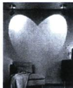
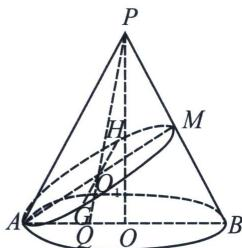
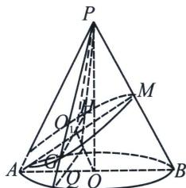
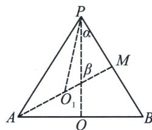

<!-- question-source:start -->
例10（2024·丰台区二模）“用一个不垂直于圆锥的轴的平面截圆锥，当圆锥的轴与截面所成的角不同时，可以得到不同的截口曲线”。利用这个原理，小明在家里用两个射灯（射出的光锥视为圆锥）在墙上投影出两个相同的椭圆（图1），光锥的一条母线恰好与墙面垂直。图2是一个射灯投影的直观图，圆锥 $PO$ 的轴截面 $APB$ 是等边三角形，椭圆 $O_{1}$ 所在平面为 $\alpha$ ， $PB \perp \alpha$ ，则椭圆 $O_{1}$ 的离心率为 （）

A. $\frac{\sqrt{3}}{2}$ B. $\frac{\sqrt{6}}{3}$ C. $\frac{\sqrt{2}}{2}$ D. $\frac{\sqrt{3}}{3}$
<!-- question-source:end -->

![[高中/总复习/专题/2026版高中《mst老唐说题》圆锥曲线专题（数学）/上册/第01章_圆锥曲线四定义/第七节_截口曲线与祖暅原理/二_丹德林双球模型与离心率/例题/answers/Q00048952A1.md]]
