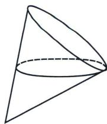
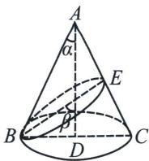
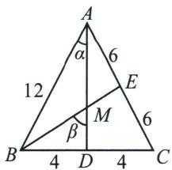

<!-- question-source:start -->
例⑪（2024·杭州二模）机场为旅客提供的圆锥形纸杯如图所示，该纸杯母线长为 $12 \mathrm{~cm}$ 。开口直径为 $8 \mathrm{~cm}$ 。旅客使用纸杯喝水时，当水面与纸杯内壁所形成的椭圆经过母线中点时，椭圆的离心率等于\_\_\_\_。

<!-- question-source:end -->

![[高中/总复习/专题/2026版高中《mst老唐说题》圆锥曲线专题（数学）/上册/第01章_圆锥曲线四定义/第七节_截口曲线与祖暅原理/二_丹德林双球模型与离心率/例题/answers/Q00048953A1.md]]
