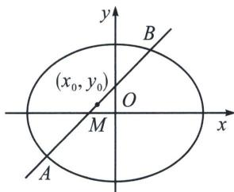

## 一、椭圆第三定义关于“积”

第三定义通常作为性质来考查使用，故我们以介绍性质为主.

已知关于原点对称的两个定点，那么到这两定点连线的斜率之积为定值 $-\frac{b^2}{a^2}$ 或 $e^2 - 1 (0 < e < 1)$ 的点的轨迹是椭圆，通常这两个定点分别为长轴或者短轴顶点.

另一方面，设 $M(x, y)$ 是椭圆上任意一点，两个定点为 $A_{1}(x_{1}, y_{1})$ 、 $A_{2}(-x_{1}, -y_{1})$ ，常数 $e=\frac{c}{a}$ ， $k_{MA_{1}}\cdot k_{MA_{2}}=\frac{y-y_{1}}{x-x_{1}}\cdot\frac{y+y_{1}}{x+x_{1}}=\frac{y^{2}-y_{1}^{2}}{x^{2}-x_{1}^{2}}$ ，根据椭圆方程，将 $\frac{x^{2}}{a^{2}}+\frac{y^{2}}{b^{2}}=1(a>b>0)$ 变形成 $y^{2}=b^{2}-\frac{b^{2}x^{2}}{a^{2}}$ ，所以 $k_{MA_{1}}\cdot k_{MA_{2}}=-\frac{b^{2}}{a^{2}}$ ，椭圆上动点到关于原点对称的两个定点的连线的斜率之积等于常数.

注意 本结论也可以用点差法证明.

若椭圆与直线 l 交于 AB 两点，其中 $A(x_{1}, y_{1})$ ， $B(x_{2}, y_{2})$ ， $M(x_{0}, y_{0})$ 为 AB 中点， $k_{AB} \cdot k_{OM} = -\frac{b^{2}}{a^{2}}$ 证明：设 $A(x_{1}, y_{1})$ ， $B(x_{2}, y_{2})$ ， $M(x_{0}, y_{0})$ ，则

椭圆： $\begin{cases} \frac{x_1^2}{a^2} +\frac{y_1^2}{b^2} = 1① \\ \frac{x_2^2}{a^2} +\frac{y_2^2}{b^2} = 1② \\ \frac{x_1 + x_2}{2} = x_0③① - ②,\\ \frac{y_1 + y_2}{2} = y_0④ \\ k_{AB} = \frac{y_2 - y_1}{x_2 - x_1⑤} \end{cases}$ 并将 $③④⑤$ 代入得： $k_{AB}\cdot k_{OM} = \frac{y_1 - y_2}{x_1 - x_2}\cdot \frac{y_1 + y_2}{x_1 + x_2} = \frac{y_1 - y_2}{x_1 - x_2}\cdot \frac{y_0}{x_0} = -\frac{b^2}{a^2},$

![[高中/总复习/专题/2026版高中《mst老唐说题》圆锥曲线专题（数学）/上册/第01章_圆锥曲线四定义/第三节_椭圆双曲的斜率转化_第三定义/一_椭圆第三定义关于_积_/例题/Q00048345.md]]
![[高中/总复习/专题/2026版高中《mst老唐说题》圆锥曲线专题（数学）/上册/第01章_圆锥曲线四定义/第三节_椭圆双曲的斜率转化_第三定义/一_椭圆第三定义关于_积_/例题/Q00048346.md]]
![[高中/总复习/专题/2026版高中《mst老唐说题》圆锥曲线专题（数学）/上册/第01章_圆锥曲线四定义/第三节_椭圆双曲的斜率转化_第三定义/一_椭圆第三定义关于_积_/例题/Q00048347.md]]
![[高中/总复习/专题/2026版高中《mst老唐说题》圆锥曲线专题（数学）/上册/第01章_圆锥曲线四定义/第三节_椭圆双曲的斜率转化_第三定义/一_椭圆第三定义关于_积_/例题/Q00048348.md]]
