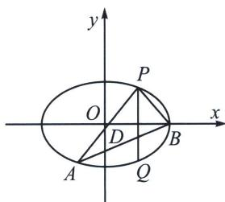

<!-- question-source:start -->
例4 (2022·武汉模拟)已知点 $P$ 在椭圆 $T: \frac{x^{2}}{a^{2}} + \frac{y^{2}}{b^{2}} = 1 (a > b > 0)$ 上, 点 $P$ 在第一象限, 点 $P$ 关于原点 $O$ 的对称点为 $A$ , 点 $P$ 关于 $x$ 轴的对称点为 $Q$ , 设 $\overrightarrow{PD} = \frac{3}{4}\overrightarrow{PQ}$ , 直线 $AD$ 与椭圆 $T$ 的另一个交点为 $B$ , 若 $PA \perp PB$ , 则椭圆 $T$ 的离心率 $e =$ A. $\frac{1}{2}$ B. $\frac{\sqrt{2}}{2}$ C. $\frac{\sqrt{3}}{2}$ D. $\frac{\sqrt{3}}{3}$

<!-- question-source:end -->

![[高中/总复习/专题/2026版高中《mst老唐说题》圆锥曲线专题（数学）/上册/第01章_圆锥曲线四定义/第三节_椭圆双曲的斜率转化_第三定义/一_椭圆第三定义关于_积_/例题/answers/Q00048348A1.md]]
