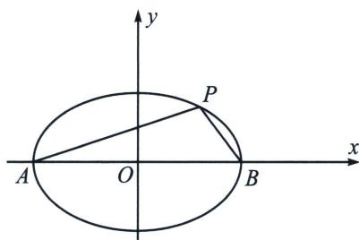

> [!faq]- 《圆锥曲线专题(上册)》例题解析
>
> > [!success]- **【答案】** ACD
>
> > [!note]- **【分析】**
> > 本题未单列分析。
>
> > [!note]- **【解析】**
> > 解析 对A，过左焦点的弦长最小值为通径长， $|MN| = 2\frac{b^2}{a} = 1$ ，故A正确；
> > 对 B，设 $M(x_{1}, y_{1})$ ， $N(x_{2}, y_{2})$ ，M，N 在椭圆上，则 $\frac{x_{1}^{2}}{4} + y_{1}^{2} = 1$ ， $\frac{x_{2}^{2}}{4} + y_{2}^{2} = 1$ ，两式相减得 $\frac{(x_{1} - x_{2})(x_{1} + x_{2})}{4} + (y_{1} - y_{2})(y_{1} + y_{2}) = 0$ ，因为 MN 的中点坐标为 $P\left(1, \frac{1}{2}\right)$ ，所以 $x_{1} + x_{2} = 2$ ， $y_{1} + y_{2} = 1$ ，
> > 所以 $\frac{(y_{1}-y_{2})}{(x_{1}-x_{2})}=-\frac{(x_{1}+x_{2})}{4(y_{1}+y_{2})}=-\frac{2}{4}=-\frac{1}{2}$ ，也可以直接利用第三定义 $k_{MN}k_{OP}=-\frac{b^{2}}{a^{2}}$ 直接判断，故 B 错误；
> > 对 C， $\frac{1}{|MF_{1}|}+\frac{9}{|NF_{1}|}=\frac{1}{4}(|MF_{1}|+|NF_{1}|)\left(\frac{1}{|MF_{1}|}+\frac{9}{|NF_{1}|}\right)\geqslant\frac{1}{4}(\sqrt{1}+\sqrt{9})^{2}=4$ （柯西不等式），当且仅当 $\frac{|NF_{1}|}{|MF_{1}|}=\frac{9|MF_{1}|}{|NF_{1}|}$ ， $|NF_{1}|=3|MF_{1}|=3$ ，故 C 正确；
> > 
> > 对D，根据对称性不妨取点 $P$ 在第一象限， $k_{1} = \tan \angle PAB > 0$ ， $k_{2} = \tan \angle PBA < 0$ ，利用 $\left\{ \begin{array}{l} k_{1}k_{2} = -\frac{1}{4} \\ k_{2} = -\frac{2k_{1}}{1 - k_{1}^{2}} \end{array} \Rightarrow k_{1} = \frac{1}{3}\right.$ ，所以 $\tan \angle PBA = \frac{3}{4}$ ， $\tan \angle PAB = \frac{1}{3}$ ， $\tan \angle APB = -\tan (\angle PAB + \angle PBA) = \frac{\tan \angle PAB + \tan \angle PBA}{\tan \angle PAB \cdot \tan \angle PBA - 1} = \frac{\frac{3}{4} + \frac{1}{3}}{\frac{1}{4} - 1} = -\frac{13}{9}$ ，故D正确，
> >
> > 故选 **ACD**.
