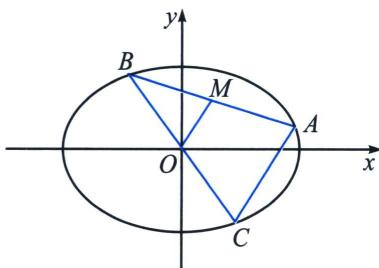
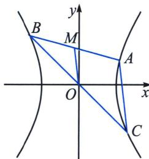

## 三、第三定义与中点弦转化

中点弦问题是斜率乘积为定值，其本质来源于第三定义，如图，设 AB 为椭圆 $\frac{x^{2}}{a^{2}} + \frac{y^{2}}{b^{2}} = 1 (a > b > 0)$ 不平行于坐标轴的弦，M 为 AB 的中点，C 是椭圆上一点，且弦 BC 过椭圆的中心 O，利用中位线得： $k_{OM} \cdot k_{AB} = k_{AB} \cdot k_{AC} = -\frac{b^{2}}{a^{2}}$ .

设 AB 为双曲线 $\frac{x^{2}}{a^{2}} - \frac{y^{2}}{b^{2}} = 1 (a > 0, b > 0)$ 不平行于坐标轴的弦，M 为 AB 的中点，C 是双曲线上一点，且弦 BC 过双曲线的中心 O，利用中位线得： $k_{OM} \cdot k_{AB} = k_{AB} \cdot k_{AC} = \frac{b^{2}}{a^{2}}$ .

若双曲线与直线 l 交于 AB 两点，其中 $A(x_{1}, y_{1})$ ， $B(x_{2}, y_{2})$ ， $M(x_{0}, y_{0})$ 为 AB 中点， $k_{AB} \cdot k_{OM} = \frac{b^{2}}{a^{2}}$ 证明：设 $A(x_{1}, y_{1}), B(x_{2}, y_{2}), M(x_{0}, y_{0})$ ，则 $\left\{\begin{aligned}\frac{x_{1}^{2}}{a^{2}}-\frac{y_{1}^{2}}{b^{2}}&=1①\\ \frac{x_{2}^{2}}{a^{2}}-\frac{y_{2}^{2}}{b^{2}}&=1②\\ \frac{x_{1}+x_{2}}{2}&=x_{0}③①-②, 并将③④⑤代入得：k_{AB} \cdot k_{OM}=\frac{y_{1}-y_{2}}{x_{1}-x_{2}} \cdot \frac{y_{1}+y_{2}}{x_{1}+x_{2}}=\frac{y_{1}-y_{2}}{x_{1}-x_{2}} \cdot \frac{y_{0}}{x_{0}}=\frac{b^{2}}{a^{2}}\\ \frac{y_{1}+y_{2}}{2}&=y_{0}④\\ k_{AB}=\frac{y_{2}-y_{1}}{x_{2}-x_{1}}⑤\end{aligned}\right.$

![[高中/总复习/专题/2026版高中《mst老唐说题》圆锥曲线专题（数学）/上册/第01章_圆锥曲线四定义/第三节_椭圆双曲的斜率转化_第三定义/三_第三定义与中点弦转化/例题/Q00048350.md]]
