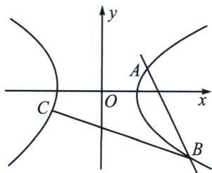
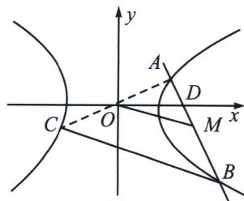

<!-- question-source:start -->
例6 (2024·三台县模拟)如图, 已知斜率为 $-2$ 的直线与双曲线 $\frac{x^{2}}{a^{2}} - \frac{y^{2}}{b^{2}} = 1 (a > 0, b > 0)$ 的右支交于 $A, B$ 两点, 点 $A$ 关于坐标原点 $O$ 对称的点为 $C$ , 且 $\angle ABC = 45^{\circ}$ , 则该双曲线的离心率为 \_\_\_\_.

<!-- question-source:end -->

![[高中/总复习/专题/2026版高中《mst老唐说题》圆锥曲线专题（数学）/上册/第01章_圆锥曲线四定义/第三节_椭圆双曲的斜率转化_第三定义/三_第三定义与中点弦转化/例题/answers/Q00048350A1.md]]
