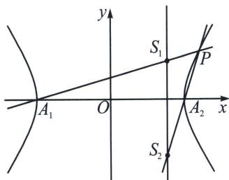

> [!faq]- 《圆锥曲线专题(上册)》例题解析
>
> > [!success]- **【答案】** $\pi$
>
> > [!note]- **【解析】**
> > 解析 利用双曲线第三定义可知 $k_{PA_1} \cdot k_{PA_2} = \frac{b^2}{a^2} = 1$ ，则 $PA_1: y = k(x + \sqrt{5})$ ， $PA_2: y = \frac{1}{k}(x - \sqrt{5})$ ，
> >
> > 
> >
> > 令 $x = 2$ ，则 $y_{S_1} = (2 + \sqrt{5})k$ ， $y_{S_2} = \frac{2 - \sqrt{5}}{k}$ ，所以 $\left|S_1S_2\right| = \left|(2 + \sqrt{5})k - \frac{2 - \sqrt{5}}{k}\right|$
> >
> > 以 $S_{1}$ ， $S_{2}$ 为直径的圆面积 $\frac{\pi|S_1S_2|^2}{4} = \frac{\pi}{4}\left[(9 + 4\sqrt{5})k^2 +\frac{9 - 4\sqrt{5}}{k^2} +2\right]\geqslant \frac{\pi}{4}(2 + 2) = \pi$ ，当且仅当 $k =$ $\pm (\sqrt{5} -2)$ 时等号成立．故答案为 $\pi$
