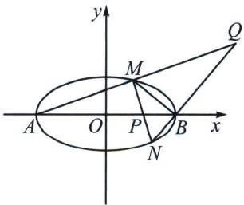

<!-- question-source:start -->
例8 (2024·多选·秦州区开学)已知A，B是椭圆 $E:\frac{x^{2}}{4}+y^{2}=1$ 的左右顶点，过点 $P(1,0)$ 且斜率不为零的直线与E交于M，N两点， $k_{AM}$ ， $k_{BM}$ ， $k_{AN}$ ， $k_{BN}$ 分别表示直线AM，BM，AN，BN的斜率，则下列结论中正确的是() A. $k_{AM} \cdot k_{BM} = -\frac{1}{4}$ B. $k_{BM} \cdot k_{BN} = -\frac{3}{4}$ C. $k_{AM} = 3k_{BN}$ D. 直线AM与BN的交点的轨迹方程是x=4

<!-- question-source:end -->

![[高中/总复习/专题/2026版高中《mst老唐说题》圆锥曲线专题（数学）/上册/第01章_圆锥曲线四定义/第三节_椭圆双曲的斜率转化_第三定义/四_第三定义转化为斜率比/例题/answers/Q00048352A1.md]]
