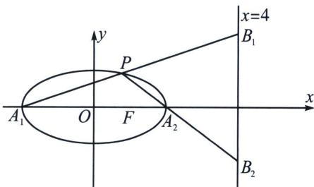

> [!faq]- 《圆锥曲线专题(上册)》例题解析
>
> > [!success]- **【答案】** AB
>
> > [!note]- **【分析】**
> > 本题未单列分析。
>
> > [!note]- **【解析】**
> > 解析 设点 $P(x_0, y_0)$ , 设直线 $PA_1$ 的倾斜角为 $\alpha$ , 斜率为 $k_1$ , 直线 $PA_2$ 的倾斜角为 $\beta$ , 斜率为 $k_2$ ,
> > 
> > 对于A，由题意可得 $\frac{|FA_1|}{|FA_2|} = \frac{a + c}{a - c} = 3$ ，且 $c = 1$ ，所以 $a = 2$ ， $b^{2} = 3$ ，则椭圆方程为 $\frac{x^2}{4} +\frac{y^2}{3} = 1$ ，所以 $k_{1}$ · $k_{2} = -\frac{b^{2}}{a^{2}} = -\frac{3}{4}$ ，故A正确；
> > 对于 B，由 $k_{1}=\frac{y_{0}}{x_{0}+2}$ ，得 $PA_{1}: y=\frac{y_{0}}{x_{0}+2}(x+2)$ ，令 x=4 得， $y_{B_{1}}=\frac{6y_{0}}{x_{0}+2}=6k_{1}$ ，所以 $B_{1}(4,6k_{1})$ ，则 $k_{B_{1}A_{2}}=\frac{6k_{1}-0}{4-2}=3k_{1}$ ，所以 $k_{PA_{2}}\cdot k_{B_{1}A_{2}}=k_{2}\cdot3k_{1}=3\times\left(-\frac{3}{4}\right)=-\frac{9}{4}$ ，故 B 正确；
> > 对于 C，同理 $k_{2}=\frac{y_{0}}{x_{0}-2}$ ，得 $PA_{2}: y=\frac{y_{0}}{x_{0}-2}(x-2)$ ，令 x=4，得 $y_{B_{2}}=\frac{2y_{0}}{x_{0}-2}=2k_{2}$ ，所以 $B_{2}(4,2k_{2})$ ，又由 $k_{1}\cdot k_{2}=-\frac{3}{4}$ ，得 $k_{2}=-\frac{3}{4k_{1}}$ ，则 $\left|B_{1}B_{2}\right|=\left|6k_{1}-2k_{2}\right|=\left|6k_{1}+\frac{3}{2k_{1}}\right|\geqslant6$ ，当且仅当 $k_{1}=\pm\frac{1}{2}$ 时，等号成立，故 C 错误；
> > 对于D，不妨设 $x_0 \geqslant 0$ 且 $y_0 \geqslant 0$ ，则 $k_1 > 0, k_2 < 0$ ，设 $\alpha, \beta$ 分别为直线 $PA_1, PA_2$ 的倾斜角，则 $\angle A_1PA_2 = \beta - \alpha$ ，即 $\tan \angle A_1PA_2 = \tan (\beta - \alpha) = \frac{k_2 - k_1}{1 + k_1k_2} < 0$ ，即 $\angle A_1PA_2$ 为钝角，又由 $k_1 \cdot k_2 = -\frac{3}{4}$ ，得 $k_2 = -\frac{3}{4k_1}$ ，则 $\tan \angle A_1PA_2 = \frac{-\frac{3}{4k_1} - k_1}{\frac{1}{4}} = -4\left(\frac{3}{4k_1} + k_1\right) \leqslant -4\sqrt{3}$ ，当且仅当 $k_1 = \frac{\sqrt{3}}{2}$ 时，等号成立，此时 $\tan \angle A_1PA_2$ 取最大值 $-4\sqrt{3}$ ，即 $\angle A_1PA_2$ 最大，因此 $\cos \angle A_1PA_2$ 的最小值为 $-\frac{1}{7}$ ，故D错误；
> >
> > 故选 **AB**.
