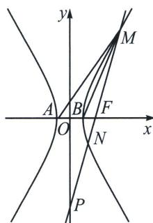

> [!faq]- 《圆锥曲线专题(上册)》例题解析
>
> > [!success]- **【答案】** BCD
>
> > [!note]- **【分析】**
> > 本题未单列分析。
>
> > [!note]- **【解析】**
> > 解析 由题意可得 $A(-1,0), B(1,0), F(2,0)$ ，设 $M(x_1, y_1), N(x_2, y_2)$ ，
> > 对于 A，由 C: $x^{2}-\frac{y^{2}}{3}=1$ 可得双曲线的渐近线方程为 $\sqrt{3}x\pm y=0$ ，由点到直线的距离公式可得，点 M 到双曲线 C 的两条渐近线的距离之积为 $\frac{\left|\sqrt{3}x_{1}-y_{1}\right|}{2}\times\frac{\left|\sqrt{3}x_{1}+y_{1}\right|}{2}=\frac{\left|3x_{1}^{2}-y_{1}^{2}\right|}{4}$ ，将 $M(x_{1},y_{1})$ 代入双曲线方程可得 $x_{1}^{2}-\frac{y_{1}^{2}}{3}=1$ ，则 $y_{1}^{2}=3x_{1}^{2}-3$ ，代入上式可得 $\frac{\left|3x_{1}^{2}-(3x_{1}^{2}-3)\right|}{4}=\frac{3}{4}$ ，故 A 错误；
> > 
> > 对于 B，设双曲线的左焦点为 $F'(-2,0)$ ，由双曲线的定义可得 $\left|MF\right|=\left|MF'\right|-2a=\left|MF'\right|-2$
> > 则 $|MR| + |MF| = |MR| + |MF'| - 2$ ，当 $M, R, F'$ 三点共线时， $|MR| + |MF'|$ 最小，且 $(|MR| + |MF'|)_{\min} = |RF'| = \sqrt{(4 + 2)^2 + 1^2} = \sqrt{37}$ ，故 $|MR| + |MF|$ 的最小值为 $\sqrt{37} - 2$ ，故 B 正确；
> > 对于 C，大家可以参考我们大题篇的定比点差部分的方法，本题小题小做， $\lambda=-\frac{|PM|}{|MF|}$ ， $\mu=\frac{|PN|}{|NF|}$ ， $\lambda=$
> > $$
> > + \mu = - \frac {| P M |}{| M F |} + \frac {| P N |}{| N F |} = - \frac {\frac {c}{\cos \alpha} + | M F |}{| M F |} + \frac {\frac {c}{\cos \alpha} - | N F |}{| N F |} = - 2 - \frac {c}{\cos \alpha \cdot \frac {b ^ {2}}{a - c \cos \alpha}} + \frac {c}{\cos \alpha \cdot \frac {b ^ {2}}{a + c \cos \alpha}}
> > $$
> > $=-2+\frac{2c^{2}}{b^{2}}=\frac{2}{3}$ 为定值，故C正确；
> > 对于 D，由条件可得 $\tan\alpha\tan\beta=\frac{b^{2}}{a^{2}}=3$ ，则 $2\tan\alpha+\tan\beta\geqslant2\sqrt{2\tan\alpha\tan\beta}=2\sqrt{6}$ ，当且仅当 $2\tan\alpha=\tan\beta$ 等号成立，此时 $\tan\alpha=\frac{\sqrt{6}}{2}$ ，此时 $M(3,2\sqrt{6})$ ，则 $S_{\triangle MAB}=\frac{1}{2}\times2\times2\sqrt{6}=2\sqrt{6}$ ，故 D 正确；
> >
> > 故选 **BCD**.
