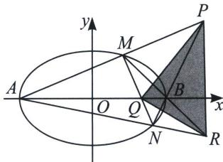

## 四、第三定义转化为斜率比

如图，A、B 分别为椭圆 $\frac{x^{2}}{a^{2}} + \frac{y^{2}}{b^{2}} = 1 (a > b > 0)$ 的左右顶点，M、N 为椭圆上任意两点，MN 与 x 轴交于点 Q，AM 与 BN 交于点 P，根据极点极线理论可知，假设 AN 与 BM 交于 R，利用圆锥曲线的可轮换性，如果 M 与 N 两点位置互换，则 P 与 R 两点位置互换，PQR 形成自极三角形（参考后面大题章节）此时一定有 $\frac{x_{P}x_{Q}}{a^{2}} + \frac{y_{P}y_{Q}}{b^{2}} = 1$ ，即 $x_{P}x_{Q} = a^{2}$ .

故一定有： $\frac{k_{PA}}{k_{PB}}=\frac{x_{P}-a}{x_{P}+a}=\frac{\frac{a^{2}}{x_{Q}}-a}{\frac{a^{2}}{x_{Q}}+a}=\frac{a-x_{Q}}{a+x_{Q}}$ ， $k_{BM}k_{BN}=k_{BM}k_{PB}=-\frac{b^{2}}{a^{2}k_{PA}}k_{PB}=-\frac{b^{2}}{a^{2}}\frac{a+x_{Q}}{a-x_{Q}}=$ 定值

![[高中/总复习/专题/2026版高中《mst老唐说题》圆锥曲线专题（数学）/上册/第01章_圆锥曲线四定义/第三节_椭圆双曲的斜率转化_第三定义/四_第三定义转化为斜率比/例题/Q00048351.md]]
![[高中/总复习/专题/2026版高中《mst老唐说题》圆锥曲线专题（数学）/上册/第01章_圆锥曲线四定义/第三节_椭圆双曲的斜率转化_第三定义/四_第三定义转化为斜率比/例题/Q00048352.md]]
![[高中/总复习/专题/2026版高中《mst老唐说题》圆锥曲线专题（数学）/上册/第01章_圆锥曲线四定义/第三节_椭圆双曲的斜率转化_第三定义/四_第三定义转化为斜率比/例题/Q00048353.md]]
![[高中/总复习/专题/2026版高中《mst老唐说题》圆锥曲线专题（数学）/上册/第01章_圆锥曲线四定义/第三节_椭圆双曲的斜率转化_第三定义/四_第三定义转化为斜率比/例题/Q00048354.md]]
